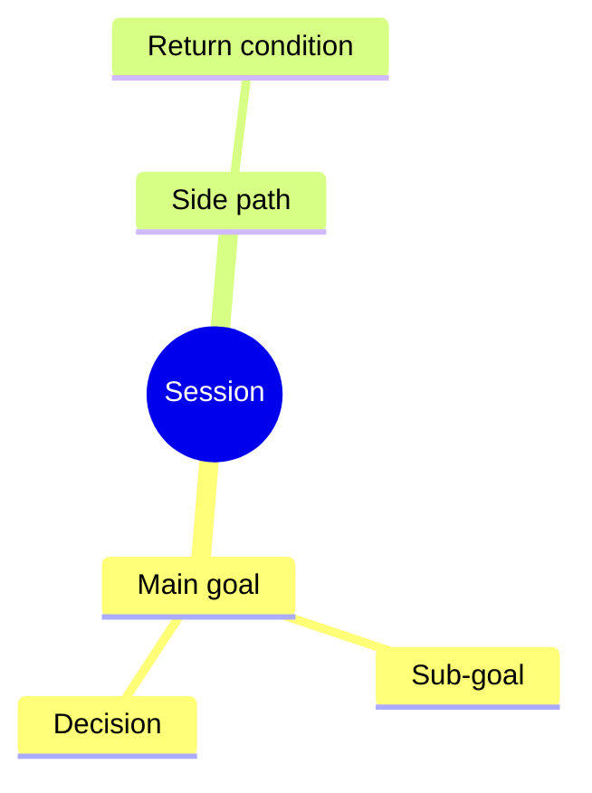

# Session Map Playbook

Use this when a conversation has enough moving parts that Hafiz or the next
agent could lose the main story.

Plain version:

```text
The Session Map is the live mindmap for the current session.
It shows why we started, where we are now, what side paths appeared, and how to
return to the main goal.
```

## What It Is

A Session Map is a working note for one chat or work session. It is different
from GitHub, Koda, Mission Ledger, and save-session.

| Tool | Owns |
| --- | --- |
| Session Map | The live story of the current session: main goal, current focus, side paths, decisions, progress, and return path. |
| GitHub issue | Execution-ready engineering work. |
| Mission Ledger | Bigger goals, future work, adjacent ideas, and paused follow-ups that should survive beyond this session. |
| Koda | Durable lessons, corrections, preferences, and non-obvious rules. |
| Session Release Ledger | Multiple fixes, commits, PRs, main state, deploy state, and live-smoke state inside one session. |
| Save-session | End-of-session summary and continuation state. |

The Session Map should make the conversation easier to follow. It should not
become another admin system that the agent updates after every message.

## Human First, Machine Second

The Session Map must be readable by Hafiz before it is optimized for an LLM.

Plain meaning:

```text
If Hafiz opens the file, the first screen should explain the session like a
clear project board.

If an LLM opens the file, the later structured sections should give enough
state to continue accurately.
```

Do not put raw JSON, dense metadata, or long audit tables at the top. Put the
human summary first, then the mindmap, then the structured continuity details.

Recommended order:

1. Human Snapshot
2. Mindmap
3. Progress Board
4. Decisions
5. Side Paths And Return Path
6. Agent Context
7. Evidence
8. Continuation Prompt

This lets Hafiz understand the session quickly while still giving Claude,
Codex, or another agent the exact state needed to resume.

## Markdown First, HTML Second

Use Markdown as the source of truth.

If Hafiz wants a dashboard, generate HTML from the Markdown instead of manually
maintaining a separate HTML file.

Plain meaning:

```text
One source to update.
One optional pretty view to inspect.
No duplicate truth.
```

Recommended future implementation:

```text
session-map.md -> generated session-map.html
```

The generated HTML can show a mindmap, progress table, current focus, open
decisions, linked issues, linked docs, and the recommended next action.

Generate the HTML view with:

```bash
python3 scripts/agent-checks/session-map-html.py .agent-os/session-maps/<file>.md
```

Plain meaning: the agent edits the Markdown, then generates the nice browser
view from that same source. Do not manually edit the generated HTML as the
truth.

When the generated HTML is meant for Hafiz to review, open it automatically:

```bash
open .agent-os/session-maps/<file>.html
```

Still report the path in chat so Hafiz can reopen it later.

## When To Create Or Update One

Create or update a Session Map when any of these are true:

- Hafiz explicitly asks for a mindmap, session map, progress board, or HTML
  session view.
- The session has one main goal plus side topics.
- The session switches between discussion, diagnosis, implementation, QA,
  commit, push, deploy, or save-session.
- The session contains more than one meaningful work item.
- A side issue appears and Hafiz wants to return to the original topic later.
- The chat resumes after compaction, a long pause, or another agent's work.
- Hafiz asks "what next?" and the answer depends on earlier session context.
- Before handoff or save-session, when the next agent would otherwise need to
  reconstruct the story from chat.

Do not create one for a tiny one-shot answer, typo fix, or single-file docs
change unless Hafiz asks.

## Where It Should Live

For now, keep session maps in one of these places:

| Case | Location |
| --- | --- |
| Active local working session | `.agent-os/session-maps/` |
| Durable example or template | `docs/agent-playbooks/templates/` |
| Handoff or snapshot | Include or link the current Session Map. |
| Bigger/future follow-up | Promote the relevant item to Mission Ledger. |

Do not commit active local session maps by default. Commit the playbook,
template, or durable examples only when the content is meant to become shared
Agent OS behavior.

## Naming Rule

Every active Session Map filename must be unique enough for parallel sessions.
Do not use date-only names such as:

```text
2026-06-28-agent-os-session-map.md
```

Use:

```text
YYYY-MM-DD-HHMMSS-<agent>-<short-topic>.md
```

Example:

```text
.agent-os/session-maps/2026-06-28-201900-codex-agent-os-session-map.md
```

Plain meaning:

```text
Same chat/session = keep updating the same file.
New chat/session = create a new timestamped file.
Generated HTML = use the same basename with .html.
```

The `Session ID` in Agent Context should match the filename without `.md`.
This prevents two same-day sessions from overwriting each other.

## Required Sections

Use the smallest useful version, but keep these headings when possible:

```md
# Session Map: <short title>

## Human Snapshot

- **Started because:** <plain-language reason>
- **Right now:** <current focus in one or two sentences>
- **What changed so far:** <short summary>
- **Next recommended move:** <one concrete next step>
- **Decision needed from Hafiz:** <yes/no and what decision>

## Mindmap

## Progress Board

## Decisions

## Side Paths And Return Path

## Agent Context

## Evidence

## Continuation Prompt
```

Keep technical metadata in `Agent Context`, not above `Human Snapshot`.

Agent Context should include:

```md
- **Date:** <YYYY-MM-DD>
- **Session ID:** <YYYY-MM-DD-HHMMSS-agent-short-topic>
- **Project:** <umbrella or project>
- **Agent:** <Codex | Claude | human | mixed>
- **Repo/worktree:** <path>
- **Branch:** <branch or none>
- **Main goal:** <why this session started>
- **Current focus:** <what we are doing right now>
- **Done means:** <practical target state for this session>
- **Recommended stop point:** <where the agent expects to pause>
- **Approved boundary:** <diagnose only | docs only | commit | push | PR | deploy | other>
- **Risk lane:** <light | medium | full | critical>
- **Related sessions:** <links or none>
```

## Mindmap Shape

Use a simple Markdown tree first:

```md
- Main goal
  - Sub-goal
    - Task
    - Decision
    - Evidence
  - Side path
    - Status
    - Return condition
```

When a visual view is useful, include a Mermaid mindmap block:

````md

````

Keep the words short. The visual map should orient Hafiz quickly, not become a
wall of text.

## Update Rules

Update the Session Map at meaningful state changes:

- human snapshot no longer describes the current truth
- main goal changes
- current focus changes
- a new side path is opened
- a decision is made
- a task moves from discussion to implementation
- a commit, PR, deploy, or live-smoke boundary matters
- the session is about to be handed off, saved, or compacted

Do not update it after every small chat reply.

When sessions get long, update the Human Snapshot more aggressively than the
technical sections. The snapshot is what prevents Hafiz from needing to reread
the whole file.

## Validation

Use the Session Map checker after changing the template, the playbook, or an
active Session Map:

```bash
python3 scripts/agent-checks/session-map-check.py
```

Use strict mode for active maps when you want to catch placeholders:

```bash
python3 scripts/agent-checks/session-map-check.py --strict .agent-os/session-maps/<file>.md
```

Plain meaning: the checker cannot judge whether the map is wise, but it catches
missing sections, missing Human Snapshot fields, missing Agent Context fields,
empty progress boards, and missing continuation prompts.

## Promotion Rules

If an item outgrows the current session, move or link it to the right system:

| Session Map Item | Promote To |
| --- | --- |
| Exact coding work | GitHub issue |
| Bigger or future work | Mission Ledger |
| Durable lesson or Hafiz correction | Koda |
| Multiple fixes or release-state tracking | Session Release Ledger |
| Final continuation state | Save-session or handoff |

Keep a short backlink in the Session Map so the story remains connected.

## Agent Behavior

When using a Session Map, the agent should say:

```text
I updated the Session Map so the main goal, current focus, side path, and next
step stay visible.
```

For Hafiz-facing summaries, keep it natural:

```text
We are still on the Agent OS clarity goal. This session is currently focused on
the Session Map layer. The next practical step is to decide whether active maps
stay local only or can be committed when they become useful examples.
```

## HTML Dashboard Direction

The first version should be Markdown only.

Add generated HTML later if the Markdown map proves useful. The HTML should be
a read-only view, not the source agents edit.

Good first HTML view:

- current focus at the top
- mindmap in the middle
- progress table
- open decisions
- links
- recommended next action

This keeps the workflow efficient: agents update one file, Hafiz can inspect a
clear page, and future agents can still read plain Markdown.

## Skill Direction

A future `$session-map` skill should manage this file instead of asking every
agent to remember the format.

Minimum skill actions:

- create a session map
- update the Human Snapshot
- add or close a side path
- record a decision
- record evidence
- link GitHub, Koda, Mission Ledger, PR, commit, or handoff
- produce a continuation prompt
- close the session map during save-session

The skill should preserve the human-first order. It should not turn the file
into a machine log.
