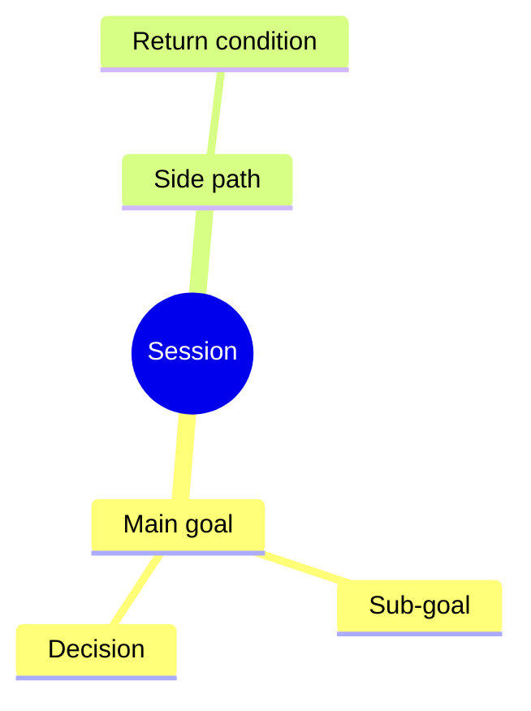

# Session Map Playbook

Use this when a conversation has enough moving parts that Hafiz or the next
agent could lose the main story.

Plain version:

```text
The Session Map is the live mindmap for the current session.
It shows why we started, where we are now, what side paths appeared, and how to
return to the main goal.
```

## What It Is

A Session Map is a working note for one chat or work session. It is different
from GitHub, Koda, Mission Ledger, and save-session.

| Tool | Owns |
| --- | --- |
| Session Map | The live story of the current session: main goal, current focus, side paths, decisions, progress, and return path. |
| GitHub issue | Execution-ready engineering work. |
| Mission Ledger | Bigger goals, future work, adjacent ideas, and paused follow-ups that should survive beyond this session. |
| Koda | Durable lessons, corrections, preferences, and non-obvious rules. |
| Session Release Ledger | Multiple fixes, commits, PRs, main state, deploy state, and live-smoke state inside one session. |
| Save-session | End-of-session summary and continuation state. |

The Session Map should make the conversation easier to follow. It should not
become another admin system that the agent updates after every message.

## Human First, Machine Second

The Session Map must be readable by Hafiz before it is optimized for an LLM.

Plain meaning:

```text
If Hafiz opens the file, the first screen should explain the session like a
clear project board.

If an LLM opens the file, the later structured sections should give enough
state to continue accurately.
```

Do not put raw JSON, dense metadata, or long audit tables at the top. Put the
human summary first, then the mindmap, then the structured continuity details.

Recommended order:

1. Human Snapshot
2. Mindmap
3. Progress Board
4. Decisions
5. Side Paths And Return Path
6. Agent Context
7. Links And Evidence
8. Reference Pack
9. Continuation Prompt

This lets Hafiz understand the session quickly while still giving Claude,
Codex, or another agent the exact state needed to resume.

## Markdown First, HTML Second

Use Markdown as the source of truth.

If Hafiz wants a dashboard, generate HTML from the Markdown instead of manually
maintaining a separate HTML file.

Use [planning-artifacts.md](planning-artifacts.md) when deciding whether the
Session Map alone is enough, or whether the current work also needs a Quick
Brief, Product Shape, Build-Ready Pack, or generated HTML review view.

Plain meaning:

```text
One source to update.
One optional pretty view to inspect.
No duplicate truth.
```

Recommended future implementation:

```text
session-map.md -> generated session-map.html
```

The generated HTML can show a mindmap, progress table, current focus, open
decisions, linked issues, linked docs, and the recommended next action.

The agreed dashboard v2 first screen should answer:

```text
Where are we, and what should happen next?
```

Use these top-screen blocks:

- **Now**: what is happening right now.
- **Goal**: why this session exists.
- **Next**: the single recommended next action.
- **Waiting**: approvals, local-only commits, blockers, or review still needed.
- **Confidence**: what has been checked and what is still only assumed.

Below that, show:

- **Progress Flow**
- **Decision Board**
- **Side Paths**
- **Evidence / Checks**
- **Reference Pack**
- **Continuation Prompt**

Plain meaning: the dashboard should feel like opening the same working session
again, not starting from a cold transcript.

Generate the HTML view with:

```bash
python3 scripts/agent-checks/session-map-html.py .agent-os/session-maps/<file>.md
```

Plain meaning: the agent edits the Markdown, then generates the nice browser
view from that same source. Do not manually edit the generated HTML as the
truth.

When the generated HTML is meant for Hafiz to review, open it automatically:

```bash
open .agent-os/session-maps/<file>.html
```

Still report the path in chat so Hafiz can reopen it later.

## When To Create Or Update One

Default rule:

```text
One meaningful session = one Session Map.
```

Plain meaning:

```text
Each real work session gets one whiteboard. Keep updating that same whiteboard
until the session is continued, parked, handed off, promoted, or closed.
```

Create or update a Session Map for both:

1. **Long or confusing sessions**
2. **Non-trivial development or workflow work**

Plain meaning:

```text
Use Session Map when losing track would cost Hafiz or the next agent time.
Skip it only for tiny one-shot work.
```

Create or update one when any of these are true:

- Hafiz explicitly asks for a mindmap, session map, progress board, or HTML
  session view.
- The session has one main goal plus side topics.
- The session switches between discussion, diagnosis, implementation, QA,
  commit, push, deploy, or save-session.
- The session contains more than one meaningful work item.
- A side issue appears and Hafiz wants to return to the original topic later.
- The chat resumes after compaction, a long pause, or another agent's work.
- Hafiz asks "what next?" and the answer depends on earlier session context.
- The work is a bugfix, feature, refactor, hotfix, QA, review, release, deploy,
  handoff, or save-session that may move through multiple states.
- The work may need to continue in another session or agent.
- The work has real state to track: local, committed, pushed, PR open, merged,
  deployed, live smoke passed, blocked, or closed.
- More than one worktree, branch, PR, or parallel agent/session may be active.
- An autonomous work packet is active and needs loop state, stop rules, or
  resume instructions.
- Before handoff or save-session, when the next agent would otherwise need to
  reconstruct the story from chat.

Do not create one for a tiny one-shot answer, quick command output, typo fix,
or small single-file docs edit unless Hafiz asks.

## Session Map Lifecycle

Use one Session Map per meaningful session. Do not create a new map just
because the conversation has a side path, a commit, a check, or a short pause.
Those belong inside the current map.

Create a new Session Map only when the work becomes a different session:

- a different main goal
- a different project or repo
- a different branch, PR, release, or deployment path
- a different owner or handoff target
- enough unrelated scope that keeping it in the current map would confuse
  Hafiz or the next agent

Plain meaning:

```text
Same mission = same map.
Different mission = new map.
Tiny question = no map unless Hafiz asks.
```

Use these lifecycle states:

| State | Meaning | Agent behavior |
| --- | --- | --- |
| Active | This is the live map for the current meaningful session. | Keep the Human Snapshot, current focus, next action, and evidence current. |
| Continued | The same map is being reused after a pause, compaction, or later prompt. | Read the Reference Pack first, summarize where we are, then continue. |
| Parked | The work is intentionally paused, but not finished. | Record why it is paused, what is waiting, and how to resume. |
| Handed off | Another agent or human should continue. | Record owner, boundary, evidence, files, commits, and continuation prompt. |
| Promoted | Part of the session became durable elsewhere. | Link the GitHub issue, Mission Ledger item, Koda memory, committed doc, PR, or save-session note. |
| Closed | Nothing required remains for this session. | Record final state, checks, durable saves, Git/GitHub/deploy state, and no required next action. |

When multiple maps exist, choose the one whose main goal, project, branch, and
latest next action match Hafiz's prompt. If more than one active map appears to
match, pause before editing and say the practical conflict:

```text
I found two possible session maps for this work. I need to choose one before
editing so we do not split the story.
```

Then recommend the likely map using current evidence: latest modified time,
matching project, matching branch, matching commit/PR references, and matching
Continuation Prompt.

Use [parallel-work-and-worktrees.md](parallel-work-and-worktrees.md) when the
map needs to track separate workspaces, branch ownership, local-only commits,
PR state, or cleanup conditions.

Use [autonomous-work-packets.md](autonomous-work-packets.md) when the map needs
to track loop number, current slice, stop rules, progress cadence, interruption
state, or resume instructions for a long-running work packet.

Do not merge two maps casually. Merge only by writing a clear handoff or
promotion note that says which map continues and which map is parked, closed,
or superseded.

## Smart Resume Behavior

Use smart automatic resume. Do not make Hafiz remember magic words, but do not
force Session Map reading into tiny unrelated questions either.

Resume from the latest relevant Session Map when one or more of these signals
appear:

- Hafiz says `continue`, `resume`, `go next`, `proceed`, `what next`, `where
  were we`, or says he left the chat for a while.
- A recent active Session Map exists.
- Local Git has commits ahead of GitHub or other unfinished state.
- The chat resumed after compaction, a long pause, or another agent's work.
- The work is Agent OS/workflow/product work with multiple steps.

When resuming, read the Reference Pack first, then summarize:

- main goal
- current focus
- waiting items
- local Git state
- recommended next action

Plain meaning:

```text
If Hafiz walks back into the room and says "continue", check the whiteboard
first. If he asks a tiny unrelated question, answer the question.
```

If the latest Session Map does not match Hafiz's prompt, say so:

```text
I found an active Session Map for <topic>, but your prompt looks like <new
topic>. I will treat this as new work unless you want to resume that map.
```

## Remote And Device Continuation

Persistent terminal tools can help, but the Session Map remains the readable
continuation source.

Plain meaning:

```text
tmux, WezTerm, SSH, Tailscale, or mosh can keep the room open.
The Session Map tells the next person what the room is for.
```

Use terminal continuity as an environment convenience, not as the only state
record. A resumed agent should still read the Reference Pack, check Git state,
and verify current evidence before acting.

When work may continue from another device, another agent, or a later day, make
sure the Session Map names:

- main goal
- current focus
- highest proven state
- dirty files or local-only commits
- first source to read
- first safe command/check to run
- waiting decision or approval boundary
- single recommended next action

If the old terminal/session is useful but not required, say that clearly. If it
is required, save or hand off enough detail so the next agent can recover if
the terminal is gone.

## Operating Rhythm

Use this rhythm during normal work:

| Moment | Agent behavior |
| --- | --- |
| Start | Decide if the session is long/confusing or non-trivial dev/workflow work. If yes, create or reuse a unique Session Map. |
| Meaningful change | Update the Human Snapshot first, then progress, decisions, side paths, evidence, or continuation prompt as needed. |
| Review needed | Regenerate HTML and open it automatically for Hafiz. |
| Commit/push/PR/deploy state changes | Update the progress board and evidence so "done" is never ambiguous. |
| Handoff/save-session | Update the continuation prompt and say whether the session can close or should continue. |

Do not update the map after every small chat reply. Update it when the practical
state changes.

## Where It Should Live

For now, keep session maps in one of these places:

| Case | Location |
| --- | --- |
| Active local working session | `.agent-os/session-maps/` |
| Durable example or template | `docs/agent-playbooks/templates/` |
| Handoff or snapshot | Include or link the current Session Map. |
| Bigger/future follow-up | Promote the relevant item to Mission Ledger. |

Do not commit active local session maps by default. Commit the playbook,
template, or durable examples only when the content is meant to become shared
Agent OS behavior.

## Naming Rule

Every active Session Map filename must be unique enough for parallel sessions.
Do not use date-only names such as:

```text
2026-06-28-agent-os-session-map.md
```

Use:

```text
YYYY-MM-DD-HHMMSS-<agent>-<short-topic>.md
```

Example:

```text
.agent-os/session-maps/2026-06-28-201900-codex-agent-os-session-map.md
```

Plain meaning:

```text
Same chat/session = keep updating the same file.
New chat/session = create a new timestamped file.
Generated HTML = use the same basename with .html.
```

The `Session ID` in Agent Context should match the filename without `.md`.
This prevents two same-day sessions from overwriting each other.

## Required Sections

Use the smallest useful version, but keep these headings when possible:

```md
# Session Map: <short title>

## Human Snapshot

- **Started because:** <plain-language reason>
- **Right now:** <current focus in one or two sentences>
- **What changed so far:** <short summary>
- **Next recommended move:** <one concrete next step>
- **Decision needed from Hafiz:** <yes/no and what decision>

## Mindmap

## Progress Board

## Decisions

## Side Paths And Return Path

## Agent Context

## Links And Evidence

## Reference Pack

## Continuation Prompt
```

Keep technical metadata in `Agent Context`, not above `Human Snapshot`.

Use this friendly progress flow for work states:

```text
Exploring -> Decided -> Updated -> Checked -> Committed -> On GitHub -> Done
```

Plain meaning:

- **Exploring**: still discussing, researching, or shaping.
- **Decided**: direction chosen.
- **Updated**: docs, code, tools, memory, or config changed.
- **Checked**: tests, guards, review, or another real check passed.
- **Committed**: saved locally in Git.
- **On GitHub**: pushed and available to future agents.
- **Done**: no required next action remains.

Only record meaningful choices in the Decision Board, not every small note.
Each decision should include the decision, reason, effect, status, owner, and
date.

Use these Side Path states:

- **Doing now**
- **Parked**
- **Needs decision**
- **Turned into task**
- **Dropped**

Plain meaning: side paths are "do not forget this, but do not let it hijack the
main task."

The Reference Pack is the bridge between sessions. It should include the
primary Session Map, generated dashboard, core docs to read first, important
commits, Koda memories, what to ignore, and a resume instruction.

Agent Context should include:

```md
- **Date:** <YYYY-MM-DD>
- **Session ID:** <YYYY-MM-DD-HHMMSS-agent-short-topic>
- **Project:** <umbrella or project>
- **Agent:** <Codex | Claude | human | mixed>
- **Repo/worktree:** <path>
- **Branch:** <branch or none>
- **Main goal:** <why this session started>
- **Current focus:** <what we are doing right now>
- **Done means:** <practical target state for this session>
- **Recommended stop point:** <where the agent expects to pause>
- **Approved boundary:** <diagnose only | docs only | commit | push | PR | deploy | other>
- **Risk lane:** <light | medium | full | critical>
- **Related sessions:** <links or none>
```

## Mindmap Shape

Use a simple Markdown tree first:

```md
- Main goal
  - Sub-goal
    - Task
    - Decision
    - Evidence
  - Side path
    - Status
    - Return condition
```

When a visual view is useful, include a Mermaid mindmap block:

````md

````

Keep the words short. The visual map should orient Hafiz quickly, not become a
wall of text.

## Update Rules

Update the Session Map at meaningful state changes:

- human snapshot no longer describes the current truth
- main goal changes
- current focus changes
- a new side path is opened
- a decision is made
- a task moves from discussion to implementation
- a commit, PR, deploy, or live-smoke boundary matters
- the session is about to be handed off, saved, or compacted

Do not update it after every small chat reply.

When sessions get long, update the Human Snapshot more aggressively than the
technical sections. The snapshot is what prevents Hafiz from needing to reread
the whole file.

## Closing A Session Map

Closing a Session Map does not always mean the work is finished. It means the
map now tells the next reader what state the session ended in.

Use these human ending states when talking to Hafiz:

| Ending state | Use when | Required before using it |
| --- | --- | --- |
| Continue | The same thread should keep going. | Current focus, next action, and waiting decision are clear. |
| Save Only | The work is not finished, but context must be preserved before stopping. | Session Map, Reference Pack, Git state, Koda saves, and next action are current. |
| Park | Work is intentionally paused. | Reason for pause, what is waiting, resume condition, and where it is recorded are clear. |
| Hand Off | Another agent or human should continue. | Owner, continuation prompt, boundaries, files/commits/links, and evidence are listed. |
| Close | Nothing required remains. | Checks are done, durable saves are done, Git/push/PR/deploy state is clear, no waiting decision remains, and next action is none or optional. |

Plain meaning:

```text
Close is strict. If anything real is waiting, do not call the session closed.
Use Continue, Save Only, Park, or Hand Off instead.
```

Use one of these close states:

| Close state | Meaning | What the agent must write |
| --- | --- | --- |
| Continue | The same session should keep going. | Current focus, next action, and decision needed. |
| Parked | Work is paused but not finished. | Why it paused, where to resume, and what is waiting. |
| Handed off | Another agent or human should continue. | Owner, exact continuation prompt, evidence, and links. |
| Closed | This session's goal is complete. | Final status, checks, durable saves, and no remaining action except optional follow-up. |
| Not needed | The work was too small for a map. | Say why a map was not created, only when useful. |

Plain meaning:

```text
At the end, the map should answer: can we close this, or where exactly do we
continue?
```

Before ending a meaningful session, update:

- Human Snapshot
- Progress Board
- Decisions
- Side Paths And Return Path
- Links And Evidence
- Reference Pack
- Continuation Prompt
- Agent Context `Done means`, `Recommended stop point`, and `Approved boundary`

Then regenerate and open the HTML dashboard if Hafiz should review it.

## Validation

Use the Session Map checker after changing the template, the playbook, or an
active Session Map:

```bash
python3 scripts/agent-checks/session-map-check.py
```

Use strict mode for active maps when you want to catch placeholders:

```bash
python3 scripts/agent-checks/session-map-check.py --strict .agent-os/session-maps/<file>.md
```

Plain meaning: the checker cannot judge whether the map is wise, but it catches
missing sections, missing Human Snapshot fields, missing Agent Context fields,
empty progress boards, and missing continuation prompts.

## Promotion Rules

If an item outgrows the current session, move or link it to the right system:

| Session Map Item | Promote To |
| --- | --- |
| Exact coding work | GitHub issue |
| Bigger or future work | Mission Ledger |
| Durable lesson or Hafiz correction | Koda |
| Multiple fixes or release-state tracking | Session Release Ledger |
| Final continuation state | Save-session or handoff |

Keep a short backlink in the Session Map so the story remains connected.

## Agent Behavior

When using a Session Map, the agent should say:

```text
I updated the Session Map so the main goal, current focus, side path, and next
step stay visible.
```

For Hafiz-facing summaries, keep it natural:

```text
We are still on the Agent OS clarity goal. This session is currently focused on
the Session Map layer. The next practical step is to decide whether active maps
stay local only or can be committed when they become useful examples.
```

## HTML Dashboard Direction

The HTML dashboard is a generated read-only view. The Markdown remains the
source agents edit.

Good HTML view:

- first-screen control blocks: Now, Goal, Next, Waiting, Confidence
- Progress Flow using Exploring, Decided, Updated, Checked, Committed, On
  GitHub, Done
- Decision Board with the latest important decisions first
- Side Paths with return paths
- Evidence / Checks
- Reference Pack
- Continuation Prompt

This keeps the workflow efficient: agents update one file, Hafiz can inspect a
clear page, and future agents can still read plain Markdown.

## Skill Direction

A future `$session-map` skill should manage this file instead of asking every
agent to remember the format.

Minimum skill actions:

- create a session map
- update the Human Snapshot
- add or close a side path
- record a decision
- record evidence
- link GitHub, Koda, Mission Ledger, PR, commit, or handoff
- produce a continuation prompt
- close the session map during save-session

The skill should preserve the human-first order. It should not turn the file
into a machine log.
