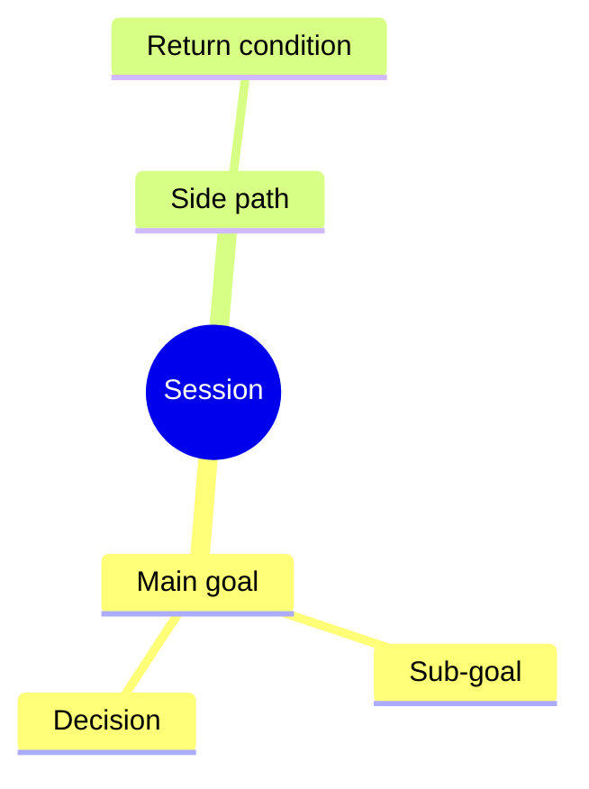

# Session Map: <short title>

## Human Snapshot

- **Started because:** <plain-language reason this session exists>
- **Right now:** <current focus in one or two human-readable sentences>
- **What changed so far:** <short summary of the important movement>
- **Next recommended move:** <one concrete next step>
- **Decision needed from Hafiz:** <no | yes: explain the decision in normal language>

## Mindmap

- <main goal>
  - <sub-goal or topic>
    - <task, decision, evidence, or blocker>
  - <side path>
    - Status: <captured | in discussion | active | paused | done>
    - Return condition: <when to come back>



## Progress Board

| Item | Status | Owner | Evidence / Link | Next |
| --- | --- | --- | --- | --- |
| <item> | <not started / in discussion / in progress / waiting / done locally / committed / pushed / PR open / merged / deployed / live smoke passed / closed> | <Hafiz / Codex / Claude / staff / dev> | <link or none> | <next step> |

## Decisions

| Decision | Why | Owner | Date |
| --- | --- | --- | --- |
| <decision> | <plain reason> | <Hafiz / agent / team> | <YYYY-MM-DD> |

## Side Paths And Return Path

| Side path | Why it appeared | Status | Return path |
| --- | --- | --- | --- |
| <topic> | <reason> | <captured / active / paused / done> | <where to continue next> |

## Open Questions

- <question>

## Agent Context

- **Date:** <YYYY-MM-DD>
- **Session ID:** <YYYY-MM-DD-HHMMSS-agent-short-topic>
- **Project:** <umbrella | sifu-tutor | ripple-suite | sifututor_tutor | sifututor_parent | lls | other>
- **Agent:** <Codex | Claude | human | mixed>
- **Repo/worktree:** <path>
- **Branch:** <branch or none>
- **Main goal:** <why this session started>
- **Current focus:** <what we are discussing, diagnosing, building, verifying, or shipping now>
- **Done means:** <practical target state, such as decision made, docs updated, fix committed, PR opened, staging verified, or production smoke passed>
- **Recommended stop point:** <where the agent should pause unless Hafiz approves going further>
- **Approved boundary:** <diagnose only | docs only | commit | push | PR | deploy | other>
- **Risk lane:** <light | medium | full | critical>
- **Related sessions:** <links or none>

## Links And Evidence

- GitHub issue: <link or none>
- PR: <link or none>
- Commit: <sha or none>
- Mission Ledger: <item/link or none>
- Koda memory: <id or none>
- Evidence: <test, screenshot, QA note, deploy/smoke link, or none>

## Continuation Prompt

Use this if another agent or future session continues:

```text
Continue from .agent-os/session-maps/<YYYY-MM-DD-HHMMSS-agent-short-topic>.md.
Main goal: <main goal>.
Current focus: <current focus>.
Next action: <one concrete next action>.
Do not change: <boundaries or protected areas>.
Check first: <files, tools, evidence, or approvals>.
```
