# The Sifututor Ecosystem: Built to Operate, Ready to Scale

> An end-to-end sourcebook of our systems, capabilities, operating maturity, business impact and expansion foundation.

| Document control | Detail |
|---|---|
| Purpose | Authoritative internal and selected-stakeholder reference |
| Version | 1.0 |
| Last reviewed | 27 August 2026 |
| Owner | Sifututor leadership and platform team |
| Review cycle | Every six months, and after a material platform milestone |
| Classification | Internal; selected excerpts may be shared after owner review |

## How to use this sourcebook

This is a knowledge source, not a prescribed presentation. A presenter can select the material that suits the audience while retaining the facts, distinctions and definitions recorded here.

- **Leadership and stakeholder path:** Executive orientation, Chapters 1–3, 11–13 and 15–17, then Appendix G before extracting material.
- **Operations and business path:** Chapters 3–4, 7–10 and 13–17, with Appendices C–D for authority and KPI definitions.
- **Technical and architecture path:** Chapters 5–10 and Appendices B–G.
- **Roadmap and expansion path:** Chapters 12–20 and the KPI dictionary.

Each substantial section begins in plain language and then adds operational or technical depth. Terms such as “authoritative system,” “reconciliation” and “multi-tenant” are defined in Appendix A.

### Confidence and claim convention

The sourcebook distinguishes four kinds of statement:

| Label | Meaning |
|---|---|
| **Established** | A durable capability evidenced in the operating system, repository or approved company record. |
| **Publicly stated** | A statement published by Sifututor or an official distribution channel, with an as-of date. |
| **Strategic direction** | An approved direction, not a launch promise or statement that the capability is already complete. |
| **Illustrative option** | An example of what the foundation could support; it is not a commitment. |

Claim references such as `[CLM-ARCH-001]` point to the evidence register in Appendix E. The register is the single source for wording, evidence class and safe-use conditions.

---

## Executive orientation

Sifututor is more than a marketplace or a pair of mobile apps. It is an operating ecosystem for personalised education: a connected set of systems, people, controls and feedback loops that carries a learning need from first interest through tutor matching, class delivery, verification, billing, collection, tutor payment, support and improvement. `[CLM-NAR-001]`

The company has operated live tutoring services since 2018. That operating experience supplied the rules and practical knowledge behind a new generation of the platform, led by the production launch of the new Sifututor Information Management System (SIMS) in May 2025. `[CLM-HIS-001] [CLM-HIS-002]`

The significance is not simply the number of applications. It is the breadth of the operating loop. Customer and tutor channels connect to an authoritative service core; staff use specialised workspaces to coordinate matching, accounts and support; learning products extend the relationship beyond administration; and observability, recovery, access control, testing and governed delivery help keep the platform healthy. `[CLM-ARCH-001] [CLM-TRU-001]`

This breadth has been created by a lean, capital-efficient company. The platform encodes repeatable business rules so that a smaller organisation can coordinate a service larger than its headcount alone would suggest. Automation and AI contribute to that leverage, but so do disciplined system boundaries, shared data, reusable workflows, monitoring, testing and operational learning. `[CLM-CAP-001]`

The strategic direction is therefore clear:

> **Consolidate the operating spine, then multiply its value across users, brands, products, verticals and markets.** `[CLM-ROAD-001]`

The same foundation can support deeper Sifututor services, the distinct Nakngaji sister brand, digital learning, education-centre operations and—where leadership validates demand—other expert-led services such as sports coaching or music instruction. Country and vertical expansion remain strategic options, not announced launches. `[CLM-EXP-001]`

### The complete operating loop

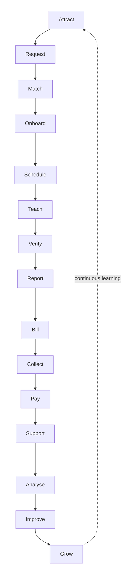

The loop creates three compounding effects:

1. **Health:** monitoring, controls and feedback identify issues before they become repeated operating cost.
2. **Efficiency:** shared information and guided workflows reduce re-entry, searching, handoffs and avoidable manual work.
3. **Growth:** a reliable service creates retention, reputation, faster fulfilment, product extension and better use of demand.

---

# Part I — The operating story

## Chapter 1 — Why the ecosystem exists

### In one minute

Personalised education is a coordination service before it is a software product. A parent has a learning need; the platform must understand it, find a suitable educator, establish a workable arrangement, help the class happen, confirm the service, move money accurately and support both sides. Failure at any link affects trust in the whole journey.

### The real problem being solved

Matching a tutor to a request is necessary, but insufficient. A healthy service also needs:

- clear parent, learner and tutor identities;
- structured requests and preferences;
- suitable supply discovery and communication;
- class, schedule, attendance and reporting records;
- invoice, collection, reconciliation and tutor-payment controls;
- notifications and customer support;
- operational visibility and a method to improve.

Sifututor’s platform exists to make these activities work as one operating system rather than a collection of disconnected conversations and spreadsheets. `[CLM-NAR-001]`

### Why this matters to each participant

| Participant | Need | Ecosystem response |
|---|---|---|
| Parent or customer | Confidence, clarity and convenient action | Request, schedule, class, invoice, payment and support visibility |
| Learner | Suitable instruction and continuity | Learner context, class delivery, progress and learning products |
| Tutor or educator | Relevant opportunities and dependable administration | Profile, matching, schedule, reporting, earnings and payment workflows |
| Operations and CX | One view of the service journey | Authoritative records, staff workspaces, communications and case context |
| Finance | Traceable movement from service to settlement | Invoices, gateway/bank evidence, reconciliation, adjustments and payment controls |
| Leadership | Reliable signals for decisions | Analytics, health indicators, operational outcomes and governed access |

### What the ecosystem changes

Without a connected operating model, growth increases coordination burden. With one, each completed journey improves the organisation’s understanding of demand, supply, service quality and financial behaviour. The platform turns operating experience into reusable capability.

## Chapter 2 — Evolution from operating experience to platform capability

### In one minute

Sifututor’s current platform did not begin as a greenfield technology exercise. It grew from years of operating a live tutoring service. The previous system carried the business while the company learned its real workflows; the new SIMS generation translated those lessons into a stronger connected foundation.

### Milestone narrative

| Period | Business and service evolution | Platform and capability evolution |
|---|---|---|
| **2018** | Sifututor begins operating live tutoring services. | The previous operating system supports the early service model. |
| **2018–2024** | Repeated delivery builds practical knowledge of parent needs, tutor supply, class administration, support and finance. | Business rules and operating patterns accumulate through real use. |
| **May 2025** | The business transitions its core operation to a new generation. | The new SIMS goes live in production as the authoritative service core. |
| **After May 2025** | Teams gain more specialised support for matching, accounts, communication, analytics and delivery. | Connected channels, staff workspaces, intelligence, observability and recovery mature around the core. |
| **Current strategic era** | The company can deepen the core service while evaluating adjacent products and markets. | The ecosystem becomes a reusable operating foundation, not merely a single-purpose application. |

`[CLM-HIS-001] [CLM-HIS-002] [CLM-ARCH-001]`

The previous system should be understood as an enabling chapter, not a failed one. It kept the service operating and supplied the evidence needed to design a more capable successor. The May 2025 launch is therefore both a technology milestone and an operational knowledge milestone.

## Chapter 3 — The end-to-end education-service value chain

### In one minute

The ecosystem covers the path from creating demand to learning from delivery. Each stage has an owner, a system responsibility, a control and a measurable form of value.

| Stage | Primary activity | Main ecosystem support | Information or control created | Value and safe KPI family |
|---|---|---|---|---|
| Attract | Create awareness and qualified interest | Public channels, Creative Hub, CRM capability | Campaign, source and audience context | Qualified demand, acquisition efficiency |
| Request | Capture the learning need | Parent channels, SIMS, CRM | Learner, subject, mode, location and preference | Request completeness, conversion |
| Match | Identify suitable educators | Ripple Matching, SIMS tutor records, communications | Eligibility, fit, availability and outreach history | Time to shortlist, fulfilment |
| Onboard | Establish the relationship | SIMS, Parent App, Tutor App | Identity, profile, terms, class arrangement | Activation, handoff quality |
| Schedule | Coordinate when learning happens | SIMS and mobile channels | Class timetable, participants and notifications | Schedule accuracy, lead time |
| Teach | Deliver the service | Tutor workflow, class records, Learnest where applicable | Attendance, lesson activity and materials | Delivery completion, engagement |
| Verify | Confirm service occurred | Parent and tutor workflows, SIMS | Submitted class and approval evidence | Verification turnaround, dispute rate |
| Report | Communicate learning activity | SIMS, apps, Learnest/Kelasapp where applicable | Class and progress reporting | Reporting timeliness, visibility |
| Bill | Convert verified service into an obligation | SIMS financial workflow | Invoice, line items, due state | Billing accuracy, cycle time |
| Collect | Receive and identify customer funds | Payment gateway, bank evidence, SIMS, Ripple Accounts | Payment evidence and allocation | Collection rate, unidentified funds |
| Pay | Calculate and settle educator earnings | SIMS and Ripple Tutor Payments | Commission, payment run, slip and settlement trail | Payment accuracy, timeliness |
| Support | Resolve questions and exceptions | Finch, tickets, operational context | Conversation, case ownership and resolution | First response, resolution, recurrence |
| Analyse | Convert records into decisions | SIMS analytics, Ripple, owner analytics | Curated indicators and controlled query results | Decision latency, data confidence |
| Improve | Change process, product or guidance | Agent OS, product and operating teams | Prioritised work, tests, release evidence, lessons | Cycle time, regression prevention |
| Grow | Reinvest learning into demand and capability | CRM, Creative Hub, shared platform | Segments, opportunities, content and product learning | Retention, referral, product adoption |

`[CLM-SYS-SIMS-001] [CLM-SYS-RIP-001] [CLM-SYS-MOB-001] [CLM-SYS-ADJ-001]`

### Why the loop is more important than any feature

A feature can improve one moment. A loop improves the organisation’s ability to repeat the entire service reliably. For example, faster matching has limited value if the class is difficult to schedule, verify or bill. Likewise, better collection has limited value if staff cannot identify the payment or explain it to the customer. End-to-end design makes local improvements add up to a better service.

## Chapter 4 — People, departments and responsibilities

### In one minute

Platform maturity is shared ownership: technology carries rules and information, while people apply judgment, empathy and accountability.

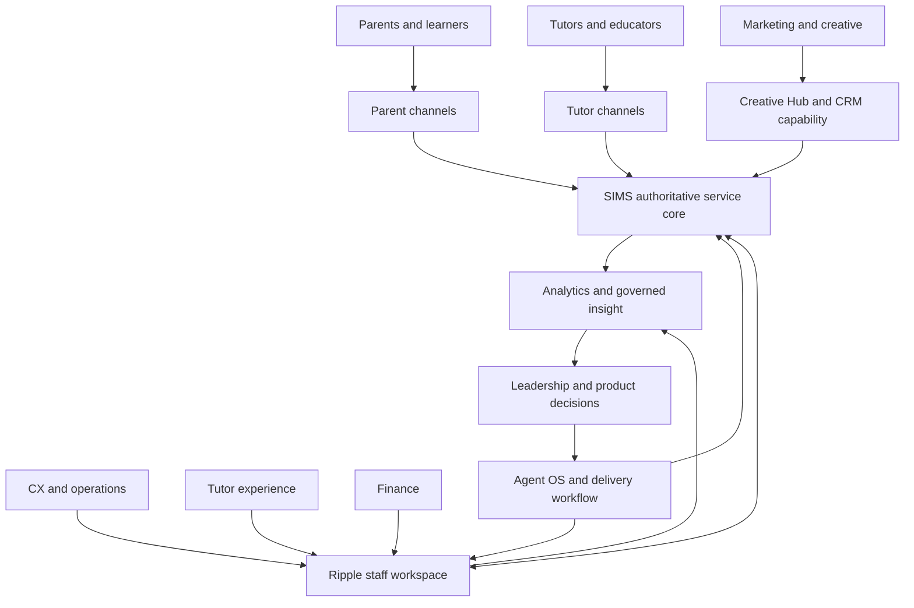

### Responsibility model

| Group | Core responsibility | Platform contribution | Human judgment retained |
|---|---|---|---|
| Parents and learners | State needs, participate and confirm service | Accurate requests, actions and feedback | Fit, satisfaction and learning priorities |
| Tutors | Maintain suitability, deliver classes and report | Availability, attendance, reports and service records | Teaching approach and learner response |
| CX and operations | Coordinate journeys and resolve exceptions | Case handling, follow-up and authoritative updates | Empathy, prioritisation and exception judgment |
| Tutor experience | Support educator quality and engagement | Profile, conduct, opportunity and payment context | Coaching, relationship and suitability judgment |
| Finance | Protect transaction integrity | Billing, collection, reconciliation and settlement control | Approval, exception treatment and compliance interpretation |
| Marketing and creative | Build relevant demand and brand consistency | Campaign context, content workflow and lead signals | Creative direction, audience judgment and brand stewardship |
| Product and engineering | Improve the operating system safely | Architecture, automation, integrations, tests and observability | Trade-offs, risk acceptance and design choices |
| Leadership | Set direction and allocate resources | Goals, KPI interpretation and governance | Strategy, commitments and market decisions |

The system guides decisions but does not remove accountable human ownership. This is particularly important for tutor suitability, financial exceptions, sensitive customer matters and AI-assisted outputs.

---

# Part II — Ecosystem architecture

## Chapter 5 — The platform-layer view

### In one minute

The ecosystem is organised in layers. People encounter simple channels at the top; specialised workflows and authoritative data sit beneath them; trust, recovery and delivery disciplines support every layer.

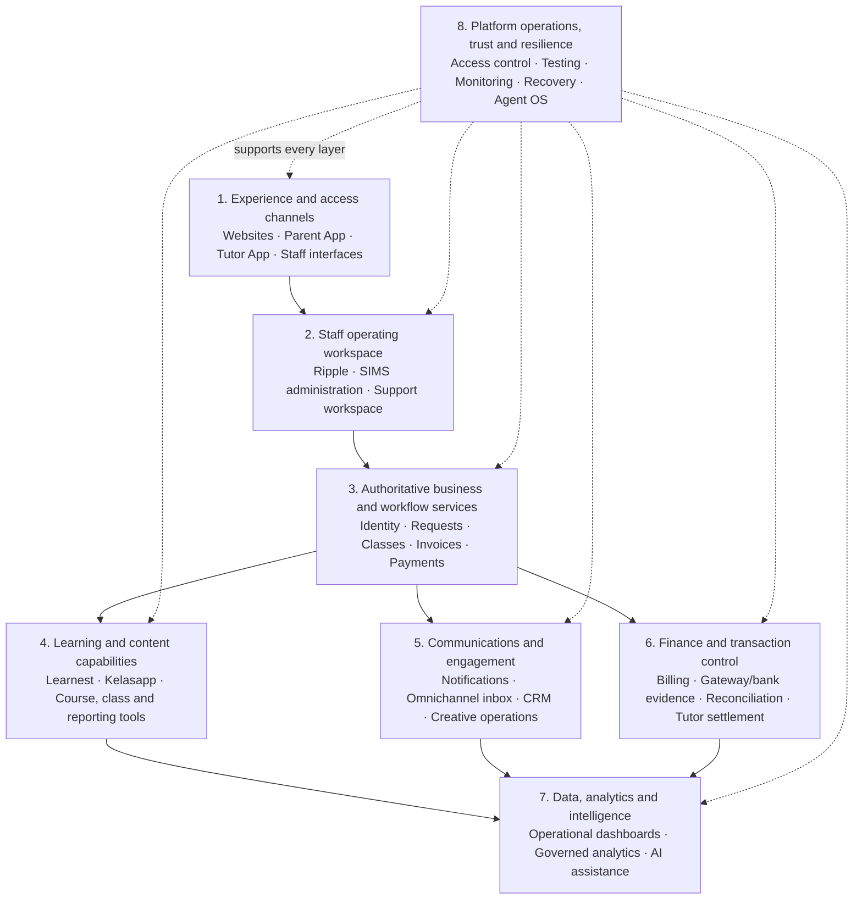

This view deliberately avoids publishing network addresses, credentials or sensitive topology. It explains responsibilities and information movement at stakeholder-safe depth.

## Chapter 6 — Information authority and system relationships

### In one minute

Connected systems do not all own the same truth. SIMS is authoritative for the core tutoring operation. Other systems either present that information, add a specialised workflow, own a distinct product domain or consume carefully governed data. Clear authority reduces duplicated truth and makes integrations safer.

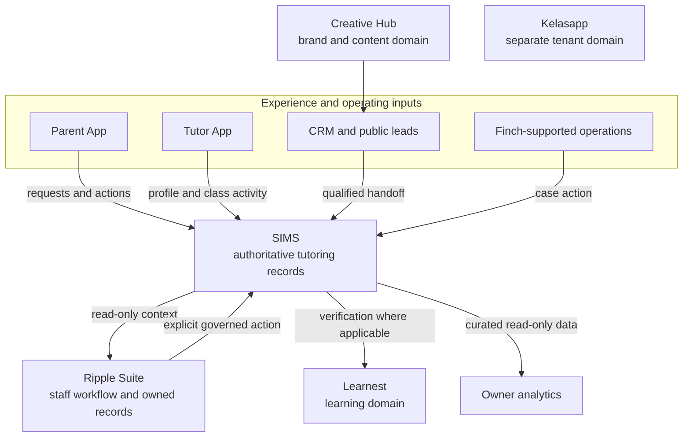

### Authority principles

1. **One authoritative source per core concern.** Core tutoring identities, requests, classes, invoices and payments are governed in SIMS. `[CLM-ARCH-001]`
2. **Specialised systems add workflow, not competing truth.** Ripple reads SIMS context and owns its own workspace records; controlled actions back to SIMS are explicit. `[CLM-ARCH-002]`
3. **Distinct products retain distinct domains.** Kelasapp, Learnest and Finch are not presented as extra SIMS modules; their own identities, tenancy or learning records remain bounded. `[CLM-ARCH-003]`
4. **Channels consume contracts.** Parent and tutor experiences use managed APIs rather than directly manipulating databases. `[CLM-ARCH-004]`
5. **Sensitive insight is curated.** Owner analytics uses narrow, read-only extraction and policy-controlled access rather than unrestricted production exploration. `[CLM-ANA-001]`
6. **Human approval remains at consequential transitions.** Financial exceptions, access changes and sensitive operational decisions retain accountable review. `[CLM-TRU-002]`

### Systems versus capabilities

A **system** is an owned product or application boundary, such as SIMS or the Parent App. A **capability** is an outcome that may cross several systems, such as matching, reconciliation or recovery. This distinction prevents a long application list from being mistaken for an end-to-end operating model.

---

# Part III — System and capability atlas

## Chapter 7 — Portfolio map by strategic role

### In one minute

The portfolio is easiest to understand by the job each system performs. The groups below are strategic roles, not a claim that every system shares one database, lifecycle or commercial model.

| Strategic role | Systems and surfaces | Primary contribution |
|---|---|---|
| **Core service operation** | SIMS | Authoritative tutoring identities, requests, classes, finance and operating administration |
| **Customer and educator experience** | Parent App, Tutor App, public Sifututor channels | Self-service access, actions, notifications and relationship continuity |
| **Staff leverage and intelligence** | Ripple Suite, owner analytics | Matching, accounts, reconciliation, payments, CRM, knowledge and governed decision support |
| **Learning and education products** | Learnest, Kelasapp | Digital learning and multi-tenant education-centre operations |
| **Communication and growth operations** | Finch, Creative Hub | Omnichannel conversation and organised brand/content operations |
| **Operational enablement** | Agent OS, observability, testing and recovery capabilities | Safer delivery, continuity, monitoring, evidence and organisational learning |
| **Distinct sister brand** | Nakngaji | Reuse approved operating capability while protecting separate brand, product and metric truth |
| **Future market optionality** | Future validated verticals and countries | Apply reusable foundations only after demand, service, trust and economic validation |

`[CLM-SYS-SIMS-001] [CLM-SYS-RIP-001] [CLM-SYS-MOB-001] [CLM-SYS-ADJ-001] [CLM-SYS-OPS-001]`

### Portfolio reading rule

“Inside the ecosystem” does not always mean “inside the same application.” It means the capability belongs to the broader operating and growth foundation. Some systems are authoritative, some are channels, some own a separate product domain and some support the teams that operate all of them.

## Chapter 8 — Core operating-system profiles

### 8.1 SIMS — Sifututor Information Management System

**Role in one sentence:** SIMS is the authoritative operational core for the live Sifututor tutoring service. `[CLM-SYS-SIMS-001]`

| Profile dimension | Detail |
|---|---|
| Users | Internal staff; parent and tutor channels through managed APIs |
| Core responsibilities | Tutor, parent and learner records; tutor requests; classes and attendance; invoices, payments and financial workflows; reports, notifications, roles and tickets |
| What it receives | Profile and request data, class activity, user actions, payment events and staff decisions |
| What it provides | Authoritative service state, workflow actions, API responses, reports, notifications and auditable transaction context |
| Important controls | Role-based permissions, typed business states, soft-delete handling, financial review rules, API-contract discipline, monitoring and release checks |
| Business value | One dependable operating backbone from service creation through financial administration |

**How it works.** Parent, learner, tutor, class and finance records meet in one domain. A tutor request can become an assignment and class; delivered activity can become verified service; verified service can feed billing and tutor-payment processes. This continuity reduces the need to reconstruct a journey from multiple unrelated tools.

**Technical depth.** SIMS is a modern web application with a server-side business layer, a typed browser interface and an API used by the mobile apps. Its modules cover operational, financial and supporting concerns. External payment, real-time communication and monitoring services connect through defined integration points. Exact infrastructure, credentials and sensitive topology are intentionally excluded.

**What it enables.** SIMS provides the stable contract on which specialised staff tools, mobile experiences, analytics and future service variants can build.

### 8.2 Ripple Suite — staff leverage around the authoritative core

**Role in one sentence:** Ripple is the staff workspace for high-leverage operations that require a focused view, specialised workflow or governed intelligence around SIMS. `[CLM-SYS-RIP-001]`

| Capability | Operating contribution |
|---|---|
| Matching | Ranks suitable tutor candidates and supports controlled opportunity outreach |
| Profiles | Creates consistent, usable tutor presentation material with assisted content workflows |
| Roles | Limits staff capabilities by permission and responsibility |
| Usage | Makes AI and API consumption visible for cost-aware operation |
| Rating | Organises tutor-conduct and quality signals for staff judgment |
| Accounts | Provides customer and tutor ledger context, ageing and controlled adjustments |
| Reconciliation | Helps identify bank or gateway evidence, match funds and handle exceptions |
| Knowledge Assistant | Answers staff questions through governed tools and approved data context |
| Tutor Payments | Supports commission calculation, payment preparation, slips and explicit handback to the core |
| CRM | Organises lead, task and pipeline context before operational handoff |

**System boundary.** Ripple does not replace SIMS. It reads the authoritative operational context, owns Ripple-specific records in its own domain and uses explicit, controlled transitions when a workflow must affect SIMS. This separation allows staff tools to evolve without turning the core database into an unrestricted workspace. `[CLM-ARCH-002]`

**Business value.** Ripple concentrates staff attention on decisions and exceptions. It reduces manual searching, makes transaction and matching context easier to interpret, and helps a lean team handle more work consistently.

### 8.3 Parent App — the family operating channel

**Role in one sentence:** The Parent App gives families a continuous, self-service relationship with the tutoring operation. `[CLM-SYS-MOB-001]`

| Journey area | Parent capability |
|---|---|
| Need and request | Submit or follow tutoring needs and associated learner context |
| Class relationship | View relevant class and schedule information |
| Verification | Review and approve attendance or service evidence where the workflow requires it |
| Finance | See invoices and complete supported payment actions |
| Communication | Receive timely notifications and reach support |

The app is a channel, not a duplicate source of truth. It uses authenticated API contracts with SIMS, receives relevant real-time or push updates and protects sensitive authentication material using platform-appropriate secure storage.

### 8.4 Tutor App — the educator operating channel

**Role in one sentence:** The Tutor App connects educators to opportunities, service delivery and earnings-related administration. `[CLM-SYS-MOB-002]`

| Journey area | Tutor capability |
|---|---|
| Profile and service preferences | Maintain information used to understand suitability and availability |
| Opportunities | Discover and respond to relevant tutoring needs |
| Class operation | Access schedules, attendance and reporting actions |
| Earnings | View relevant payment and settlement information |
| Communication | Receive operational notifications and updates |

The app uses typed API access, token-based authentication, managed server-state caching, push notification and error-observability capabilities. These are technical means to a business outcome: less uncertainty between opportunity, delivery and payment.

### 8.5 Public Sifututor channels

**Role in one sentence:** Public web and store channels establish trust, explain the offer and bring parents and tutors into the appropriate operating journey.

The official Sifututor website describes nationwide home and online tutoring and publicly displays a 4.9 Google rating with more than 2,600 parent reviews as of 26 August 2026. Official app-store listings provide independent distribution evidence for the parent and tutor channels. These are attributed public statements, not blended with internally governed active-user definitions. `[CLM-PUB-001] [CLM-PUB-002]`

## Chapter 9 — Learning, communication and growth-system profiles

### 9.1 Learnest — digital learning capability

**Role in one sentence:** Learnest extends the ecosystem from service administration into structured digital learning. `[CLM-SYS-ADJ-001]`

Learnest supports course and lesson management, video learning, quizzes and assessments, live classes, learner progress, parent visibility, tutor content workflows, moderation, billing and AI-assisted learning. It serves student, tutor, parent and administrative roles through a web and API-based product architecture.

Its connection to the broader ecosystem is purposeful rather than indiscriminate: Sifututor identity or student verification can be used where applicable, while learning content, enrolment and progress remain Learnest-domain concerns.

**Business value:** the relationship can extend beyond matching and administration into repeatable learning experiences, content and learner engagement.

### 9.2 Kelasapp — education-centre operating product

**Role in one sentence:** Kelasapp packages education operations for multiple independent organisations, demonstrating that the platform capability can be expressed as a tenant-aware product. `[CLM-SYS-KEL-001]`

| Domain | Capability |
|---|---|
| Organisation foundation | Tenant-scoped identity, access and operating data |
| Academic operation | Classes, teachers, learners, guardians and enrolments |
| Delivery evidence | Attendance, reports and document outputs |
| Finance | Family billing, invoices, receipt submission and verification |
| Educator administration | Teacher-pay calculation and related records |
| Market readiness | English and Malay interfaces and Malaysian date/money conventions |

Kelasapp keeps each organisation’s data separated and its money calculations precise. It is a separate product domain, not merely an extra page inside SIMS. Its value to the ecosystem is both commercial and architectural: it proves that reusable education-operation patterns can serve organisations beyond Sifututor’s one-to-one tutoring model.

### 9.3 Finch — omnichannel conversation capability

**Role in one sentence:** Finch brings customer conversations from multiple channels into one accountable workspace. `[CLM-SYS-FIN-001]`

Finch is designed around multi-brand, multi-tenant conversation handling across channels such as WhatsApp, email and social messaging. Its core concepts—conversation ownership, tenant separation, agent roles, real-time updates and channel integration—turn communication into an operating record rather than an isolated inbox.

Within the Sifututor ecosystem, this capability supports faster context gathering and more consistent handoff between conversation and service action. As a distinct product, it also represents potential external SaaS value. Only established, evidenced capabilities should be described as current in audience-specific extracts; commercial rollout details require a current owner review.

### 9.4 Creative Hub — organised brand and content operations

**Role in one sentence:** Creative Hub turns creative work into a visible, brand-aware process for Sifututor and Nakngaji. `[CLM-SYS-CRE-001]`

It organises work from request through creation, review, approval and asset management; maintains structured brand context; and connects ideas, hooks, scripts, calendars, content inventory and trend signals. Assisted generation is designed to respect audience, tone and brand pillars rather than produce context-free content.

**Business value:** creative output becomes easier to coordinate, reuse and evaluate, strengthening the loop from market signal to content and back to demand.

### 9.5 Nakngaji — distinct sister brand, shared strategic learning

**Role in one sentence:** Nakngaji is a distinct education brand that may benefit from shared operating capability without losing separate brand, product and metric truth. `[CLM-BRD-001]`

The sourcebook deliberately does not combine Sifututor and Nakngaji users, reviews, operating history or product behaviour. Reusable capabilities—such as content operations, communication, finance patterns, learning workflows and platform governance—can create leverage across brands, but every external claim must retain its correct owner and evidence.

### 9.6 Customer-evidence capture — controlled capability

Privacy-aware call and interaction capture is treated as a controlled capability rather than a universally deployed system. Its strategic value is to preserve customer evidence, improve coaching and reduce lost context, while consent, access, retention and device controls determine whether and where it is appropriate. `[CLM-CAP-CX-001]`

## Chapter 10 — Intelligence, delivery and operational enablement

### 10.1 Owner analytics — governed insight, not unrestricted access

**Role in one sentence:** Owner analytics provides controlled, read-only decision support over curated operating data. `[CLM-ANA-001]`

The design separates analytics from unrestricted production access. Narrow extraction, reviewed datasets and tools, policy-controlled queries, fail-closed audit behaviour, rate and concurrency limits, private connectivity and recovery controls create a safer path from operational data to leadership questions.

This matters because analytics maturity is not measured only by dashboard count. It is measured by whether people can obtain useful answers while preserving authority, privacy, traceability and platform health.

### 10.2 Agent OS — the organisation’s delivery and learning layer

**Role in one sentence:** Agent OS is the working system that helps leadership, human contributors and AI agents plan, build, verify, remember and hand work over safely. `[CLM-SYS-OPS-001]`

| Component | Contribution |
|---|---|
| Working agreements and playbooks | Make repeatable workflows explicit |
| Task routing and approval boundaries | Direct work to the correct process and preserve human control |
| Verification, QA and review | Require evidence proportionate to user and business risk |
| GitHub and mission tracking | Separate execution-ready work from larger strategic goals |
| Koda memory and session continuity | Preserve durable decisions and lessons across sessions |
| Guardrails | Prevent accidental secret access, unsafe releases and scope drift |
| Human–AI collaboration | Increase throughput while keeping ownership, evidence and review visible |

Agent OS contributes to capital efficiency because it reduces rediscovery and makes disciplined engineering repeatable. It is one contributor among architecture, automation, staff expertise and operating knowledge—not a claim that AI alone created the platform.

### 10.3 Observability, testing and recovery as shared capabilities

Monitoring, error tracking, logs, performance visibility, automated tests, human-journey checks, guarded release practices and recovery procedures span products rather than belonging to one screen. SIMS, for example, uses application performance monitoring, error tracking and uptime/log visibility. The wider operating model also maintains off-server protected recovery evidence and monitors backup health. `[CLM-TRU-001] [CLM-RES-001]`

These capabilities make platform health actionable:

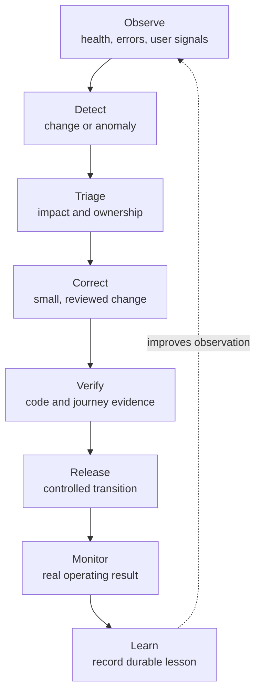

---

# Part IV — Platform health and operating maturity

## Chapter 11 — Trust, governance and resilience

### In one minute

A live platform is healthy when it can prevent avoidable harm, detect abnormal behaviour, continue or recover from disruption and learn without losing accountability. Trust is therefore an operating capability, not a policy page added after product development.

### The trust model

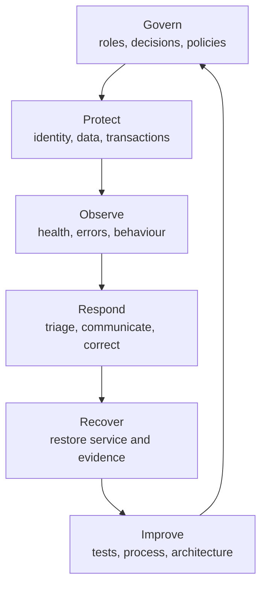

This aligns with the practical logic of the NIST Cybersecurity Framework 2.0—govern, identify, protect, detect, respond and recover—without claiming formal certification. `[CLM-STD-001]`

### Control families

| Control family | How it appears in the ecosystem | Business protection |
|---|---|---|
| Identity and access | Authenticated channels, staff roles, permissions, tenant boundaries and narrow service access | Reduces inappropriate access and cross-customer exposure |
| Data authority | Defined sources of truth, read-only replicas, explicit write paths and domain separation | Prevents competing records and accidental corruption |
| Transaction integrity | Typed states, idempotent/reviewed transitions, reconciliation and financial approval | Protects invoices, payments, allocations and settlements |
| Privacy and responsible data use | Purpose limitation, controlled analytics, consent-sensitive evidence and restricted sharing | Supports customer trust and PDPA-aligned practice |
| Secure delivery | Code review, tests, human-journey evidence, guarded releases and monitoring | Reduces regressions reaching live users |
| Observability and incident response | Error, log, uptime and performance signals with accountable triage | Shortens detection and recovery time |
| Backup and recovery | Multiple protected components, off-server copies, restore evidence and health monitoring | Reduces the risk that a disruption becomes irreversible loss |
| AI governance | Human-controlled consequential decisions, approved tools/context, usage visibility and explainability | Creates leverage without hiding responsibility |

`[CLM-TRU-001] [CLM-TRU-002] [CLM-RES-001] [CLM-AI-001]`

### Privacy and compliance direction

Sifututor should describe its posture as **compliance-aware and evidence-led**, not self-certify legal conclusions in a platform sourcebook. Malaysia’s Personal Data Protection framework, the Data Protection Officer requirements, breach-notification expectations, cross-border data considerations, e-Invoice obligations and the Gig Workers Act may affect different parts of the operation depending on current thresholds and legal interpretation. Formal applicability and filings must be confirmed by the responsible owner or qualified adviser. `[CLM-REG-001] [CLM-REG-002] [CLM-REG-003]`

The durable platform implication is clear: maintain data ownership, purpose, access, retention, transaction evidence, incident handling and change history in a form that can support compliance decisions.

### Responsible AI principles

AI can assist matching interpretation, profile or content drafting, knowledge retrieval, classification and analysis. It should not disguise uncertainty or become the unreviewed authority for consequential outcomes.

The ecosystem direction follows four rules:

1. approved data and tools only;
2. human accountability at consequential decisions;
3. traceable and understandable outputs;
4. cost, quality and risk monitoring.

These principles are consistent with Malaysia’s national AI governance guidance and international risk-based practice, without claiming external assurance. `[CLM-AI-001]`

### Recovery evidence

Sifututor has demonstrated composed recovery of the SIMS production service across seven protected components, supported by off-server object-lock protection and backup-health monitoring. This is a point-in-time operating proof, not a guarantee against every scenario; periodic restore evidence keeps the capability credible. `[CLM-RES-001]`

## Chapter 12 — Platform Maturity Built Through Live Operations

### In one minute

Maturity is the accumulated ability to operate reliably, improve deliberately and reuse capability—not the age of a codebase or a self-awarded score. Sifututor’s maturity comes from live service experience since 2018, the May 2025 SIMS transition and the connected operating capabilities built around it.

### Capability progression

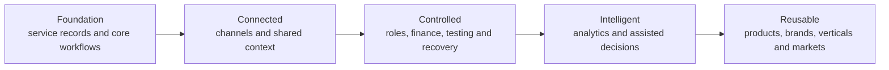

Not every capability sits at the same point. Unlabelled final-column statements describe leverage already supported by established foundations; entries marked **Strategic direction** are future leverage governed by the cited roadmap evidence gate; and entries marked **Current proof concludes at business value** name the highest evidenced stage before describing the next validation. A mature organisation can honestly operate a strong controlled core while validating newer reuse. The purpose is to show what has been learned and what comes next, not to create a uniform maturity score.

### Maturity dimensions

| Dimension | Foundation established | Capability expanded | Business value created | Highest supported leverage or strategic direction |
|---|---|---|---|---|
| Service lifecycle | Core participant and class records | Connected request-to-verification workflows | Consistent journey and clearer ownership | New service variants can reuse the lifecycle |
| Financial integrity | Billing and payment records | Gateway/bank evidence, accounts, reconciliation and settlement workflows | More traceable collections and payments | **Strategic direction:** shared finance primitives where product and regulatory rules permit (`H4-C02`) |
| Experience | Staff administration | Dedicated parent, tutor and specialised staff channels | Lower friction and more self-service | Audience-specific experiences without duplicating truth |
| Data and insight | Operational reports | Curated analytics and knowledge tools | Faster, better-context decisions | **Strategic direction:** governed cross-product semantics and intelligence (`H3-C01`) |
| Reliability | Manual operating knowledge | Monitoring, tests, guarded delivery and composed recovery | Reduced interruption and regression risk | Repeatable reliability patterns for new systems |
| Organisational learning | Individual know-how | Playbooks, memory, evidence and review through Agent OS | Less rediscovery and safer iteration | **Current proof concludes at business value.** Next leverage: extend repeatable human–AI collaboration as the portfolio grows (`H3-C06`) |
| Product architecture | One tutoring operation | Distinct but connected learning, centre and communication products | More ways to create value from shared knowledge | **Current proof concludes at business value.** Next leverage: validate reuse across products, verticals and markets (`H4-C02`, `H5-C03`) |

`[CLM-MAT-001]`

### Why live operation matters

A prototype can demonstrate features. A live system must handle incomplete information, permissions, retries, schedule changes, support cases, transaction exceptions, mobile contracts, releases and recovery. Years of real operation convert these situations into business rules and controls. That is why the strongest proof of maturity is the completeness of the operating loop and the evidence behind it—not a claim that everything is finished.

---

# Part V — Business leverage and measurement

## Chapter 13 — Capital-efficient capability and business impact

### In one minute

Sifututor has built broad operating capability with a lean organisation and without relying on a conventional large funded technology-team model. The strongest claim is capital efficiency: systems, operating knowledge, automation and disciplined delivery allow the company to coordinate more complexity than headcount alone would suggest. `[CLM-CAP-001]`

### How capability becomes value

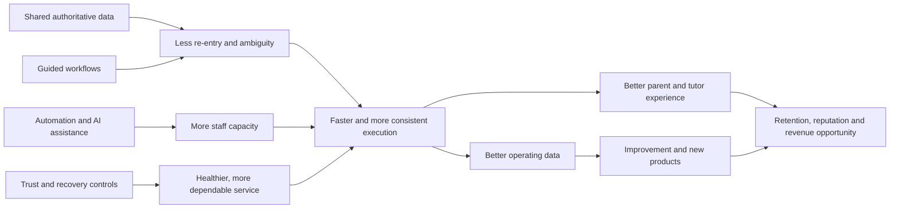

### Impact map

| Platform capability | Operational effect | Customer or tutor effect | Business effect |
|---|---|---|---|
| Authoritative service core | Less duplicated truth and clearer ownership | More consistent status and support | Lower coordination cost and risk |
| Matching workspace | Faster candidate interpretation and outreach | Quicker access to relevant options | Better fulfilment capacity and demand use |
| Mobile self-service | Fewer routine information handoffs | Convenient, timely actions | Greater service capacity without equal staff growth |
| Verification and reporting | Clearer evidence of delivered service | Better visibility and confidence | Stronger billing basis and dispute handling |
| Reconciliation and accounts | More structured exception work | Clearer payment outcomes | Better cash visibility and financial integrity |
| Tutor-payment workflow | Repeatable settlement preparation | More dependable educator administration | Supply trust and lower processing burden |
| Omnichannel context | Fewer fragmented conversations | Faster, more informed support | Better resolution and relationship continuity |
| Analytics and knowledge tools | Shorter search and interpretation time | Indirectly better decisions and service | Faster learning and management attention |
| Monitoring, tests and recovery | Earlier detection and safer change | Fewer avoidable disruptions | Revenue protection and reduced recovery cost |
| Reusable product patterns | Less reinvention | New experiences can launch on known foundations | Expansion options with lower marginal build cost |

### A credible capital-efficiency statement

Use this wording in stakeholder material:

> Sifututor has developed a broad end-to-end operating foundation through a lean, capital-efficient model. Its leverage comes from years of live operating knowledge encoded into connected systems, disciplined architecture, automation, governed AI assistance and repeatable delivery controls. `[CLM-CAP-001]`

Avoid absolute comparisons such as “more advanced than every funded competitor” unless an independently defined benchmark and current evidence exist.

### Revenue impact without confidential finance

The sourcebook does not disclose revenue, margin or cost allocation. It explains the mechanisms through which platform health can affect revenue:

- more qualified requests can be processed without proportional coordination growth;
- faster and better-informed matching can improve fulfilment opportunity;
- clearer delivery and verification can shorten the path to accurate billing;
- better reconciliation can reduce unidentified or delayed collections;
- dependable tutor administration can support supply retention;
- responsive support and transparent status can improve trust and retention;
- reusable foundations can reduce the cost and time of validated product expansion.

These are causal pathways to measure, not a claim that technology alone caused a specific financial result.

## Chapter 14 — KPI framework: health, efficiency, trust and growth

### In one minute

The ecosystem should be measured as a balanced service system. A single number—registered users, revenue or uptime—cannot explain whether demand is fulfilled, classes are delivered, money is correct and customers trust the experience.

### Balanced KPI architecture

| Category | Core question | Example indicators | Interpretation guardrail |
|---|---|---|---|
| Demand | Are we attracting relevant needs? | Qualified request volume, source quality, request completeness | Do not count raw leads as fulfilled demand |
| Supply | Do we have suitable and responsive educators? | Verified/eligible tutor pool, response, availability coverage | Define registered, verified, eligible and active separately |
| Matching | Can demand and supply meet efficiently? | Time to shortlist, contact rate, fulfilment, rematch | Segment by mode, subject, level and geography |
| Delivery | Is the service happening as intended? | Scheduled-to-delivered ratio, attendance, report timeliness | Exclude cancellations or reschedules using agreed definitions |
| Trust and quality | Do users experience a dependable service? | Verification turnaround, dispute/complaint rate, rating and resolution | Attribute reviews to brand, channel and as-of date |
| Finance | Does service become accurate cash movement? | Billing cycle time, collection, unidentified funds, reconciliation age, payment timeliness | Use controlled finance definitions and owner-approved access |
| Platform health | Can the ecosystem sustain service? | Availability, error rate, job/queue health, recovery evidence, change-failure signals | Pair technical health with user-journey health |
| Efficiency | Is capacity increasing without equal coordination cost? | Touches per journey, automation coverage, handling time, exception rate | Avoid interpreting speed as quality without outcome checks |
| Learning | Are learners engaging and progressing? | Lesson/course engagement, assessment, class/report continuity | Use product-appropriate learning definitions |
| Growth | Is value compounding? | Retention, referral, repeat request, product adoption, expansion validation | Separate interest, trial, active use and paid adoption |

### Metric definition standard

Every metric shown externally or across departments should record:

1. business definition;
2. inclusion and exclusion rules;
3. source system and owner;
4. calculation and time window;
5. update frequency;
6. segmentation allowed;
7. quality caveat;
8. as-of date.

For people metrics, never interchange these terms:

| Term | Meaning |
|---|---|
| Registered | An account or record exists |
| Verified | Required identity or qualification checks are complete under the current policy |
| Eligible | The person currently satisfies the rules for a particular opportunity or action |
| Active | The person meets a defined recent-activity window |
| Served | The person has participated in a defined completed service |
| Cumulative | Counted across the full stated historical window, with duplicate policy defined |

`[CLM-MET-001]`

### Recommended ecosystem scorecard

A leadership scorecard should combine a small set from each causal layer:

> **Healthy platform → efficient operation → trusted service → sound finance → sustainable growth**

Targets belong in a controlled planning instrument, not this evergreen sourcebook. This document defines the measurement system; leadership sets current targets using verified baselines and strategic priorities.

---

# Part VI — Milestones and strategic direction

## Chapter 15 — Milestones: from service operation to reusable platform

### In one minute

Milestones should show durable changes in capability, not a feed of releases. The two-track view below links what the business learned to what the platform became capable of doing.

### Business and service milestones

| Milestone ID | Period | Durable milestone | Why it matters |
|---|---|---|---|
| M-B01 | 2018 | Live Sifututor service operation begins | Establishes real customer, educator and operating experience |
| M-B02 | 2018–2024 | Repeat operating cycles refine the service model | Turns exceptions and staff knowledge into reusable business rules |
| M-B03 | May 2025 | The new SIMS generation becomes the live operating core | Creates a stronger authoritative foundation for connected workflows |
| M-B04 | Post-launch era | Parent, tutor and staff experiences deepen around the core | Extends capability without duplicating the source of truth |
| M-B05 | Platform era | Learning, centre operations, communication and creative capabilities form a wider portfolio | Creates strategic options beyond one tutoring workflow |

### Technology and operating-capability milestones

| Milestone ID | Durable milestone | Proof represented |
|---|---|---|
| M-T01 | Authoritative tutoring lifecycle | Identity, request, class, verification, billing and payment state can be governed coherently |
| M-T02 | Dedicated participant channels | Parents and tutors can act through purpose-built mobile experiences |
| M-T03 | Specialised staff leverage | Matching, accounts, reconciliation, payments, CRM and knowledge workflows surround the core |
| M-T04 | Observable and recoverable operation | Health signals, testing, release controls and composed recovery support live service |
| M-T05 | Governed analytics and AI assistance | Useful questions and assisted work can occur through controlled tools and human review |
| M-T06 | Reusable product patterns | Learning, multi-tenant centre operation and omnichannel communication extend the platform portfolio |

`[CLM-HIS-001] [CLM-HIS-002] [CLM-MAT-001]`

### Dual-track milestone timeline

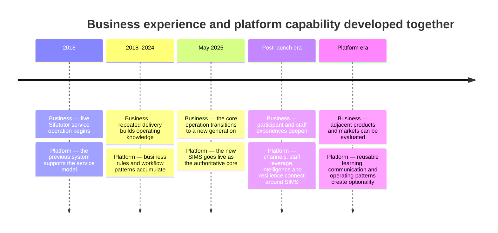

### Milestone maintenance rule

Add a milestone only when it changes a durable company capability, operating model, audience or strategic option. Feature releases, temporary status and percentages belong in product delivery records. Each future milestone entry must include a date or period, owner-approved wording and an evidence claim.

## Chapter 16 — Strategic goals

### Governing goal

> **Consolidate the operating spine, then multiply its value across users, brands, products, verticals and markets.** `[CLM-ROAD-001]`

### Goal framework

| Goal ID | Strategic goal | Desired outcome | Evidence families |
|---|---|---|---|
| G-01 | Protect the trusted operating spine | Core service and finance remain authoritative, observable and recoverable | Platform health, transaction integrity, recovery, access reviews |
| G-02 | Complete connected user journeys | Parents, tutors and staff move through fewer fragmented handoffs | Journey completion, handling time, verification and support outcomes |
| G-03 | Increase staff leverage responsibly | Automation and AI reduce repetitive work while humans own consequential decisions | Capacity, exception rate, quality, usage/cost and audit evidence |
| G-04 | Turn data into governed action | Leadership and teams receive timely, explainable and permission-appropriate insight | Decision latency, data confidence and action follow-through |
| G-05 | Reuse capability across products and brands | Shared foundations reduce reinvention while preserving domain and metric truth | Reuse, integration time, independent product health |
| G-06 | Validate expansion before committing scale | New countries or verticals progress through evidence-based gates | Problem validation, regulatory fit, unit economics, pilot outcomes |
| G-07 | Keep the sourcebook trustworthy | Stakeholder knowledge remains current, attributable and safe to share | Review cadence, claim freshness and unresolved evidence exceptions |

Goals are durable outcomes. The roadmap describes the order in which capability should compound toward them.

# Part VII — Detailed strategic roadmap

## Chapter 17 — Roadmap overview: five strategic horizons

### In one minute

The roadmap is capability-led rather than date-led. Each horizon creates prerequisites for the next, while independent learning can occur in parallel. This communicates direction without promising a launch schedule that daily delivery may overtake.

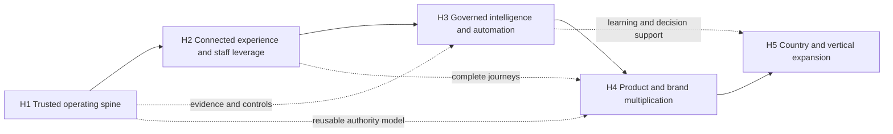

| Horizon | Strategic question | Outcome |
|---|---|---|
| H1 — Trusted operating spine | Is the core dependable, governed and measurable? | A healthy foundation that can carry growth |
| H2 — Connected experience and staff leverage | Can each participant complete the journey with less friction? | Greater capacity and more consistent service |
| H3 — Governed intelligence and automation | Can data and AI improve decisions without losing control? | Faster learning and selective automation |
| H4 — Product and brand multiplication | Can trusted capabilities be reused without creating coupled products? | More value from the same operating knowledge |
| H5 — Country and vertical expansion | Can the model adapt to a new market while preserving local fit? | Evidence-led expansion options |

### Roadmap reading rules

- Horizons are strategic sequence, not calendar quarters.
- A capability may begin discovery early but should not scale before its dependencies are proven.
- Current-capability claims remain in the system atlas; roadmap entries remain directional until promoted through evidence governance.
- Leadership can add dates in a separate execution plan after resourcing, regulatory and market decisions.

## Chapter 18 — Detailed capability roadmap

### H1 — Trusted operating spine

**Intent:** strengthen the authoritative core and the controls that protect service continuity, money, data and change.

| Roadmap ID | Capability direction | Primary value | Dependency | Evidence to advance |
|---|---|---|---|---|
| H1-C01 | Unified service-state and definition governance | Fewer ambiguous records and metrics | Named data and process owners | Approved dictionary, authority map and sampled consistency |
| H1-C02 | End-to-end financial control evidence | More traceable bill-to-collect-to-pay movement | Stable invoice/payment states and reconciliation ownership | Exception ageing, reconciliation evidence and reviewed controls |
| H1-C03 | Identity, role and access review across systems | Appropriate access as the portfolio grows | Current system/role inventory | Periodic review evidence and removal workflow |
| H1-C04 | Resilience by design across critical services | Faster recovery and lower irreversible-loss risk | Service criticality and recovery ownership | Restore exercises, recovery objectives and monitored protection |
| H1-C05 | Shared observability and journey health | Earlier detection of user-impacting failure | Defined critical journeys and telemetry | Alerts mapped to journeys, response ownership and review history |
| H1-C06 | Privacy and regulatory evidence model | Readiness for changing obligations and markets | Data inventory, processing purpose and adviser input | Approved records, decisions and response procedures |

### H2 — Connected experience and staff leverage

**Intent:** reduce friction between request, fulfilment, delivery, finance and support while keeping one authority model.

| Roadmap ID | Capability direction | Primary value | Dependency | Evidence to advance |
|---|---|---|---|---|
| H2-C01 | Parent journey continuity | More self-service and fewer status enquiries | H1-C01, reliable mobile/API contracts | Journey completion and support-contact reduction |
| H2-C02 | Tutor opportunity-to-payment continuity | Better educator clarity and trust | H1-C02, H1-C05 | Opportunity, class and payment journey evidence |
| H2-C03 | Staff work orchestration across matching, CX and finance | Less searching and re-entry | Authority map and role model | Handling time, handoff and exception measures |
| H2-C04 | Conversation-to-record linkage | Better support context and accountable follow-up | Tenant/privacy rules and case ownership | Resolution quality and sampled linkage accuracy |
| H2-C05 | Consistent notification and preference governance | Timely communication without avoidable noise | Event taxonomy and user preferences | Delivery, action and opt-out evidence |
| H2-C06 | Operational knowledge at the point of work | Faster answers with less tribal dependency | Approved documentation and permissions | Answer quality, escalation and source traceability |

### H3 — Governed intelligence and automation

**Intent:** convert trustworthy operational data into explainable recommendations and controlled action.

| Roadmap ID | Capability direction | Primary value | Dependency | Evidence to advance |
|---|---|---|---|---|
| H3-C01 | Curated operating semantic layer | Consistent analytics across teams | H1-C01 and KPI ownership | Reconciled definitions and report parity |
| H3-C02 | Proactive service-health and exception signals | Earlier intervention | H1-C05 and sufficient event quality | Precision, recall, response and prevented-impact evidence |
| H3-C03 | Assisted matching and fulfilment decisions | Faster, more consistent candidate review | Documented suitability rules and human review | Outcome quality, fairness and override analysis |
| H3-C04 | Assisted finance and support triage | More attention on genuine exceptions | H1-C02, H2-C04 | Accuracy, auditability and controlled fallback |
| H3-C05 | Responsible action automation | Selective straight-through processing | H1-C03, explainability and rollback | Idempotency, exception containment and approval evidence |
| H3-C06 | Portfolio-level usage and value governance | Sustainable AI/tool economics | Capability-level cost and outcome measures | Cost per useful outcome, quality and owner decisions |

### H4 — Product and brand multiplication

**Intent:** reuse proven foundations while allowing each product and brand to own its user promise and data truth.

| Roadmap ID | Capability direction | Primary value | Dependency | Evidence to advance |
|---|---|---|---|---|
| H4-C01 | Shared identity and entitlement patterns | Easier cross-product access where appropriate | H1-C03 and privacy model | Consent, access and support evidence |
| H4-C02 | Reusable education-service primitives | Lower marginal build cost | Stable request, schedule, delivery and finance contracts | Reuse without core regression or domain leakage |
| H4-C03 | Sifututor-to-Learnest learning pathways | Longer learner relationship | Product proposition and identity boundary | Engagement and learning-outcome evidence |
| H4-C04 | Kelasapp productisation | Serve independent education organisations | Tenant isolation, billing and onboarding readiness | Safe tenant pilots and repeatable onboarding |
| H4-C05 | Finch external productisation | Turn communication capability into independent SaaS value | Tenant safety, subscription and channel readiness | Paying-tenant retention and supportability |
| H4-C06 | Brand-safe shared operations for Nakngaji | Shared efficiency without blended truth | Brand ownership and separate measurement | Brand-specific outcomes and governed reuse |

### H5 — Country and vertical expansion

**Intent:** adapt the operating model through validated modules rather than copy the Malaysian implementation unchanged.

| Roadmap ID | Capability direction | Primary value | Dependency | Evidence to advance |
|---|---|---|---|---|
| H5-C01 | Country configuration layer | Localise language, currency, tax, payment and policy | H1 governance, H4 reusable boundaries | Country readiness assessment and controlled pilot |
| H5-C02 | Multi-market operating model | Clear ownership and service quality across regions | Local partners, support model and observability | Service-level and escalation evidence |
| H5-C03 | Vertical service template | Reuse request-to-settlement for other expert services | H4-C02 and validated vertical demand | Pilot completion, fit and unit economics |
| H5-C04 | Provider credential and safeguarding variants | Fit trust rules to tutor, coach, music and faith-learning contexts | Legal/policy design and identity capability | Approved controls and participant confidence |
| H5-C05 | Market-learning feedback loop | Compare outcomes without forcing false uniformity | Consistent KPI core plus local definitions | Reliable cohort and market comparisons |

### Cross-horizon dependency rules

1. H3 automation may recommend before it acts; action automation requires H1 authority, access and rollback controls.
2. H4 reuse should extract stable patterns, not share databases by convenience.
3. H5 discovery may run early, but launch commitments require regulatory, service, partner and economic gates.
4. No horizon is complete merely because software exists; operating ownership and evidence are part of capability.

# Part VIII — Expansion opportunity

## Chapter 19 — Expansion readiness: countries, products and verticals

### In one minute

The ecosystem is structurally ready to evaluate expansion because it already separates channels, workflow, finance, communications, learning, analytics and trust capabilities. Readiness means the foundation can be adapted; it does not mean every market requirement is already solved.

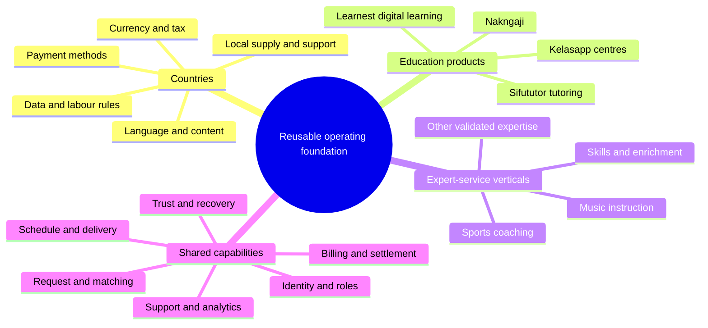

### Expansion capability matrix

| Capability | Reusable core | Must be localised or revalidated |
|---|---|---|
| Demand and request | Structured need capture, channel pattern | Language, category taxonomy, acquisition channel |
| Provider matching | Eligibility, preference, availability and ranking pattern | Credential, safeguarding, geography and fairness rules |
| Scheduling and service evidence | Participants, session, attendance and reporting pattern | Time zone, service norms and cancellation policy |
| Finance | Invoice, payment evidence, reconciliation and settlement pattern | Currency, tax, gateway, invoicing and provider classification |
| Communication | Omnichannel case and notification pattern | Channel popularity, consent and messaging regulation |
| Analytics | KPI governance and controlled insight pattern | Local definitions, benchmarks and regulatory restrictions |
| Trust | Access, audit, testing, monitoring and recovery pattern | Local privacy, employment/gig, education and consumer rules |

### Expansion decision gates

| Gate | Question | Minimum evidence |
|---|---|---|
| 1. Problem | Is there a material, underserved coordination need? | Interviews, demand signals and current alternatives |
| 2. Service fit | Does the value chain fit the local or vertical workflow? | Mapped journey, exceptions and participant responsibilities |
| 3. Trust and regulation | Can the service be operated lawfully and responsibly? | Adviser-reviewed obligations and control plan |
| 4. Supply and partnership | Can suitable providers and support capacity be established? | Recruitment/partner evidence and quality model |
| 5. Economics | Can the model create sustainable value? | Owner-approved unit-economics assumptions and sensitivity |
| 6. Pilot | Does a bounded live cohort achieve quality and operational outcomes? | Defined cohort, scorecard, incident/feedback record |
| 7. Scale | Are systems and operating owners ready for repeatability? | Capacity, recovery, support, finance and governance proof |

Sports coaching and music instruction are useful illustrations because they share a recognisable pattern—expert discovery, suitability, schedule, service verification, billing, settlement and support. They should enter the roadmap only after validation of vertical-specific safety, credential and service requirements. `[CLM-EXP-001]`

# Part IX — Sourcebook governance

## Chapter 20 — Sourcebook governance and future updates

### In one minute

The sourcebook remains credible only if it changes more slowly than daily delivery but quickly enough to reflect durable milestones.

### Governance model

| Responsibility | Accountable role |
|---|---|
| Narrative and strategic direction | Leadership |
| System and capability accuracy | Named product/system owner |
| KPI definitions and financial wording | Data/finance owner as applicable |
| Privacy, regulatory and shareability review | Responsible owner and qualified adviser where needed |
| Architecture and resilience evidence | Platform/engineering owner |
| Editorial integrity and claim register | Document owner |

### Review triggers

Perform the scheduled six-month review and also review after:

- a new authoritative system or major domain boundary;
- a material product, country or vertical launch;
- a major change to finance, privacy, identity or analytics responsibility;
- a new externally used scale or outcome claim;
- a resilience exercise that changes the approved evidence;
- a material rebrand, acquisition, retirement or portfolio change.

### Change procedure

1. Identify the affected chapter, visual, glossary term and claims.
2. Verify the evidence with the responsible owner.
3. Update the evidence register first.
4. Change narrative and diagrams without inserting temporary delivery status.
5. Re-run the terminology, sensitive-detail, chapter and link checks.
6. Obtain a fresh adversarial review for material changes.
7. Record the review date and release the approved audience version.

### Audience-safe extraction

Before sharing an excerpt, the owner should confirm:

- the audience may see the relevant classification;
- no internal file path, non-public topology or operating instruction is included;
- metrics retain definitions, attribution and as-of dates;
- roadmap language remains directional;
- separate brands and product domains remain distinguishable;
- the excerpt preserves enough context to avoid a misleading interpretation.

---

# Reference appendices

## Appendix A — Glossary

| Term | Plain-language definition |
|---|---|
| Agent OS | Sifututor’s operating layer for human–AI planning, delivery, verification, memory and governance |
| API | A managed contract that allows one application to request data or action from another |
| Authoritative system | The approved source that owns the current business truth for a defined concern |
| Capability | An outcome the organisation can repeatedly produce, often using several systems and teams |
| Capital efficiency | Creating and operating useful capability with disciplined use of financial and human resources |
| Channel | A user-facing route into a service, such as a mobile app, website or inbox |
| Composed recovery | Restoring a service by recovering all required components together, not only one database or file |
| CRM | Customer relationship management: organised lead, relationship, task and pipeline context |
| Domain | A bounded business area with its own rules and data ownership |
| End-to-end | Covering the complete user or business journey rather than one isolated step |
| Established | A durable current capability supported by approved evidence |
| Governed intelligence | Analytics or AI accessed through defined data, permissions, tools and accountability |
| Human-journey evidence | Proof that a real participant can complete the intended workflow, beyond code-level tests |
| Idempotency | A safeguard that allows a repeated request to avoid duplicating a consequential action |
| Integration | A controlled information or action connection between systems |
| Multi-tenant | One product serves separate organisations while keeping each tenant’s data and access isolated |
| Observability | The ability to understand system health through metrics, errors, logs and traces |
| Operating spine | The shared authoritative lifecycle, financial, trust and delivery foundations of the ecosystem |
| Reconciliation | Comparing records from different sources to identify, match and resolve transaction differences |
| Resilience | The ability to prevent, withstand, respond to and recover from disruption |
| Roadmap horizon | A strategic capability stage; it does not itself promise a calendar date |
| Source of truth | See authoritative system |
| Strategic optionality | A credible future choice created by current capability, not a committed launch |
| Tenant isolation | Controls that prevent one organisation from seeing or changing another’s data |

## Appendix B — System inventory and ownership map

| System or capability | Strategic role | Authority class | Principal users | Stable connection | Profile depth |
|---|---|---|---|---|---|
| SIMS | Core service operation | Authoritative for Sifututor tutoring operation | Staff; apps through API | Core identity, request, class and finance contracts | Full |
| Parent App | Family experience | Channel; SIMS remains authoritative | Parents/families | Authenticated SIMS API, notification and payment flows | Full |
| Tutor App | Educator experience | Channel; SIMS remains authoritative | Tutors | Authenticated SIMS API, real-time/push workflows | Full |
| Ripple Suite | Staff leverage and intelligence | Owns Ripple workspace data; reads core context | Operations, CX, tutor experience, finance, leadership | Read-oriented core context plus explicit governed actions | Full |
| Learnest | Digital learning | Authoritative for its learning domain | Learners, tutors, parents, admins | Sifututor verification where applicable | Full |
| Kelasapp | Education-centre SaaS | Authoritative within each tenant domain | Centre operators, teachers, guardians | Reuses operating patterns; does not share core truth by default | Full |
| Finch | Omnichannel communication | Owns conversation/tenant domain | Agents, managers, external tenants where applicable | Operational handoff through people and governed integrations | Compact |
| Creative Hub | Creative operations | Owns creative job and brand-content context | Creative team, marketing, management | Approved assets and campaign context feed public/growth channels | Compact |
| Owner analytics | Governed leadership insight | Curated read-only analytical domain | Authorised owners | Narrow extraction from approved operating sources | Compact |
| Agent OS | Delivery and organisational learning | Owns workflow guidance, evidence and memory conventions | Leadership, engineering, agents and reviewers | Coordinates work across repositories and tools | Full |
| Public Sifututor channels | Demand and trust | Public presentation channel | Prospective parents/tutors | Routes participants into the operating journey | Compact |
| Nakngaji | Distinct sister brand | Separate brand/product truth | Its own customers and educators | May reuse approved shared capabilities | Compact |
| Customer-evidence capture | Controlled evidence capability | Purpose- and policy-bounded | Authorised CX/management | Adds consented evidence to coaching/support processes | Compact |

### Retired-system rule

The previous team inbox has been retired in favour of Finch and must not be presented as an active portfolio system. Historical references may be retained only when needed to explain migration or lineage. `[CLM-RET-001]`

## Appendix C — Interface and authority catalogue

| From | To | Relationship | Authority and safety rule |
|---|---|---|---|
| Parent App | SIMS | Request, class, verification, invoice and payment actions | SIMS validates identity, permission and business transition |
| Tutor App | SIMS | Profile, opportunity, schedule, class report and payment context | Mobile contract changes require compatibility evidence |
| Ripple | SIMS | Staff reads operational context | SIMS is read-only from the general Ripple data-access path |
| Ripple | SIMS | Selected explicit business handbacks | Each write-capable transition is narrow, reviewed and auditable |
| Payment providers | SIMS | Payment event and evidence | Signed/validated events must be safe against duplicates and retries |
| Bank/gateway evidence | Ripple Accounts/Reconciliation | Import and match | Source evidence is retained; unmatched or ambiguous items remain exceptions |
| SIMS | Ripple Tutor Payments | Service and payment-calculation context | Calculation and settlement preparation remain controlled workflows |
| Learnest | SIMS | Student verification where applicable | Verification returns only the required result/context |
| Owner analytics | Operating sources | Curated extraction | Read-only, policy-limited, audited and rate-controlled |
| Creative Hub | Public/growth channels | Approved creative assets and campaign context | Brand approval precedes publication |
| Finch | Operations/SIMS | Conversation and case handoff | Conversation context does not silently overwrite authoritative service state |
| Kelasapp tenant | Kelasapp | Organisation-scoped service workflow | Every tenant operation remains within its organisation boundary |

### Integration design checklist

For every new relationship, record:

- the owner of each side;
- the data or action purpose;
- the authoritative source;
- the authentication and permission model;
- validation and privacy minimisation;
- retry, duplicate and failure behaviour;
- audit and monitoring evidence;
- backward compatibility;
- recovery and decommissioning path.

## Appendix D — KPI dictionary starter set

These definitions are templates. Baselines and targets must be verified by the named owner before operational use.

| KPI ID | Indicator | Suggested definition | Source owner | Review lens |
|---|---|---|---|---|
| KPI-D01 | Qualified requests | Requests satisfying the approved completeness and serviceability rules in the period | Operations/growth | Demand quality, not raw lead count |
| KPI-S01 | Eligible tutor coverage | Eligible tutors available for the relevant subject, level, mode and geography | Tutor experience | Coverage by segment, not one total |
| KPI-M01 | Time to viable shortlist | Median time from serviceable request to first approved candidate set | Matching owner | Exclude paused or incomplete requests |
| KPI-M02 | Fulfilment rate | Serviceable requests that establish an approved tutor/class within the window | Operations | Define window and rematch policy |
| KPI-C01 | Scheduled-to-delivered ratio | Scheduled sessions resulting in accepted delivery evidence | Service operations | Segment cancellations and reschedules |
| KPI-C02 | Verification turnaround | Time from tutor submission to parent/staff acceptance or resolved exception | Operations | Track exception age separately |
| KPI-F01 | Billing cycle time | Time from billable verified service to issued invoice | Finance | Use owner-approved billable event |
| KPI-F02 | Collection rate | Eligible amount collected within the defined window | Finance | Define credits, refunds and write-offs |
| KPI-F03 | Unidentified-funds age | Age distribution of funds without confirmed customer/invoice allocation | Finance | Pair amount with item count |
| KPI-F04 | Tutor-payment timeliness | Eligible settlements completed within the approved cycle | Finance/tutor experience | Exclude documented holds separately |
| KPI-X01 | First meaningful response | Time from inbound support need to a response that advances resolution | CX | Avoid auto-acknowledgement inflation |
| KPI-X02 | Resolution recurrence | Resolved cases returning for the same root cause within a window | CX/product | Requires consistent cause taxonomy |
| KPI-P01 | Critical-journey availability | Successful completion of defined safe journey probes | Platform | More meaningful than homepage uptime alone |
| KPI-P02 | Change failure signal | Releases requiring rollback, hot correction or causing material regression | Platform | Use blameless cause learning |
| KPI-P03 | Recovery proof freshness | Time since the last successful scoped restore/recovery exercise | Platform | Record components and result privately |
| KPI-E01 | Manual touches per journey | Count of staff interventions for a defined completed journey | Operations | Interpret with quality and exception rate |
| KPI-E02 | Exception rate | Journeys leaving the standard path for manual resolution | Process owner | A lower rate is useful only if detection remains sound |
| KPI-L01 | Learning engagement | Product-specific completion or meaningful participation measure | Learning product | Do not impose one definition across products |
| KPI-G01 | Repeat service relationship | Customers returning within an approved window and definition | Growth/operations | Separate repeat request from completed repeat service |
| KPI-G02 | Validated product adoption | Target users completing the product’s defined recurring value action | Product owner | Separate sign-up, trial, active and paid |

## Appendix E — Evidence and claim register

### Evidence classes

| Class | Definition | Typical use |
|---|---|---|
| E1 | Owner-confirmed operating history or strategic decision | History, goals and approved direction |
| E2 | Current internal system documentation or architecture evidence | Stable system and capability descriptions |
| E3 | Point-in-time operational proof | Recovery, live health or audited outcome; always use an as-of date when material |
| E4 | Official public Sifututor/brand/channel evidence | Public proposition, review or distribution claim |
| E5 | Primary external authority | Law, regulator, standard or official framework |
| E6 | Inference | Explicit conclusion drawn from E1–E5; never present as an independently verified fact |

The four reader-facing labels in the front matter describe **what a statement means**; E1–E6 describe **where its evidence comes from**. They are complementary rather than interchangeable:

| Reader-facing label | Permitted evidence class | Required expression |
|---|---|---|
| Established | Usually E1–E3 | Past or present capability, with any point-in-time limit stated |
| Publicly stated | E4 | Attribute the channel and retain the as-of date |
| Strategic direction | E1 owner decision, supported by E2/E3 where relevant | Use future/modal language and a roadmap or goal reference |
| Illustrative option | E6 inference grounded in E1–E5 | Label as an example; never imply approval or commitment |

### Claim register

| Claim ID | Approved claim | Class and source | Safe-use condition |
|---|---|---|---|
| CLM-NAR-001 | Sifututor operates an end-to-end education-service ecosystem, not only a matching marketplace | E6 from the system inventory and value-chain mapping | Explain the complete loop; avoid implying every stage is fully automated |
| CLM-HIS-001 | Sifututor has operated live tutoring services since 2018 using a previous operating system before the current generation | E1, owner-confirmed history | Do not infer Nakngaji’s founding date or combine histories |
| CLM-HIS-002 | The new SIMS went live in May 2025 | E1, owner-confirmed correction | Use “went live,” not “development began” |
| CLM-ARCH-001 | SIMS is authoritative for core Sifututor tutoring identities, requests, classes, invoices and payments | E2, SIMS and Ripple architecture records | Stakeholder-safe architecture only |
| CLM-ARCH-002 | Ripple is a specialised staff workspace with its own domain and controlled relationship to SIMS | E2, Ripple goals and architecture | Do not describe unrestricted SIMS writes |
| CLM-ARCH-003 | Learnest, Kelasapp and Finch own distinct product domains | E2, product documentation | Connection does not mean shared database or combined metrics |
| CLM-ARCH-004 | Parent and tutor apps use managed SIMS APIs | E2, SIMS and mobile documentation | Do not publish endpoint or security details |
| CLM-SYS-SIMS-001 | SIMS covers core tutoring operations and supporting finance, reporting, notification, permission and ticket capabilities | E2, SIMS system documentation | Avoid volatile module counts in external extracts |
| CLM-SYS-RIP-001 | Ripple supports matching, profiles, roles, usage, rating, accounts, reconciliation, knowledge, tutor payment and CRM work | E2, Ripple approved goals | Describe stable capability; revalidate before public launch claims |
| CLM-SYS-MOB-001 | The Parent App supports request, class, verification, invoice/payment, notification and support journeys | E2 plus E4 app listing | Current store details require an as-of date |
| CLM-SYS-MOB-002 | The Tutor App supports opportunity, profile/preference, schedule, class/report, payment and notification journeys | E2 plus E4 app listing | Current store details require an as-of date |
| CLM-SYS-ADJ-001 | Learnest supports multi-role digital learning, courses, video, quizzes, live classes, parent visibility, payments and AI assistance | E2, Learnest documentation | Do not overstate mobile completeness |
| CLM-SYS-KEL-001 | Kelasapp supports tenant-separated centre operations, attendance/reporting, billing and teacher-pay workflows | E2, Kelasapp documentation | Audience-specific rollout status requires owner review |
| CLM-SYS-FIN-001 | Finch is a multi-tenant omnichannel conversation product/capability | E2, Finch goals and architecture | Revalidate channel and commercial claims before external use |
| CLM-SYS-CRE-001 | Creative Hub organises brand-aware creative jobs, ideas, content planning and assets | E2, Creative Hub goals | Distinguish operating capability from current release detail |
| CLM-BRD-001 | Nakngaji is a distinct sister brand whose metrics and product truth must remain separate | E1, owner correction | Shared capability does not authorise blended claims |
| CLM-CAP-CX-001 | Privacy-aware customer-evidence capture is a controlled capability/pilot pattern | E2, scoped product record | Never call it universally deployed without current approval |
| CLM-ANA-001 | Owner analytics uses narrow, read-only, policy-controlled access over curated operating data | E2, analytics architecture record | Exclude topology, tools, datasets and operational access detail |
| CLM-SYS-OPS-001 | Agent OS coordinates human–AI work through agreements, routing, evidence, memory and guardrails | E2, Sifututor Agent OS documentation | Treat as one contributor to efficiency, not the sole cause |
| CLM-TRU-001 | Monitoring, testing, release controls and recovery operate as shared platform-health capabilities | E2/E3, product and operating evidence | No claim of zero incidents or universal coverage |
| CLM-TRU-002 | Consequential finance, access, data and AI-assisted decisions retain human accountability | E2, operating agreements | Validate actual workflow when used in an audit or legal context |
| CLM-RES-001 | SIMS composed recovery was proven across seven protected components with off-server object-lock protection and monitoring | E3, internal recovery evidence, verified 28 July 2026 | Point-in-time proof; do not publish infrastructure identifiers |
| CLM-AI-001 | Responsible AI direction requires approved context, human accountability, explainability and cost/quality/risk monitoring | E1/E2/E5, Agent OS and Malaysia AIGE | Direction/alignment only; no certification claim |
| CLM-STD-001 | The trust loop is informed by NIST CSF 2.0 | E5, NIST CSF 2.0 | Say “informed by” or “aligned in logic,” not compliant/certified |
| CLM-REG-001 | Malaysia’s PDPA framework includes DPO, breach and cross-border considerations relevant to platform governance | E5, PDP Commissioner materials and Act A1727 | Applicability and thresholds require qualified review |
| CLM-REG-002 | Malaysia’s e-Invoice implementation is phased and includes exemption/eligibility rules | E5, HASiL current guidance | Company applicability depends on verified facts and current guidance |
| CLM-REG-003 | Gig Workers Act 2025 may affect platform/provider relationships depending on legal applicability | E5, Act 872 and KESUMA materials | Do not state tutor classification or company obligation without legal review |
| CLM-MAT-001 | The platform demonstrates progression from foundation through connected, controlled and reusable capability | E6 from E1–E3 portfolio evidence | Not a certification or universal maturity score |
| CLM-CAP-001 | Sifututor has built broad capability through a lean, capital-efficient operating model | E1/E6, owner direction plus portfolio evidence | Avoid absolute competitor claims and unsupported funding statements |
| CLM-MET-001 | Registered, verified, eligible, active, served and cumulative are distinct metric states | E1 governance decision | Every use requires definition, source and as-of date |
| CLM-ROAD-001 | Approved roadmap strategy is to consolidate the operating spine, then multiply its value | E1, owner-approved direction | Horizons are not launch promises |
| CLM-EXP-001 | The foundation supports evaluation of other countries/products/verticals, including sports or music examples | E1/E6, owner direction plus architecture | Strategic optionality only until gate evidence and commitment |
| CLM-PUB-001 | The official Sifututor site displayed a 4.9 Google rating and more than 2,600 parent reviews | E4, official site reviewed 26 August 2026 | Attribute to Google reviews displayed on the site and retain the as-of date |
| CLM-PUB-002 | Official Google Play listings evidence distributed Parent and Tutor Apps | E4, Google Play reviewed 26 August 2026 | Store counts and copy are volatile; recheck before reuse |
| CLM-RET-001 | The previous team inbox is retired in favour of Finch | E1/E2, Agent OS portfolio record | Historical mention only; do not treat as active |

### Claims requiring owner verification before any external use

- financial values, unit economics, revenue or savings;
- active, verified, served or cumulative user/tutor counts;
- market ranking or direct competitor superiority;
- legal compliance, certification or statutory applicability;
- launch dates, country commitments or commercial product status;
- recovery objectives or current infrastructure coverage beyond the approved point-in-time statement.

## Appendix F — Research and reference library

### Internal primary sources

Reviewed 26–27 August 2026:

- SIMS system README, architecture, integration and monitoring documentation;
- Ripple Suite goals, module specifications and authority rules;
- Sifututor Parent App and Tutor App system documentation;
- Learnest backend, web and mobile product documentation;
- Kelasapp system README and operating goals;
- Finch goals and architecture summary;
- Creative Hub goals and brand-operation definition;
- owner analytics privacy-safe architecture summary;
- Agent OS operating contract, playbooks and memory records;
- internal recovery verification record;
- owner-confirmed company history and strategic decisions recorded in this sourcebook’s claim register.

Internal sources prove current architecture and intent but can become stale. System owners should reconfirm material claims during each sourcebook review.

### Official Sifututor and distribution sources

- [Sifututor official website](https://sifututor.my/) — proposition and publicly displayed review evidence.
- [Sifututor Parent App on Google Play](https://play.google.com/store/apps/details?id=com.sifuparent) — official distribution and current public feature description.
- [Sifututor Tutor App on Google Play](https://play.google.com/store/apps/details?id=com.sifututor) — official distribution and current public feature description.
- [Nakngaji official website](https://nakngaji.my/) — brand reference only; its public metrics are not used in Sifututor claims.

### Malaysian official sources

- [Personal Data Protection Commissioner — guidance library](https://www.pdp.gov.my/ppdpv1/en/akta/personal-data-protection-guidelines-on-data-breach-notification-dbn/) — breach notification, DPO, cross-border and related guidance.
- [Personal Data Protection (Amendment) Act 2024, Act A1727](https://www.pdp.gov.my/ppdpv1/wp-content/uploads/2024/11/Act-A1727.pdf) — statutory DPO and breach-notification provisions.
- [HASiL — e-Invoice implementation timeline](https://www.hasil.gov.my/e-invois/pelaksanaan-e-invois-di-malaysia/garis-masa-pelaksanaan-e-invois/) — current phased timeline and exemption summary.
- [HASiL — e-Invoice Guidelines and implementation resources](https://www.hasil.gov.my/en/e-invoice/implementation-of-e-invoicing-in-malaysia) — official implementation hub.
- [Gig Workers Act 2025, Act 872](https://www.mohr.gov.my/aktapekerjagig2025/assets/documents/Act%20872.pdf) — official English text.
- [KESUMA Gig Workers Act information kit](https://www.mohr.gov.my/aktapekerjagig2025/infokit.html) — official implementation context.
- [MOSTI — National Guidelines on AI Governance and Ethics](https://www.mosti.gov.my/?p=74502) — Malaysia’s responsible-AI principles.

### International frameworks and standards

- [NIST Cybersecurity Framework 2.0](https://www.nist.gov/publications/nist-cybersecurity-framework-csf-20) — risk-governance outcomes for organisations of different sizes and sectors.
- [OWASP Mobile Application Security Verification Standard](https://mas.owasp.org/MASVS/) — mobile security verification reference.
- [W3C Web Content Accessibility Guidelines 2.2](https://www.w3.org/TR/WCAG22/) — current accessibility recommendation.
- [ISO 21001:2025](https://www.iso.org/standard/21001) — management systems for educational organisations; useful as a future quality reference, not a claimed certification.
- [FinOps Framework](https://www.finops.org/framework/) — cross-functional cloud/technology value and cost-management reference.

### Research interpretation

External frameworks were used to challenge coverage and vocabulary. Their inclusion does not mean Sifututor is certified, audited or formally conformant. Legal and regulatory sources are time-sensitive and must be rechecked before decisions.

## Appendix G — Stakeholder-safe content checklist

Before converting material into slides, a memo or partner pack, confirm:

- [ ] The central story remains the complete end-to-end operating ecosystem.
- [ ] The lean-company message is “capital-efficient,” not an unsupported funding claim.
- [ ] Sifututor history says operations since 2018 and new SIMS live in May 2025.
- [ ] Current capability, strategic direction and illustrative options remain visually distinct.
- [ ] Every number has a definition, source, brand, time window and as-of date.
- [ ] Sifututor and Nakngaji metrics are not combined.
- [ ] SIMS is shown as authoritative for the core tutoring operation.
- [ ] Ripple is shown as a specialised staff workspace, not a replacement database.
- [ ] Separate products retain separate domain truth.
- [ ] No credential, address, private topology, operational command or exploitable control detail is shown.
- [ ] No weakness list, sprint status, completion percentage or temporary blocker appears.
- [ ] Positive wording does not omit context that would materially change its meaning.
- [ ] Roadmap horizons are not converted into promised dates without leadership approval.
- [ ] Legal, certification and compliance language has responsible-owner review.
- [ ] The sourcebook version and review date appear in the final material.

## Appendix H — Topic index

| Topic | Primary location |
|---|---|
| AI and automation | Chapters 10, 11 and 18 |
| Analytics and decision support | Chapters 6, 10, 14 and 18 |
| Architecture | Chapters 5–6; Appendices B–C |
| Business impact | Chapter 13 |
| Capital efficiency | Executive orientation and Chapter 13 |
| Company history | Chapters 2 and 15 |
| Compliance and privacy | Chapter 11; Appendices E–F |
| Creative and growth | Chapters 3, 9 and 13 |
| Customer and tutor journeys | Chapters 1, 3, 4 and 8 |
| Data ownership | Chapter 6; Appendices B–C |
| Expansion | Chapters 17–19 |
| Finance | Chapters 3, 8, 11, 13–14 and 18 |
| Finch | Chapter 9; Appendix B |
| Kelasapp | Chapters 7 and 9; Appendix B |
| KPIs | Chapter 14; Appendix D |
| Learnest | Chapters 7 and 9; Appendix B |
| Milestones | Chapters 2 and 15 |
| Mobile apps | Chapter 8 |
| Nakngaji | Chapters 9 and 19 |
| Platform health | Chapters 10–11 and 14 |
| Recovery and resilience | Chapters 10–12; Appendix E |
| Ripple Suite | Chapters 6 and 8; Appendices B–C |
| Roadmap | Chapters 16–18 |
| SIMS | Chapters 2, 6 and 8; Appendices B–C |
| System inventory | Chapters 7–10; Appendix B |
| Trust and governance | Chapters 10–12 |
| Value chain | Executive orientation and Chapter 3 |

---

## Closing perspective

Sifututor’s strongest capability is not a single application. It is the accumulated operating system behind a live education service: people, authoritative information, connected workflows, financial controls, participant channels, learning products, communications, insight, delivery discipline and recovery.

That foundation was shaped by operating experience since 2018 and strengthened by the new SIMS generation from May 2025. Its value today is healthier and more efficient operation. Its strategic value is leverage: the ability to improve Sifututor, support distinct brands and products, and evaluate new verticals or countries without beginning from zero.

> **Built through live operations. Connected end to end. Governed for trust. Ready to scale through evidence.**
