# TEKUN Corporation Integrated Collection Growth Partnership

> **Platform, managed operations, governance and measurable growth capability**

| Document control | Detail |
| --- | --- |
| Status | Governed sourcebook — locally reviewed edition |
| Prospective client | TEKUN Corporation Sdn Bhd |
| Document owner | Hafiz / designated proposal owner |
| Version | 1.0 |
| Last reviewed | 31 August 2026 |
| Classification | Confidential — internal and controlled stakeholder use |
| Legal position | This document is not legal advice; applicability and authorisation require confirmation |
| Commercial position | No price, guaranteed result or final commercial commitment is made |

## How to use this sourcebook

This is the knowledge source behind future discussions and presentations. It is deliberately more complete than a slide deck. Presentation creators may select and arrange material for their audience, but they should preserve the claim labels, limitations and ownership boundaries.

Every substantial section follows three layers:

1. **In one minute** explains the business meaning.
2. **How it works** explains people, process and system relationships.
3. **Control and evidence** gives technical, regulatory or measurement depth.

### Claim convention

| Label | Meaning |
| --- | --- |
| **Established** | Supported by TEKUN Corporation public evidence or existing Sifututor operating evidence |
| **Publicly stated** | Attributed to the organisation that published it; may require freshness checking |
| **Proposed design** | What the partnership would create; not a current TEKUN Corporation capability claim |
| **Conditional** | Depends on discovery, portfolio facts, legal interpretation or approval |
| **Strategic direction** | Future capability governed by an evidence gate, not a launch promise |
| **Illustrative** | An example used to explain a possible model; not a representation of current operations |

### Suggested reading paths

| Reader | Recommended path |
| --- | --- |
| Executive or board | Executive orientation; Chapters 1–4, 19–25 and 28 |
| Collection operations | Chapters 4–7, 9–12, 15–17 and 20–24 |
| Compliance, legal or privacy | Chapters 2, 5, 7, 11–14, 16, 20–21 and 26–27; Appendices C/F/G |
| Finance and performance | Chapters 3, 6, 12, 19–22 and 24; Appendix D |
| Technology, data or security | Chapters 8–14, 17–18 and 24; Appendices B/C |
| Procurement or partnership | Chapters 4–5, 7 and 21–28 |

## Executive orientation

### The proposition in one sentence

> Modernise, integrate, scale and continuously improve TEKUN Corporation's established credit-management and recovery business through a **TEKUN Corporation-owned and governed platform**, built and operated by our team together with an authorised managed collection service.

### What the evidence says

TEKUN Corporation is not beginning from zero. It states that it established its Customer Call Centre for debt collection on 15 September 2015, that it is registered with the Ministry of Finance under field code 221105, and that around 30 agencies and companies have appointed it. TCorp's own figure is undated and may already include the appointments below. Public announcements show Awqaf Education and MOCCIS collection or recovery appointments during 2026. `[CLM-003–006] [CLM-013–016]`

The opportunity is therefore not to “fix a broken collector.” It is to give an established operator a stronger digital operating spine: one that can coordinate multiple principals, make customer treatment provable, connect payment evidence to case outcomes, give management reliable portfolio intelligence and support safe expansion.

### What the partnership combines

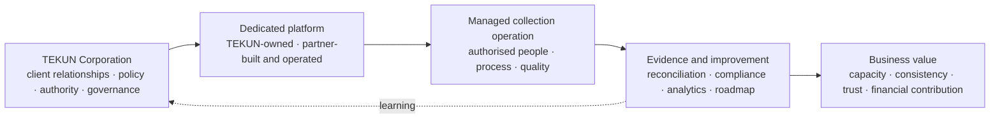

### Ownership and accountability

| TEKUN Corporation governs | Our team delivers | Jointly governed |
| --- | --- | --- |
| Client and principal relationships | Platform design, build, operation and maintenance | Discovery, implementation priorities and service levels |
| Policy, risk appetite and authority limits | Authorised collection execution or coordination | Baseline, scorecard and pilot evaluation |
| Regulatory relationship and legal position | Reporting, operational evidence and continuous improvement | Governance forums and roadmap |
| Portfolio onboarding approval | Technical and operating documentation | Incident, conduct and change escalation |
| Final consequential authority as agreed with principals | Recommendations within approved limits | Expansion after evidence gates |

The exact legal responsibilities, data roles and authority chain must be confirmed with TEKUN Corporation's compliance function and qualified Malaysian counsel. The platform can enforce and evidence controls; it cannot itself declare legal compliance.

### The value pathway

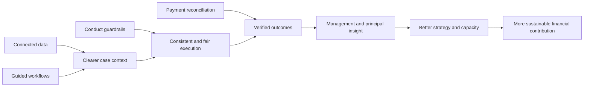

This is a measurable pathway, not a profit guarantee. Improvement must be proven against agreed definitions and a defensible baseline.

# Part I — TEKUN Corporation Context And Opportunity

## Chapter 1 — An established collection operator

### In one minute

TEKUN Corporation is a TEKUN Nasional subsidiary with a public business focus that includes credit management and recovery. Its collection call centre dates to 2015, and its website states that approximately 30 organisations have appointed it. The respectful starting point is capability expansion, not replacement. `[CLM-001–006] [CLM-008]`

### Publicly evidenced milestones

| Date | Public milestone | What it demonstrates | Limitation |
| --- | --- | --- | --- |
| 27 February 2014 | TEKUN Corporation states it was registered with SSM | Corporate operating history | First-party statement; reverify before external use |
| 15 September 2015 | Customer Call Centre established for debt collection | More than a decade of stated collection operation | Current process, technology and scale are not public |
| Undated current page | TCorp states MOF field code 221105 and around 30 appointing organisations | Established collection role and multi-principal context | Currency and exact active count require confirmation |
| 7 May 2026 | Collection and recovery agreement announced with Awqaf Education | Recent portfolio/client expansion activity | No value, duration or portfolio detail published |
| July–August 2026 | MOCCIS appointment, service agreement and MoU events announced | High-profile expansion activity | No value, commission, account count or performance disclosed |

`[CLM-001] [CLM-004–006] [CLM-013–016]`

### What is not publicly disclosed

No public source reviewed identified a third-party provider appointed by TEKUN Corporation, a contract value, a commission structure, its current collection platform, portfolio volumes or a current performance baseline. This does **not** prove that any of these do not exist. They are discovery matters. `[CLM-017–018]`

## Chapter 2 — Why the operating environment is changing

### In one minute

Malaysia's Consumer Credit Act 2025 and the Consumer Credit Commission create a more formal authorisation and conduct environment for applicable debt collection. The published standards are unusually operational: they address when contact may occur, how often, what notice must precede recovery, identity checks, disclosure, payment handling, complaints, hardship, representative competency and information security. These rules can be translated into platform controls and evidence. `[CLM-026–039] [CLM-042–044] [CLM-046–067]`

### Regulatory timeline as at 31 August 2026

| Milestone | Date | Practical meaning |
| --- | --- | --- |
| Consumer Credit Act 2025 gazetted | 31 December 2025 | New statutory framework established |
| Act effective except Part V | 1 March 2026 | General framework commenced |
| Part V and applications opened | 1 June 2026 | Licensing and registration provisions commenced |
| SKP standards issued | 5 June 2026 | Authorisation and conduct expectations became operational references |
| Existing affected operator transition | Application required within six months from 1 June 2026 under section 135(1) | Exact applicability, status and consequences require TCorp/counsel confirmation |

`[CLM-026–029] [CLM-109]`

### Scope must be determined portfolio by portfolio

Debt collection is listed as a credit service business, but the Act contains exclusions and different treatment for certain government-funded micro-financing and co-operative contexts. TEKUN Corporation serves multiple principals, so one legal conclusion should not be applied across every portfolio without analysis. `[CLM-030–039] [CLM-040] [CLM-041]`

Phase 2 is expected to transfer hire purchase and credit sales from KPDN to SKP. TEKUN Corporation's public client panel includes motor dealers; this becomes relevant only if their assigned portfolios involve those products. The products are not publicly disclosed, and no Phase 2 date was found. `[CLM-110–111]`

### The platform consequence

The immediate business opportunity is not a fear-based compliance sale. It is the ability to make authorised operations easier to perform consistently and easier to prove:

- actions are allowed only inside approved time and frequency rules;
- the correct notice and identity steps precede debt discussion or recovery action;
- hardship, dispute and settlement events stop or redirect work automatically;
- every action, override, approval and communication attempt is traceable;
- management and compliance see exceptions without waiting for a complaint;
- each principal receives segregated and trustworthy reporting.

## Chapter 3 — The strategic opportunity

### In one minute

TEKUN Corporation publicly describes itself as a principal income-generating subsidiary for TEKUN Nasional. A stronger collection operating platform can support that mandate through capacity, performance evidence, client confidence and the ability to onboard more appointing organisations safely. `[CLM-008]`

### From capability to financial contribution

| Capability | Operating effect | Possible business effect | Measure before claiming value |
| --- | --- | --- | --- |
| Reliable portfolio intake | Less manual cleansing and re-entry | Faster start for new assignments | Onboarding lead time, rejection rate |
| Better contact context | Agents act with clearer information | Higher right-party contact opportunity | Right-party contact rate, data completeness |
| Promises linked to payment evidence | Follow-up is timely and outcomes verified | Better kept-promise visibility | Kept-promise rate, time to payment |
| Reconciliation integration | Payments stop collection faster and close cases accurately | Lower exception effort and customer friction | Reconciliation ageing, cessation compliance |
| Conduct controls | Fewer avoidable exceptions | Protects client trust and regulatory readiness | Contact, notice, disclosure and complaint exceptions |
| Principal reporting | Each appointing organisation sees its own outcomes | Retention and stronger service credibility | Report acceptance, renewal and principal satisfaction |
| Reusable onboarding | Policies and integrations become repeatable | More principals without proportional reinvention | Principal onboarding lead time, capacity headroom |

Technology is an enabler. Portfolio quality, customer contactability, policy, staffing, authority, economic conditions and principal cooperation also affect collection results.

# Part II — Partnership And Operating Model

## Chapter 4 — Partnership proposition

### In one minute

The proposed model combines ownership and accountability on the TEKUN Corporation side with specialised technology and operating execution from our team. TEKUN Corporation should own the platform and govern the operation; our team should earn a long-term role through results, expertise, integration and continuous improvement.

### Proposed model

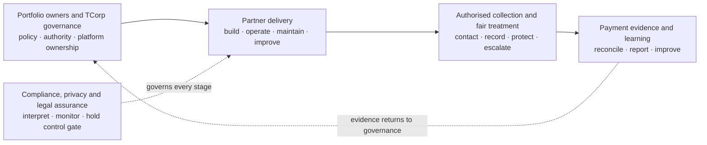

### What is included in principle

- Dedicated collection platform owned and governed by TEKUN Corporation.
- Platform design, implementation, operation, maintenance and continuous improvement by our team.
- Authorised collection work performed or coordinated within confirmed legal and policy boundaries.
- Integration with approved principal, communication and payment-evidence sources.
- Operating procedures, training, supervision, quality and service governance.
- Evidence-led pilot followed by gated expansion.
- Complete documentation, data portability and transition support from day one.

### What is not yet committed

- A particular portfolio, principal, channel mix, headcount, launch date or price.
- Replacement of any existing system or provider.
- Separate registration or operation under TEKUN Corporation authorisation.
- Any recovery uplift, collection target or profit outcome.
- Any legal, regulatory or data-role conclusion.

## Chapter 5 — Stakeholders and responsibilities

### In one minute

Collection is a multi-stakeholder operation. The platform succeeds only when it preserves the difference between who owns the underlying financing, who governs collection, who performs work, who receives money, who verifies payment and who makes consequential decisions.

### Proposed responsibility model

The model is shown in two linked views so every role remains readable. The first view covers governance and delivery; the second isolates money handling and compliance assurance.

#### Governance and delivery

| Activity | TEKUN Corporation | Portfolio owner | Partner platform team | Collection operation |
| --- | --- | --- | --- | --- |
| Approve portfolio onboarding | Accountable | Consulted/Responsible | Supports | Consulted |
| Define collection policy | Accountable | Consulted | Configures | Responsible for execution |
| Build and operate platform | Governs | Informed | Accountable/Responsible | Consulted |
| Assign and work cases | Governs | Informed | Enables | Responsible |
| Receive customer money | As confirmed | As confirmed | Never as agent | Never as agent |
| Reconcile payments | Accountable as agreed | May confirm | Enables | Supports |
| Approve settlement/write-off/legal | Accountable as agreed | May retain authority | Never independently | Recommends/escalates only |
| Complaints and hardship | Accountable | Consulted | Enables evidence/holds | Responsible within policy |
| Regulatory submission | Accountable party to be confirmed | May supply data | Supports data/export | Supplies operating evidence |
| Roadmap and expansion | Chairs | Consulted | Co-designs/delivers | Supplies learning |

#### Money handling and assurance

| Activity | Finance/payment source | Compliance/legal |
| --- | --- | --- |
| Approve portfolio onboarding | Consulted | Consulted |
| Define collection policy | Consulted | Reviews |
| Build and operate platform | Supports integrations | Reviews controls |
| Assign and work cases | — | Monitors |
| Receive customer money | Responsible through approved channel | Reviews rule |
| Reconcile payments | Responsible as agreed | Audits evidence |
| Approve settlement/write-off/legal | Consulted | Reviews |
| Complaints and hardship | Consulted | Responsible oversight |
| Regulatory submission | Supplies finance evidence | Reviews/submits as assigned |
| Roadmap and expansion | Supplies outcome data | Holds control gate |

This matrix is proposed. The final RACI must reflect the underlying principal contracts, TEKUN Corporation authority and qualified legal advice.

## Chapter 6 — End-to-end collection lifecycle

### In one minute

The solution is a complete operating loop, not a dialler or dashboard. A portfolio enters with defined authority and data; accounts are validated and segmented; authorised representatives work controlled cases; promises and payment evidence close the loop; complaints, disputes and hardship take protected paths; management learns from results.

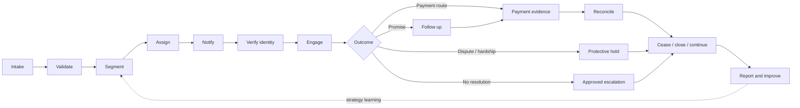

### Lifecycle control matrix

| Stage | Key information | Required control | Operational value |
| --- | --- | --- | --- |
| Intake | Principal, account, agreement, balance, history | Provenance, validation, deduplication, segregation | Trustworthy starting population |
| Segment | Product, arrears age, value, geography, status | Approved strategy and exclusions | Proportionate treatment |
| Assign | Agent, team, workload, skill, language | Role, competency and authorisation validity | Accountable ownership |
| Notify | Reminder/recovery notice and delivery | Correct template, fields, timing and evidence | Defensible pre-contact/recovery step |
| Verify | Customer identity | Verification before debt disclosure | Confidentiality and correct-party contact |
| Engage | Attempts, conversations and outcomes | Contact window, frequency cap, script and conduct | Consistency and fair treatment |
| Promise | Amount, date, method and tolerance | Follow-up and no false closure | Reliable outcome tracking |
| Protect | Dispute, hardship, vulnerability or legal hold | Automatic pause and specialist routing | Prevents harmful or invalid escalation |
| Pay | Approved payment route | Representatives do not receive funds | Safer money flow |
| Reconcile | Bank/principal evidence and allocation | Source evidence retained; exceptions visible | Verified collection result |
| Cease/close | Settlement, accepted plan, withdrawal or return | Immediate stop trigger and audit trail | Prevents continued contact after resolution |
| Report/improve | Outcomes, exceptions, cost and service health | Segregated views and governed definitions | Better decisions and principal trust |

## Chapter 7 — Governance and decision authority

### In one minute

Performance and customer-treatment oversight must reinforce one another without becoming the same conversation. A collection target cannot excuse a conduct failure. The proposed governance separates strategic, performance, compliance and delivery forums while keeping escalation visible to TEKUN Corporation.

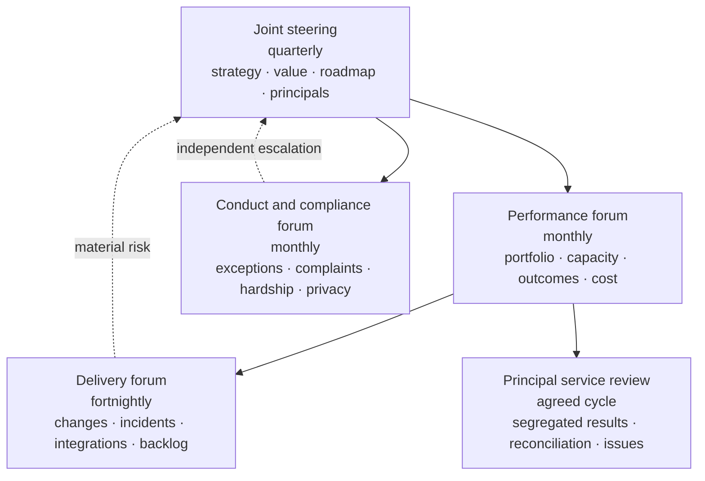

### Decision principles

1. TEKUN Corporation chairs strategic governance and owns policy.
2. Consequential authority is explicit, limited and auditable.
3. The partner may recommend but never silently assume settlement, write-off or legal authority.
4. Compliance exceptions remain visible even when collection outcomes improve.
5. Changes affecting conduct, money flow, data roles or principal contracts receive appropriate review.
6. Every expansion horizon requires evidence, not only a calendar date.

# Part III — Dedicated Platform Solution

## Chapter 8 — Platform architecture in plain language

### In one minute

People should experience one coherent operation even though different components perform different jobs. Customer and staff channels sit at the top; authoritative portfolio, case and payment state sits beneath them; analytics, security, monitoring and recovery support every layer.

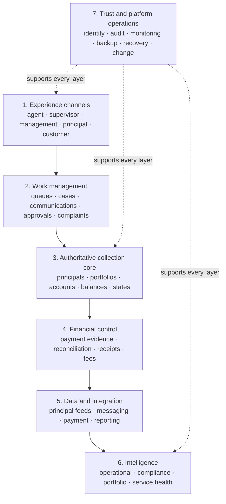

### Authority principles

- One authoritative source is named for each balance, payment, case state and decision.
- A principal sees only its own portfolio and approved aggregate service information.
- Channels use managed interfaces; they do not directly alter core records.
- Imported evidence is retained with provenance instead of silently overwritten.
- Write-capable integrations use validation, duplicate protection, audit and failure handling.
- Analytics uses curated, policy-controlled data rather than unrestricted operational access.
- TEKUN Corporation can export its information, configuration and operating records in usable formats.

## Chapter 9 — Portfolio and principal foundation

### In one minute

TEKUN Corporation's multi-principal model requires more than an “organisation” field. Each principal can have distinct products, definitions, authority, strategies, channels, notices, service levels, reporting and integrations. The platform must keep these separate while giving TCorp a governed enterprise view.

### Proposed information hierarchy

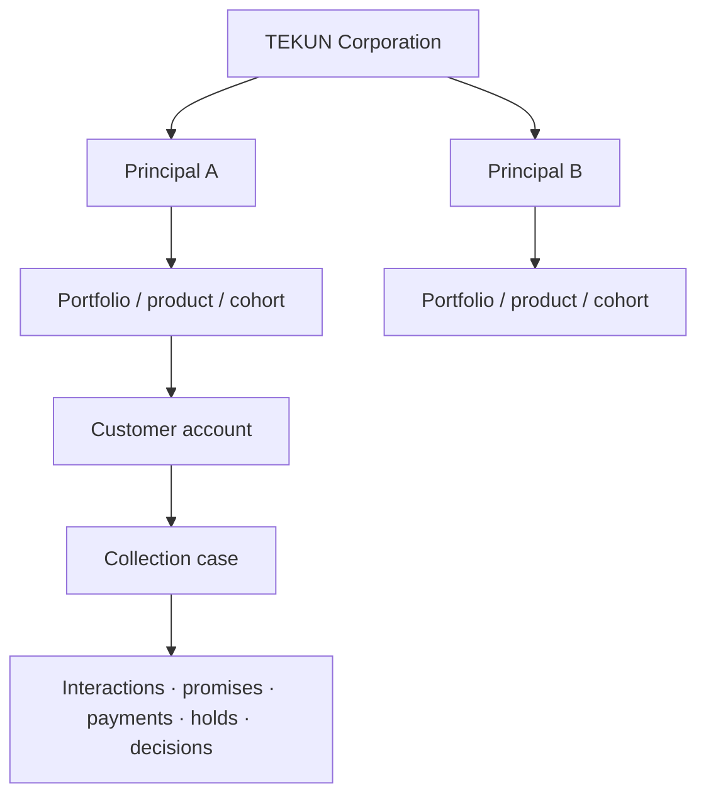

### Core records

| Record | Minimum purpose |
| --- | --- |
| Principal | Contract, data owner/controller context, policy and reporting boundary |
| Portfolio | Product, assignment scope, cohort, arrears definition and service rules |
| Customer/account | Identity, contact, agreement, balance components, schedule and restrictions |
| Case | Assignment, current treatment state, agent ownership, next action and escalation |
| Interaction | Channel, time, recipient verification, outcome, evidence and agent |
| Notice | Template/version, mandatory fields, delivery method, date and proof |
| Promise | Amount, due date, method, tolerance, status and linked payment |
| Payment evidence | Source, reference, amount, date, matching and reversal status |
| Complaint/dispute/hardship | Intake, owner, hold, evidence, decision and turnaround |
| Approval | Requested decision, limit, approver, rationale and timestamp |
| Representative | Employer, authorisation, competency, training, validity and revocation |

### Intake quality gates

Before an account enters active work, the platform should verify required identity/contact fields, balance composition, assignment authority, product and principal policy, previous notices/actions, dispute/hardship/legal state and the source snapshot. Invalid or ambiguous records remain exceptions rather than being pushed into agent queues.

## Chapter 10 — Agent and supervisor workspace

### In one minute

The workspace should tell an authorised representative what can be done now, why, and what must happen next. It should reduce memory-based compliance and manual searching while keeping human judgment and supervisor accountability visible.

### Agent view

| Area | What the agent needs |
| --- | --- |
| My work | Prioritised, authorised cases with due actions and safe workload limits |
| Customer context | Correct identity/contact data, language, account and principal context |
| Allowed action | Channel, contact window/frequency status, notice status and holds |
| Guided conversation | Approved script, identity check, mandatory explanations and outcomes |
| Outcome capture | Right-party contact, promise, dispute, hardship, complaint, no-contact or escalation |
| Payment direction | Approved official channel; no representative receipt of customer money |
| Next step | System-calculated follow-up with manual override only where authorised and recorded |

### Supervisor view

- queue volume, ageing and workload distribution;
- promises due, broken promises and unresolved outcomes;
- cases approaching service or conduct thresholds;
- quality samples, coaching actions and representative competency;
- overrides, exceptions and unusual activity;
- team contact, resolution and customer-treatment measures;
- ability to pause, reassign or escalate within authority.

### Human control

Automation may surface priority and enforce hard rules, but it must not quietly decide settlement, hardship, legal escalation or other consequential outcomes. Where assisted prioritisation is later introduced, inputs, explanation, override, bias/quality monitoring and the applicable automated-decision guidance must be reviewed first.

## Chapter 11 — Customer treatment and regulatory controls

### In one minute

The strongest platform argument is not that rules exist; it is that authorised teams can follow them consistently and produce evidence. The controls below apply only where the confirmed legal pathway says they apply, but they form a prudent design baseline for fair collection.

### Rule-to-control translation

| Published expectation | Proposed platform control | Evidence produced |
| --- | --- | --- |
| Contact during permitted hours | Channel/time-zone scheduler and hard block outside approved window | Attempt timestamp, channel, block/override log |
| Contact-frequency limit | Rolling consumer-level counter across channels | Weekly/monthly count and exception report |
| Written recovery notice before action | Approved template, mandatory fields and pre-action waiting gate | Notice version, delivery evidence and elapsed time |
| Verify identity before debt discussion | Scripted verification checkpoint | Method, result and agent timestamp without excessive exposure |
| No unauthorised third-party disclosure | Relationship/consent gate and script restriction | Consent or prevented disclosure record |
| Representatives do not accept payment | No cash-receipt function; official payment-route message only | Payment instruction and external evidence source |
| Stop on settlement or accepted arrangement | Authoritative payment/decision event places immediate cessation | Stop timestamp and any post-stop exception |
| Hardship assessment protects legal process | Hardship intake creates a system hold | Hold owner, start, status and release decision |
| Complaints are accessible and tracked | One complaints record with ownership and turnaround | Intake, investigation, outcome and remediation trail |
| Representatives remain competent | Appointment, training and periodic assessment records | Current validity and overdue assessment report |
| Consumer data access is controlled | Role limits, audit, download controls and anomaly alerts | Access history, alert and investigation record |

`[CLM-047–067] [CLM-113]`

### Protective branches

Disputes, hardship, vulnerability, deceased/bankrupt status, complaints and legal matters should leave the standard collection queue. Each receives a specialised owner, a documented hold where required, controlled communication and a clear return/closure decision. This prevents target pressure from overriding customer treatment.

## Chapter 12 — Payment, reconciliation and financial authority

### In one minute

Collection results are real only when payment evidence is reconciled to the correct account. Representatives should direct customers to approved channels, not receive money. The platform connects the promise and interaction history to authoritative payment evidence, then stops or changes treatment accordingly. `[CLM-022–023]`

### Illustrative flow requiring confirmation

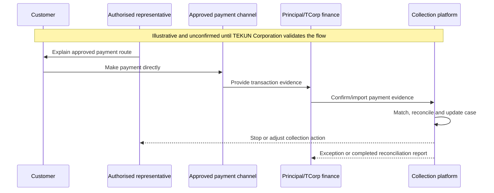

The actual recipient account, receipt issuer, reconciliation owner and timing are not publicly known. This visual must remain illustrative until TEKUN Corporation validates it. `[CLM-024]`

### Financial controls

- separate promise, reported payment and reconciled payment states;
- retain source evidence and reversals;
- prevent duplicate imports and allocations;
- keep unmatched or ambiguous funds visible as exceptions;
- require approval for adjustments, settlement recommendations and fee calculations;
- stop contact from an authoritative settlement/arrangement event;
- calculate performance and commercial fees only from agreed reconciled evidence;
- preserve point-in-time portfolio and ageing snapshots.

## Chapter 13 — Data, integrations, security and resilience

### In one minute

The platform will handle sensitive identity, financial and communication information. Trust depends on knowing why data exists, who may access it, where it came from, what changed, how an incident is handled and how service can recover.

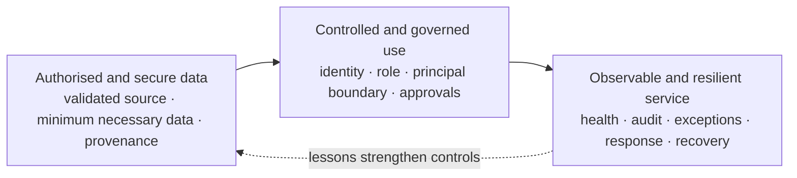

### Integration catalogue

| Relationship | Purpose | Authority and safety rule |
| --- | --- | --- |
| Principal → platform | Account assignment, balances, updates and withdrawals | Validate schema, provenance and duplicates; principal remains authoritative where agreed |
| Platform → principal | Status, activity and performance reporting | Principal-only segregation and approved definitions |
| Messaging/telephony ↔ platform | Controlled contact and interaction evidence | Channel consent/policy, identity, time/frequency and retention controls |
| Payment source → platform | Transaction evidence | Signed/validated feed, duplicate/reversal handling, no agent-reported result |
| Platform → official documents | Notices, statements or acknowledgements | Approved template/version and delivery evidence |
| Platform → regulatory/credit reporting | Required data support where applicable | Accountable submitter, format and approval confirmed before build |
| Platform → analytics | Curated operational and compliance insight | Read-oriented, policy-controlled and audited access |

### Privacy roles are a discovery outcome

The amended Personal Data Protection framework gives duties according to whether a party is a controller, processor, sub-processor or joint controller and according to applicable criteria. The proposed relationship could create direct duties for the partner, but the actual role cannot be declared from public information. Data flows, agreements, DPO requirements, security duties, breach response, retention and cross-border constraints must be confirmed. `[CLM-070–075] [CLM-076]`

### Trust model

| Control family | Proposed design | Evidence |
| --- | --- | --- |
| Identity and access | Strong authentication, least privilege, principal and role boundaries | Access review and authentication logs |
| Data authority | Named source, explicit write path and immutable provenance | Interface catalogue and change history |
| Sensitive-data protection | Encryption, minimisation, controlled export/download and endpoint policy | Configuration and access evidence |
| Audit | Append-only or tamper-evident event history for material actions | Searchable export for audit/investigation |
| Monitoring | Availability, errors, failed feeds, unusual access and operational thresholds | Alerts, incident records and service reports |
| Incident response | Severity, ownership, containment, notification support and learning | Incident and breach registers |
| Backup and recovery | Protected backups, defined objectives and periodic restore tests | Backup health and restore evidence |
| Secure change | Review, testing, journey evidence, controlled release and rollback | Change and release records |

## Chapter 14 — Reporting, analytics and explainable assistance

### In one minute

Different stakeholders need different truth. An agent needs today's safe actions; a supervisor needs queue and quality health; compliance needs exceptions; management needs outcomes and cost; each principal needs only its own portfolio; the board needs strategic value and risk.

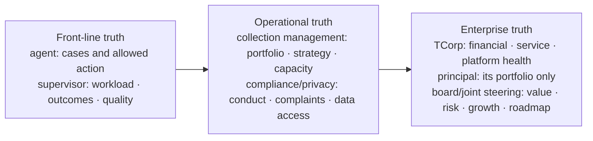

### Intelligence progression

1. **Descriptive:** what was assigned, attempted, promised, paid, reconciled and closed.
2. **Diagnostic:** why contact, promise, payment, complaint or exception patterns differ.
3. **Guided:** surface approved next actions, missing information and risk flags.
4. **Predictive:** forecast expected outcomes or capacity only after sufficient clean history.
5. **Assisted:** explainable summaries and quality sampling, only after definitions, clean data, audit and human oversight are established; humans retain authority.

# Part IV — Managed Collection Service

## Chapter 15 — Operating team and service model

### In one minute

The proposed solution combines platform and people. The operating team executes authorised work; supervisors protect quality and capacity; compliance has an independent line; finance verifies outcomes; product and engineering improve the system without bypassing business authority.

### Proposed operating cells

| Role | Primary responsibility | Key boundary |
| --- | --- | --- |
| TCorp service owner | Client/principal relationship, policy, authority and outcomes | Retains governance |
| Collection manager | Strategy, portfolio allocation, performance and escalation | Cannot override compliance controls silently |
| Supervisor | Queue health, coaching, quality, exceptions and daily decisions | Works within approved limits |
| Authorised representative | Contact, verify, understand, record, follow up and escalate | Does not receive money or make unapproved consequential decisions |
| Complaints/hardship specialist | Protected-case assessment and resolution coordination | Independent from target pressure where required |
| Finance/reconciliation | Validate payment evidence, allocation, reversals and reporting | Reconciled evidence is outcome authority |
| Compliance/privacy | Interpret obligations, monitor conduct/data and manage escalation | Separate reporting line from performance |
| Platform operations | Availability, integrations, incidents, changes and recovery | Does not redefine business policy |
| Product/continuous improvement | Analyse friction, prioritise improvements and verify value | Roadmap co-owned and evidence-gated |

Headcount, employment model, location, channel mix and hours remain discovery and costing decisions.

## Chapter 16 — Training, competency and quality assurance

### In one minute

An authorised representative needs more than a script. The organisation must know who is suitable, what they were trained on, whether they can apply it, how quality is sampled and what happens when conduct or performance falls below the approved standard.

### Competency lifecycle

> Screen and verify → Train → Assess → Authorise → Observe and sample → Coach or remediate → Reassess periodically. A material concern may trigger immediate suspension, revocation or investigation.

### Training domains

- TEKUN Corporation and principal policy;
- customer identification and confidential communication;
- permitted channels, timing, frequency and notices;
- accurate explanation of account and payment routes;
- promises, disputes, complaints, hardship and vulnerability;
- prohibited conduct, pressure and misleading statements;
- platform use, evidence quality and escalation;
- personal-data protection, device and workspace controls;
- fraud awareness and unusual activity;
- changes in law, policy, portfolio or system.

Quality measures should balance outcome, accuracy, conduct, documentation and customer treatment. Recovery alone is not a complete quality score.

## Chapter 17 — Service management and continuous improvement

### In one minute

A healthy platform is one that detects issues, responds, recovers and improves without losing accountability. The operating partnership should use the same evidence discipline for software, integrations and collection processes.

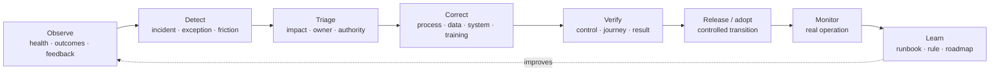

### Service disciplines

- agreed service hours, availability and response objectives;
- health monitoring for application, integrations, data feeds and queues;
- incident severity, communication and post-incident learning;
- change classification, review, testing and rollback;
- restore exercises and continuity procedures;
- operating playbooks, data dictionary and configuration history;
- visible improvement backlog jointly prioritised with TCorp;
- principal and customer feedback converted into measurable changes.

# Part V — Capability Proof, Measurement And Commercial Logic

## Chapter 18 — Why our experience is relevant

### In one minute

Sifututor has operated a live education service since 2018 and moved its new SIMS generation into production in May 2025. Its ecosystem coordinates multiple participant groups, operational states, financial evidence, mobile and staff channels, communications, analytics, permissions, monitoring and recovery. That is evidence of platform-operating capability—not evidence of debt-collection performance. `[CLM-HIS-001–002] [CLM-NAR-001]`

### Proven foundations

| Existing Sifututor capability | Relevance to TEKUN Corporation | Truth boundary |
| --- | --- | --- |
| SIMS authoritative operating core | Pattern for connected identities, workflows, finance and reports | Not a debt or arrears system today |
| Ripple specialised staff workspace | Pattern for queues, accounts, reconciliation, roles and governed decisions | Collection strategy and controls are new |
| Kelasapp tenant separation | Pattern for serving separate organisations and finance contexts | New platform isolation requires its own testing |
| Finch conversation ownership | Pattern for multi-channel, multi-brand agent work | Approved collection channels must be confirmed |
| Parent/Tutor authenticated apps | Pattern for safe participant self-service and notifications | Customer-in-arrears portal would be new |
| Owner analytics | Pattern for curated, read-only and policy-controlled insight | TEKUN datasets and KPI definitions are new |
| Monitoring, testing and recovery | Pattern for operating live services and controlled change | TEKUN service levels and recovery proof must be established |
| Agent OS | Pattern for playbooks, evidence, human oversight and continuous learning | Does not substitute for collection training or legal authority |

`[CLM-ARCH-001–004] [CLM-SYS-SIMS-001] [CLM-SYS-RIP-001] [CLM-SYS-KEL-001] [CLM-SYS-FIN-001] [CLM-ANA-001] [CLM-SYS-OPS-001] [CLM-TRU-001] [CLM-RES-001]`

### What must be created specifically for collection

- principal and portfolio assignment model;
- debt, instalment, arrears and cohort records;
- configurable treatment strategies and work queues;
- conduct gates for notice, identity, timing, frequency and disclosure;
- promises to pay linked to reconciled evidence;
- complaints, disputes, hardship, cessation and legal holds;
- representative authorisation and competency lifecycle;
- per-principal reporting and regulatory submission support;
- collection operations, scripts, supervision and quality;
- TEKUN-specific integrations, policies, service levels and proof.

### The credible capability claim

> We have learned how to build and operate complex, multi-stakeholder and financially sensitive live platforms. We propose applying those proven foundations—together with TEKUN Corporation's collection expertise—to create a dedicated collection platform and managed service. The pilot, not our education history, will prove collection outcomes.

## Chapter 19 — Business impact model

### In one minute

The platform can influence financial contribution by increasing safe operating capacity, improving verified outcomes, reducing avoidable manual work, protecting client trust and enabling faster onboarding of additional principals. Every effect needs a named measure.

### Impact chain

| Input capability | Leading operational signal | Outcome signal | Strategic effect |
| --- | --- | --- | --- |
| Better portfolio data | Completeness, intake acceptance, time to first action | Contactability and case throughput | Faster principal onboarding |
| Guided work and segmentation | Workable queue coverage, right-party contact | Kept promises and time to payment | More effective capacity |
| Payment integration | Match rate and reconciliation age | Verified collection/recovery | Clearer revenue and fee basis |
| Customer-treatment controls | Conduct and complaint exceptions | Trust and service consistency | Principal retention and regulatory readiness |
| Supervisor and quality tools | Coaching closure and competency currency | Stable team performance | Scalable operations |
| Principal reporting | Report timeliness and acceptance | Renewal and referral opportunity | More appointing organisations |
| Platform health | Availability, failed-feed rate, restore evidence | Fewer interrupted workflows | Revenue protection and confidence |

### Economic caution

Recovery is affected by portfolio vintage, arrears age, balance, product, customer circumstances, data quality, contactability, moratoria, legal state and economic conditions. A fair comparison therefore uses frozen or controlled cohorts and agreed adjustment events. Raw totals alone can reward easy portfolio mix rather than better operation.

## Chapter 20 — Baseline and scorecard

### In one minute

“Collection rate” is not a complete definition. The parties must agree numerator, denominator, population, period, exclusions and authoritative source before a target or commercial fee can use it.

### Balanced scorecard

| Lens | Core indicators | Why it matters |
| --- | --- | --- |
| Operations | Contact coverage, right-party contact, promises, kept promises, time to first action, cases per agent | Shows activity and workflow health |
| Financial outcomes | Amount collected, collection rate, recovery rate, net recovery, cost-to-collect | Shows verified financial effect |
| Portfolio quality | Ageing, PAR where appropriate, roll rate, cure rate, write-off context | Shows movement and risk, not only cash |
| Customer treatment | Complaints, resolution time, hardship outcomes, dispute age, cessation | Protects fairness and trust |
| Compliance controls | Contact, notice, identity, disclosure, payment-handling, representative and data exceptions | Proves whether the process stayed inside approved rules |
| Platform health | Availability, incidents, restore time, backup/restore evidence, failed feeds, reconciliation age | Shows service dependability |
| Strategic growth | Active principals, onboarding lead time, capacity headroom, renewal and contribution | Shows whether capability compounds |

### Core metric definitions

| KPI | Governed definition starter |
| --- | --- |
| Right-party contact rate | Verified customer conversations ÷ valid contact attempts |
| Kept-promise rate | Promises due that were fulfilled within agreed amount/date tolerance ÷ promises due |
| Collection rate | Reconciled qualifying amount received ÷ agreed amount due for the defined population and period |
| Recovery rate | Reconciled amount recovered from a named frozen cohort ÷ opening value of that cohort |
| Cost-to-collect | Agreed attributable collection cost ÷ reconciled qualifying amount collected |
| Roll rate | Accounts moving from one ageing bucket to the next worse bucket ÷ accounts in the starting bucket |
| Cure rate | Delinquent accounts returning to current under the agreed definition ÷ starting delinquent accounts |
| Cessation compliance | Qualifying cases stopped within the agreed window ÷ all cases requiring cessation |
| Reconciliation ageing | Value and count of unmatched payment evidence by age bucket |
| Principal onboarding lead time | Days from approved mobilisation input to first authorised collection action |

The full KPI dictionary must name source, owner, frequency, exclusions and misinterpretation risk. See Appendix D and the governed research framework.

## Chapter 21 — Bounded pilot

### In one minute

A pilot creates TEKUN-specific proof while limiting operational, client and implementation risk. It should cover one principal, product or arrears cohort large enough to measure but bounded enough to govern.

### Pilot design

| Element | Proposed rule |
| --- | --- |
| Scope | One principal or one defined cohort within one principal |
| Baseline | Prefer 6–12 months of comparable history using written definitions |
| Cohort | Freeze account list, value, arrears stage and starting conditions |
| Comparator | Matched hold-out or defensible historical comparison where feasible |
| Duration | Long enough to observe contact, promise and payment cycles; decide after discovery |
| Primary outcomes | Agreed collection/recovery and kept-promise measures |
| Guardrails | Conduct, complaint, hardship, cessation, reconciliation and platform-health measures |
| Governance | Weekly operating review; monthly performance and compliance reviews |
| Decision | Expand, adjust, re-baseline or stop based on evidence |

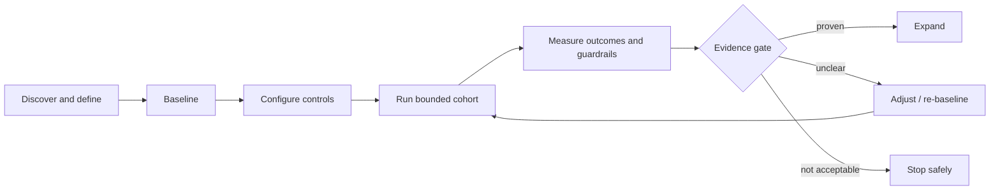

A pilot that improves recovery while creating unacceptable customer-treatment or control exceptions has not succeeded.

## Chapter 22 — Commercial principles

### In one minute

Pricing cannot be responsibly decided from public information. Portfolio size, ageing, channels, staffing, technology scope, integrations, current cost, baseline and risk allocation are unknown. The document therefore defines principles rather than a price.

### Commercial archetypes

| Model | Strength | Risk | Appropriate use |
| --- | --- | --- | --- |
| Fixed platform and operating fee | Predictable and supports essential control investment | Weak direct outcome alignment | Foundation, minimum team and platform service |
| Per-account or capacity fee | Scales with workload | Can reward volume rather than resolution | When account states and workable population are clear |
| Success fee | Strong outcome alignment | Conduct pressure, easy-cohort bias and baseline disputes | Only with strict definitions, guardrails and reconciled evidence |
| Gain-share above baseline | Pays for measured improvement | Entirely dependent on baseline integrity | After a defensible pilot/baseline |
| Hybrid fixed plus performance | Funds reliable operation while sharing upside | More governance and calculation detail | Recommended direction after discovery |

### Recommended principle

> Fund the minimum platform, compliance and operating capability with a predictable component, then link a controlled variable component to independently defined and reconciled outcomes, subject to customer-treatment and service guardrails.

No commercial model should reward contact volume alone or allow financial targets to bypass complaints, hardship, cessation or conduct rules.

# Part VI — Milestones And Roadmap

## Chapter 23 — Milestones to date

### In one minute

The proposal is credible because both sides bring operating history: TEKUN Corporation brings established collection relationships and domain authority; our team brings years of live multi-stakeholder platform operation and a modern connected ecosystem. The partnership itself remains proposed.

### Dual-track history

| Period | TEKUN Corporation evidence | Our platform-operating evidence |
| --- | --- | --- |
| 2014 | TCorp states corporate registration | — |
| 2015 | TCorp collection call centre established | — |
| 2018 | — | Sifututor live tutoring operation begins using its previous system |
| 2018–2024 | TCorp collection service continues | Live operations accumulate service, participant and finance rules |
| May 2025 | — | New SIMS goes live in production |
| 2025–2026 | — | Specialised staff tools, apps, communications, analytics, monitoring and recovery expand around the core |
| May–August 2026 | Awqaf Education and MOCCIS appointments/agreements announced | Connected operating foundation continues to mature |
| 2026 proposed next | Evaluate an integrated platform and managed service partnership | Apply proven platform disciplines to a dedicated collection domain |

`[CLM-001] [CLM-004] [CLM-013–016] [CLM-HIS-001–002]`

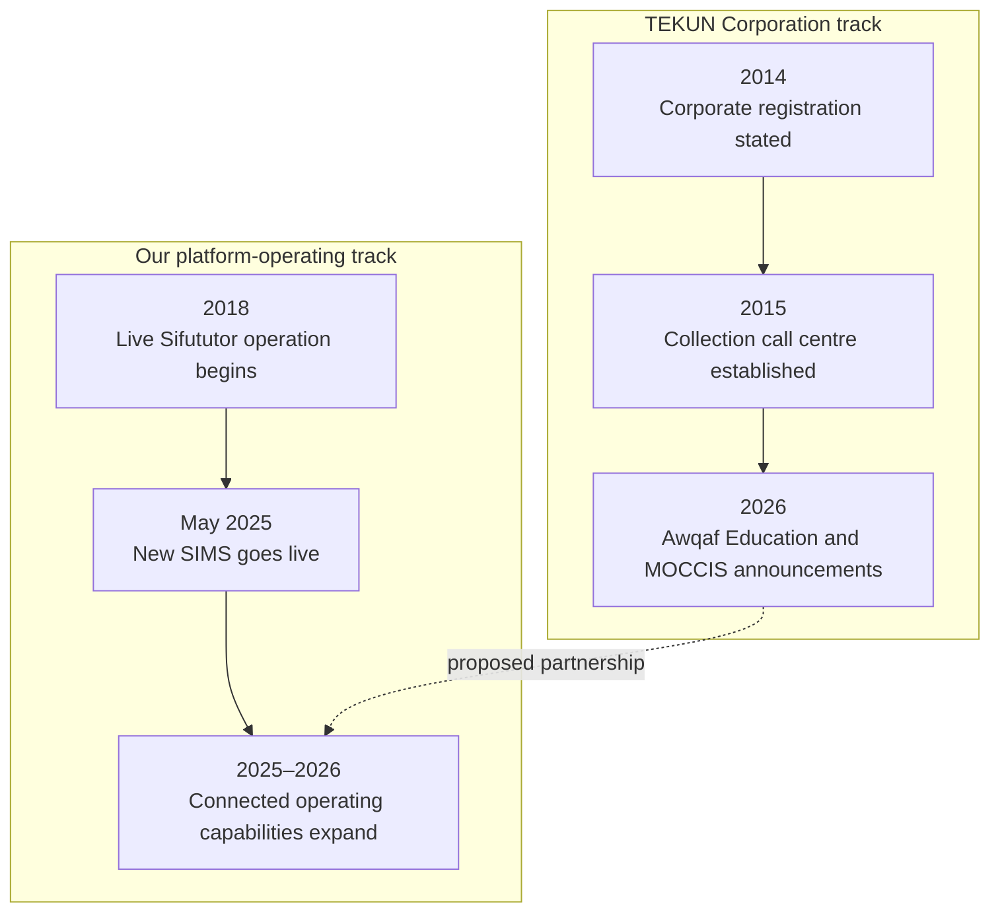

## Chapter 24 — Detailed partnership roadmap

### In one minute

The roadmap advances when evidence says the next level is safe and valuable. It does not publish fragile dates or completion percentages. Discovery may later attach delivery windows after portfolio access, legal direction, data quality and resources are confirmed.

### Foundation and controlled pilot

| Horizon | Objective | Principal capabilities | Dependencies | Business impact | Evidence gate |
| --- | --- | --- | --- | --- | --- |
| **H0 — Align and baseline** | Establish shared truth and lawful operating boundary | Current-state lifecycle; portfolio segmentation; provider/system map; RACI; regulatory/privacy map; KPI definitions; pilot cohort | TCorp access; compliance/counsel; anonymised data | Removes design ambiguity and makes measurement fair | Signed discovery pack; baseline and controls accepted |
| **H1 — Trusted operating foundation** | Make one bounded portfolio visible, controlled and auditable | Principal/account core; intake; roles; queues; interaction log; payment evidence; export; monitoring; recovery plan | H0; secure data transfer; policy templates | One dependable operating record | Data reconciliation accepted; access tests pass; restore demonstrated; users trained |
| **H2 — Controlled pilot operation** | Run authorised work with enforceable treatment controls | Verification; contact limits; notices; promises; complaints; disputes; hardship/legal holds; cessation; QA; representative records | H1; approved scripts/notices; staffing/authorisation; payment feed | Consistent execution and first TEKUN-specific results | Full cycle; outcome evidence; guardrails inside threshold; no unresolved critical control failure |

### Scale and governed expansion

| Horizon | Objective | Principal capabilities | Dependencies | Business impact | Evidence gate |
| --- | --- | --- | --- | --- | --- |
| **H3 — Integrated performance scale** | Extend across a principal or broader cohort | Automated feeds; reconciliation; approvals; principal reporting; capacity planning; service governance; onboarding playbook | H2 evidence; integration owners; commercial approval | More capacity and clearer cost/performance | Principal accepts reporting; service and reconciliation targets stable |
| **H4 — Multi-principal growth** | Replicate safely across appointing organisations | Configurable principal policy; segregated reports/portals; onboarding templates; cross-principal control monitoring | H3 stability; principal agreements; isolation proof | More principals without proportional reinvention | Each principal passes policy, data, isolation and reconciliation acceptance |
| **H5 — Governed intelligence and expansion** | Turn accumulated evidence into stronger decisions | Cohort insight; quality analytics; explainable assistance; forecasting; optional channels and portfolio types | Clean history; human oversight; legal/ADMP review; mature controls | Better strategy, reduced avoidable work and stronger growth proposition | Assistance/models validated, monitored, explainable and approved |

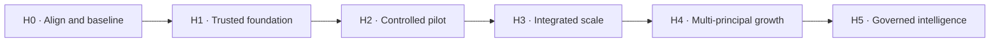

### Cross-horizon rules

- Customer-treatment and compliance evidence can stop expansion even when recovery improves.
- A failed or ambiguous pilot is adjusted, re-baselined or stopped safely.
- TEKUN ownership, documentation, usable export and transition readiness are maintained at every horizon.
- New principals reuse the onboarding pattern but receive their own policy, data and acceptance.
- AI is later leverage, not the foundation; humans retain consequential authority.

## Chapter 25 — Long-term partnership value

### In one minute

The relationship should become durable because it keeps producing measurable value—not because TEKUN Corporation cannot leave. The strongest advantages accumulate through operating experience, integrations, trained people, trusted governance and portfolio intelligence.

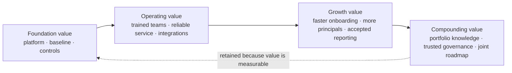

### How value compounds

| Value asset | First proof | How it deepens |
| --- | --- | --- |
| Measurable outcomes | Pilot scorecard | Comparable history across cohorts and principals |
| Operating knowledge | Initial playbooks | Evidence of which strategies work for which portfolio conditions |
| Trained teams | Authorised pilot team | Coaching, competency history and reusable leadership capacity |
| Integrations | First data/payment feeds | Hardened interfaces and faster new-principal onboarding |
| Governance | Forums and authority matrix | Trusted decisions, audit evidence and predictable escalation |
| Reliability | Service and restore evidence | Longitudinal availability and incident learning |
| Portfolio intelligence | Baseline and cohort reporting | Cross-period insight without compromising principal segregation |

### Transition-ready by design

TEKUN Corporation should be able to leave cleanly with everything it needs—and choose to stay because the partnership is valuable. This strengthens procurement, audit and governance confidence while making continuous performance the reason to renew. Maintain from day one:

1. complete usable data export;
2. current configuration and data dictionary;
3. integration specifications;
4. operating procedures and runbooks;
5. open case, promise, dispute, hardship and legal registers;
6. full permitted interaction and decision history;
7. change and decision logs;
8. a tested transition plan and agreed assistance terms.

# Part VII — Decisions And Assurance

## Chapter 26 — Discovery and decision agenda

### In one minute

The public research is sufficient to define the opportunity, but private operating facts determine the actual solution. Discovery should begin with objectives and regulatory/authority boundaries, then move through portfolios, current providers/systems, customer treatment, money flow, data and the pilot.

### Tier-1 agenda

| Area | Decisions required before detailed design |
| --- | --- |
| Direction | Priority outcomes, main constraint and 12-month success definition |
| Regulatory | Applicable pathway per portfolio; current authorisation/application/declaration status; partner authority model |
| Principals | Active organisations, product types, contracts and reporting needs |
| Portfolio | Accounts, value, ageing, geography, history and data quality |
| Current operation | Channels, teams, queues, strategies, notices, promises and escalation |
| Providers/systems | Existing provider roles, contracts, allocation, systems and integration constraints |
| Customer treatment | Identity, contact, complaints, hardship, disputes, vulnerability and cessation |
| Money flow | Payment destination, receipt/statement, reconciliation authority and stop event |
| Data/privacy | Data flows, controller/processor roles, hosting, access, retention, breach and export |
| Pilot | Cohort, baseline, comparator, outcomes, guardrails and decision gate |

The meeting-ready 24-question guide is maintained separately in the planning pack. Raw personal data is not required during initial discovery.

## Chapter 27 — Risk, assurance and transition readiness

### In one minute

Assurance is the evidence that ownership, policy and controls work in real operation. It includes prevention, detection, response, recovery, audit and clean transition.

### Assurance model

| Question | Evidence expected |
| --- | --- |
| Are only authorised people acting? | Identity, role, competency and authorisation records |
| Are actions permitted now? | Notice, contact, consent, hold and authority gates |
| Was the customer treated fairly? | Interaction record, quality sample, complaint/hardship handling |
| Is a collection result real? | Reconciled payment evidence and cohort definition |
| Did payment stop action correctly? | Cessation timestamp and post-stop exception report |
| Is each principal separated? | Access/isolation tests and principal-scoped reporting |
| Can an incident be understood? | Monitoring, audit, incident and breach evidence |
| Can service recover? | Backup health, recovery objectives and restore test |
| Can TEKUN govern or transition? | Documentation, export and annual transition exercise |

### Claims that always require owner approval

- financial results, savings, profit, targets or pricing;
- active principal, portfolio or account figures;
- provider names and contract terms;
- legal applicability, registration or compliance conclusions;
- data-role and DPO conclusions;
- launch dates, staffing levels and service commitments;
- certifications and externally shareable security statements.

## Chapter 28 — Recommended next step

The recommended next action is a governed discovery programme with TEKUN Corporation leadership, collection operations, compliance/legal/privacy, finance/reconciliation and technology/data stakeholders.

The output should be one agreed current-state and pilot-design pack containing:

1. collection lifecycle and stakeholder map;
2. portfolio and principal segmentation;
3. authority, regulatory and privacy responsibility map;
4. system, provider, data and money-flow architecture;
5. baseline, KPI and guardrail definitions;
6. bounded pilot cohort and evidence gate;
7. solution scope, transition approach and implementation sequence;
8. commercial inputs without premature pricing.

> **Proposed decision:** Authorise discovery and pilot co-design. Commit to full implementation only after the evidence, authority and commercial gates are satisfied.

# Reference Appendices

## Appendix A — Glossary

| Term | Plain-language meaning |
| --- | --- |
| Account | The customer's financing obligation and associated balance/history |
| Ageing | Grouping overdue amounts or accounts by how long they have been past due |
| Authoritative system | The agreed place whose record controls a particular fact or state |
| Authorised representative | A person permitted to perform defined collection activity for the accountable entity |
| Baseline | The agreed starting performance and conditions used for comparison |
| Case | The work record through which an account is assigned, contacted, followed up and resolved |
| Cessation | Stopping collection activity after a qualifying settlement, arrangement or other event |
| Cohort | A fixed group of accounts measured together from a stated starting point |
| Collection rate | Amount collected against a precisely defined amount due, population and period |
| Conduct guardrail | A customer-treatment or compliance measure that performance may not override |
| Controller / processor | Legal roles describing who determines data purposes/means and who processes for another; counsel confirms actual roles |
| Hardship hold | A protected state that pauses relevant escalation while hardship is assessed |
| Multi-principal | One operation serves multiple appointing organisations with separated policies, data and reporting |
| PAR | Portfolio at risk beyond a stated number of days; definition must state threshold and balance treatment |
| Principal | An organisation appointing TEKUN Corporation and owning or governing the underlying credit relationship |
| Promise to pay | A recorded customer commitment to pay a defined amount by a defined date/method |
| Reconciliation | Matching payment evidence to the correct account and resolving differences |
| Recovery rate | Amount recovered from a named frozen arrears cohort divided by its opening value |
| Representative competency | Evidence that a representative remains suitable, trained and able to perform authorised work |
| Right-party contact | A conversation with the verified customer, not merely a successful call connection |
| Roll rate | The share of accounts moving into a worse ageing state |
| Tenant/principal isolation | Controls preventing one organisation from accessing another's data or actions |
| Transition readiness | The ability to hand over data, configuration, documents and open work cleanly |

## Appendix B — Capability requirements catalogue

### Minimum trusted operation

1. Principal and portfolio segregation.
2. Role-based access and representative validity.
3. Account, balance, ageing and point-in-time history.
4. Controlled intake and provenance.
5. Work queue, case assignment and supervisor override.
6. Identity-verification gate.
7. Interaction log for every attempt and outcome.
8. Approved reminders/notices and delivery evidence.
9. Contact-window and frequency enforcement where applicable.
10. Consent and third-party-disclosure controls.
11. Promise-to-pay and follow-up.
12. Payment evidence and reconciliation without agent receipt of money.
13. Complaint, dispute and hardship workflows.
14. Settlement/arrangement cessation and protected holds.
15. Approval workflows for consequential decisions.
16. Audit trail and usable export.
17. Monitoring, incident handling, backup and restore evidence.
18. Compliance and principal reporting.

### Growth capability

19. Automated principal data feeds and validation.
20. Payment-provider/principal reconciliation integration.
21. Configurable treatment paths by principal and cohort.
22. Capacity and workforce planning.
23. Representative training, quality and annual-assessment management.
24. Principal portals and scheduled reporting packs.
25. Standard onboarding/offboarding kit.
26. Regulatory/credit-reporting submission support where confirmed.
27. Access anomaly detection and investigation.
28. Field/legal coordination if authorised and required.

### Advanced capability

29. Cohort and strategy performance insight.
30. Explainable prioritisation with human review.
31. Assisted summaries and quality sampling.
32. Expected-payment and capacity forecasting.
33. Cross-principal trend insight using properly governed, segregated data.
34. New portfolio/product/channel support after legal and operating gates.

## Appendix C — Authority and unresolved decisions

| Decision | Default proposed boundary | Confirmation owner |
| --- | --- | --- |
| Platform ownership | TEKUN Corporation owns and governs | TCorp/contract |
| Portfolio authority | Defined per principal contract | TCorp + principal + counsel |
| Partner collection authority | Only authorised activity inside approved policy | TCorp + counsel/regulator as required |
| Settlement/restructure | Partner recommends; authorised TCorp/principal role decides | TCorp + principal |
| Write-off | No partner independent authority | TCorp + principal + finance |
| Legal escalation | No representative/partner independent authority | TCorp + principal + legal |
| Payment receipt | Representatives never receive customer money | TCorp + finance + counsel confirm recipient flow |
| Reconciliation authority | Authoritative finance/payment evidence | TCorp + principal finance |
| Data roles | Not predetermined | TCorp/principal/partner privacy and counsel |
| Regulatory submission | Accountable submitting entity named per obligation | TCorp compliance/counsel |
| New principal onboarding | TEKUN Corporation approval plus acceptance gate | TCorp |

## Appendix D — KPI dictionary starter

Every KPI record must include name, business meaning, numerator, denominator, population, period, source, exclusions, owner, frequency, target type and gaming/misinterpretation risk.

| ID | Indicator | Owner | Required interpretation safeguard |
| --- | --- | --- | --- |
| O1 | Contact coverage | Collection manager | Pair with contact-frequency compliance; volume is not quality |
| O2 | Right-party contact rate | Collection manager | Data quality and identity rule affect result |
| O3 | Promise-to-pay rate | Collection manager | Pair with kept promises; promises can be over-recorded |
| O4 | Kept-promise rate | Collection manager/finance | Fix amount/date tolerance and use reconciled evidence |
| O5 | Time to first substantive action | Collection manager | Define substantive to prevent trivial-action gaming |
| F1 | Reconciled amount collected | Finance | Exclude reversals, dishonoured and misapplied payments |
| F2 | Collection rate | Finance | State due amount, cohort, period and exclusions |
| F3 | Recovery rate | Finance | Freeze opening cohort and adjustment rules |
| F4 | Net recovery | Finance | Agree attributable cost method |
| F5 | Cost-to-collect | Finance | Segment by portfolio mix and arrears age |
| P1 | Ageing/PAR | Finance | State threshold, balance and restructure treatment |
| P2 | Roll rate | Collection manager | Requires reliable point-in-time snapshots |
| P3 | Cure rate | Collection manager | Separate payment cure from restructure cure |
| T1 | Complaint rate | Compliance | A low rate can also indicate inaccessible intake |
| T2 | Complaint resolution time | Compliance | Track ageing and overdue cases, not only closed average |
| T3 | Hardship outcome/timeliness | Compliance | Approval rate alone is not a quality measure |
| T4 | Cessation compliance | Compliance | Every exception requires investigation |
| C1 | Contact-window exceptions | Compliance | Target and applicable rule set confirmed |
| C2 | Identity-verification exceptions | Compliance | Debt discussion population must be reliable |
| C3 | Contact-frequency exceptions | Compliance | Count across all integrated channels |
| C4 | Notice-gate compliance | Compliance | Validate mandatory fields and delivery evidence |
| C5 | Third-party disclosure exceptions | Compliance/privacy | Consent and relationship evidence required |
| C6 | Payment-handling exceptions | Compliance | Representatives receiving payment should be zero where rule applies |
| C7 | Representative validity/competency | Compliance/operations | Active population and due dates must be current |
| C8 | Data-access anomalies | Privacy/security | Track investigation and closure, not alerts alone |
| H1 | Critical-workflow availability | Platform operations | Measure safe journey, not homepage only |
| H2 | Incident restore time | Platform operations | Segment by severity |
| H3 | Recovery proof freshness | Platform operations | Successful backup is not a successful restore |
| H4 | Reconciliation ageing | Finance/platform | Pair value with item count and cause |
| S1 | Principal onboarding lead time | TCorp management | Start/end conditions must be written |
| S2 | Capacity headroom | TCorp management | Quality and conduct remain constraints |

## Appendix E — Tier-1 discovery questions

1. What outcomes does TCorp most want to improve, in priority order?
2. What is the main operating constraint today?
3. What would make the partnership successful to management, board and principals?
4. Which regulatory pathway applies to each portfolio type, in TCorp's view, and what is the current status?
5. Which activities could a partner perform, under what authorisation?
6. Who holds settlement, restructure, write-off, legal and closure authority?
7. Which complaints, hardship, conduct and reporting processes are mandatory from day one?
8. Which appointing organisations and portfolios are active?
9. What products, volumes, value, ageing, geography and history are involved?
10. How are accounts assigned, updated, suspended, returned and closed?
11. Which activities are performed by TCorp staff?
12. Are external providers used for operations, people, technology, channels, data, payment, field or legal work?
13. What does each provider do and what are the transition/contract constraints?
14. Which systems support the lifecycle today?
15. How are queues and treatment strategies defined and approved?
16. How are identity, contact, notice, consent, promises and cessation evidenced?
17. How are complaints, disputes, hardship, vulnerability and legal holds handled?
18. How are representatives trained, authorised, supervised and assessed?
19. Where do customers pay and what event stops collection?
20. Who reconciles payment, in which system and cycle?
21. What data arrives from each principal and what quality issues matter?
22. Which integrations exist or are required?
23. What privacy roles, hosting, retention, breach, export and audit constraints apply?
24. Which cohort and scorecard should govern a bounded pilot?

## Appendix F — Evidence and source register

### TEKUN Corporation and regulatory evidence

The detailed 114-claim register and 36-source register are maintained in the governed research pack. The most important sources are:

| Source | Use | Freshness |
| --- | --- | --- |
| TEKUN Corporation official company and credit-management pages | Identity, business, call-centre date, MOF statement and appointing-organisation statement | Reverify before external use |
| TEKUN Corporation official 2026 news releases | Awqaf Education and MOCCIS announcements | Reverify before external use |
| Consumer Credit Act 2025 (Act 873) | Definitions, authorisation, conduct offences, exclusions and transition | Recheck with counsel/official text |
| Consumer Credit Commission FAQs and media releases | Commencement, phases, application opening and complaints route | Monthly while implementation evolves |
| SKP Authorisation Standards 2026 | Registration criteria, finance and reporting expectations | Reverify before external use |
| SKP Conduct Standards 2026 | Collection, complaints, hardship, competency and data controls | Reverify before external use |
| Personal Data Protection Amendment Act 2024 and official guidelines | Controller/processor, DPO, breach and security framework | Confirm applicability and current guidance |

### Sifututor capability evidence

| Claim family | Approved use |
| --- | --- |
| `CLM-HIS-*` | Live service since 2018; new SIMS went live May 2025 |
| `CLM-ARCH-*` | Authoritative core, managed interfaces and controlled system relationships |
| `CLM-SYS-*` | Current system/capability profiles with safe-use limitations |
| `CLM-ANA-001` | Curated, policy-controlled owner analytics |
| `CLM-TRU-*` | Monitoring, testing, release controls and human accountability |
| `CLM-RES-001` | Point-in-time composed recovery proof; no universal guarantee |
| `CLM-AI-001` | Responsible AI direction, not certification |

### Material open facts

- current external providers and their terms;
- current TCorp collection platform and integrations;
- portfolio/account volume, value and ageing;
- performance baseline and cost-to-collect;
- money flow and reconciliation authority;
- portfolio-specific regulatory applicability and TCorp authorisation status;
- data roles, hosting and DPO requirements;
- partner authorisation/registration model;
- staffing, channel and field/legal scope;
- procurement and commercial envelope.

## Appendix G — Assumption and contradiction log

| ID | Working assumption or tension | Treatment |
| --- | --- | --- |
| A1 | TCorp retains major consequential authority | Confirm per principal; design configurable approvals |
| A2 | Customers pay an approved entity/channel, never a representative | Confirm actual flow; keep agent receipt prohibited in design where applicable |
| A3 | Data roles may differ by portfolio and agreement | Map flows and obtain legal/privacy conclusion |
| A4 | A complaints intake exists because TCorp publishes a complaint form | Confirm operational process and system |
| A5 | Current collection is mainly call-centre based | Confirm channels, volumes and field/legal activity |
| A6 | Reconciliation is principal- or jointly controlled | Confirm source and timing before KPI/commercial design |
| A7 | Each principal has distinct policy | Configure for difference; simplify only after evidence |
| A8 | Partner personnel may act under a TCorp model | Do not commit until counsel/regulator position is confirmed |
| CON-1 | Secondary material misstated the Part V transition direction | Primary Act/MOF/SKP evidence governs; reverify before use |
| CON-2 | Motor-dealer identity does not prove assigned product | Keep Phase 2 relevance conditional |
| CON-3 | Absence of public provider/baseline evidence does not prove absence | Ask neutrally; never claim none exists |

## Appendix H — Stakeholder-safe extraction checklist

Before content becomes a slide, memo or externally shared excerpt:

- [ ] Correct legal entity is named: TEKUN Corporation, not TEKUN Nasional, unless the parent relationship is the subject.
- [ ] Established facts, proposed design and future direction remain visibly distinct.
- [ ] Current provider, system, portfolio, money flow and baseline are not invented.
- [ ] Legal applicability, authorisation, data role and compliance are not declared without approval.
- [ ] No guaranteed recovery, profit, revenue or savings statement appears.
- [ ] Sifututor capability is not presented as prior debt-collection performance.
- [ ] Customer-treatment guardrails remain beside performance claims.
- [ ] Roadmap horizons are not converted into dates or completion percentages without approval.
- [ ] Security and architecture are described without sensitive topology or access detail.
- [ ] TEKUN ownership, usable export and transition readiness remain explicit.
- [ ] Volatile public facts are reverified.
- [ ] Commercial figures and confidential discovery data have owner approval.

## Closing perspective

TEKUN Corporation already has the relationships and operating history of a collection business. Our contribution is the ability to turn complex multi-stakeholder work into a connected, governed and continuously improving operating platform.

The strongest partnership is therefore neither “software supplied” nor “collection outsourced.” It is a jointly governed capability:

> **TEKUN Corporation owns the platform and direction. Our team supplies the technology, authorised operating execution and improvement discipline. Together, the parties build measurable capacity that can serve more principals while protecting customer treatment, evidence and long-term trust.**

That value must be earned first through discovery and a bounded pilot, then expanded only when the evidence is strong enough.
