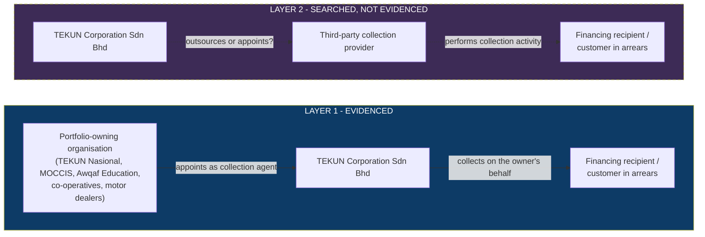
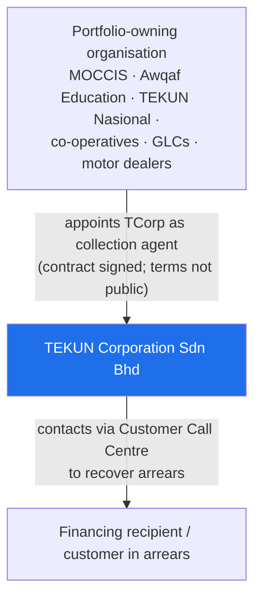
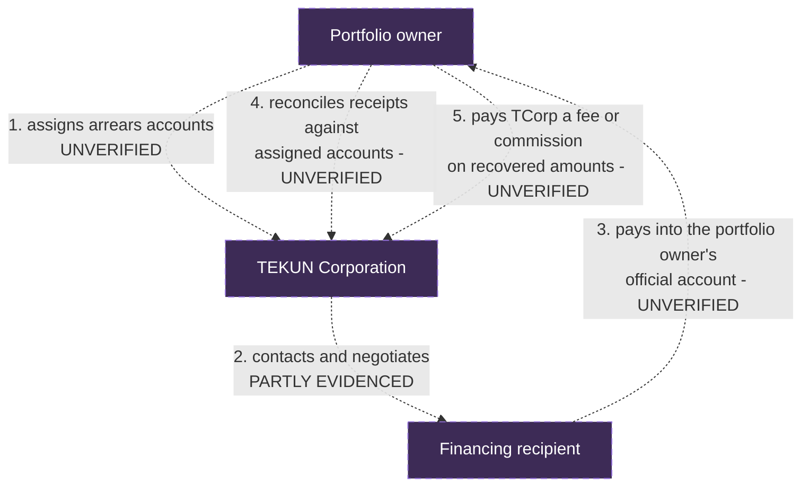

# Current Third-Party Arrangements, Contracts And Commercial Model

**Research date:** 31 August 2026. **Covers research areas C, D, E and M.**
**Reading rule:** every heading below states what was *found*, not what is *likely*.

---

## 1. Executive answer

Three direct answers to the three questions that matter most.

### Q1. Who appoints TEKUN Corporation to manage collection?

**Answered.** Roughly 30 agencies and companies, per TCorp's own statement. At
least 24 are identifiable by name, and three 2026 appointments are documented
with dates and signatories. They include TEKUN Nasional itself, government-linked
bodies, a large group of co-operatives, and private motor dealers.
See [tekun-corporation-profile.md §6](tekun-corporation-profile.md#6-publicly-named-client-organisations).

### Q2. Which external providers does TEKUN Corporation currently hire?

**Not publicly disclosed.** Extensive searching in Bahasa Melayu and English
across TCorp's own site, TEKUN Nasional's procurement pages, government
procurement portals, the Auditor-General's report and news found **no evidence
that TEKUN Corporation appoints any third-party collection provider.** The public
record describes TCorp performing collection itself through its own call centre.

This is a searched-and-not-found result. It is **not** evidence that no such
provider exists. It means the question must be put to TEKUN.

### Q3. How are existing providers paid?

**Not publicly disclosed.** No contract value, commission percentage, success
fee, management fee, per-account fee, per-agent fee or performance incentive
relating to TEKUN Corporation's collection business was found in any public
source. No tender or quotation notice for collection services was found.

---

## 2. The two relationship layers, kept separate

This distinction is the most common way this research could be misread, so it is
stated formally.

| | Layer 1 | Layer 2 |
| --- | --- | --- |
| Who is the customer? | The portfolio owner is TCorp's customer | TCorp would be the provider's customer |
| Evidence status | **Evidenced** - named clients, dated contracts | **Not publicly disclosed** |
| Named parties | ~30, at least 24 identifiable | None found |
| What it means for us | These are the organisations TCorp must serve well | This is where our proposed role would sit - **or** where we would be a new capability rather than a replacement |

> **The single most common error to avoid:** treating a name on TCorp's client
> panel as a collection vendor TCorp hires. MOCCIS, ANGKASA, Koperasi TNB, PUNB
> and the rest **hire TCorp**. They are the demand side, not the supply side.

---

## 3. What was searched, and where

Recording the search perimeter makes the "not disclosed" finding auditable.

| Source searched | Result |
| --- | --- |
| `tcorp.com.my` - all main pages, credit recovery page, news, corporate info | No third-party collection provider named |
| `tcorp.com.my/iklan-sebut-harga/` (quotation notices) | Page exists; **no notices rendered** on 31 August 2026 |
| `tcorp.com.my/iklan-kerjaya/` (career ads) | **HTTP 404** on 31 August 2026 |
| `tekun.gov.my` tender page | One tender listed: advertised 4 February 2026, closed 12 February 2026, shown as `DITUTUP`. Search results indicate it concerned a **financial management system**, not collection |
| `tekun.gov.my/ms/perolehan/iklan/` and `/kenyataan-sebutharga/` (given as starting points) | **HTTP 404** - broken URLs, corrected to `tekun.gov.my/tender/` |
| Auditor-General report on TEKUN Nasional fund and financing management | No mention of external collection agents; no mention of TEKUN Corporation |
| MyProcurement / ePerolehan via search | No collection-services award to or by TEKUN Corporation found |
| Malay-language searches: *ejen kutipan hutang*, *syarikat kutipan hutang*, *pihak ketiga kutipan*, *outsourcing kutipan*, *tender kutipan*, *sebut harga kutipan*, *perolehan*, *keputusan tender*, *kadar komisen*, *fi kutipan*, *bayaran vendor*, *pusat panggilan* | No third-party provider identified |
| English searches: contract award, vendor, collection agency, commission, ePerolehan, MyProcurement | No third-party provider identified |

### Sources that could not be opened

| Source | Status | Effect |
| --- | --- | --- |
| `iso.org/standard/27001` | HTTP 403 (bot protection) | No ISO-specific claim is made anywhere in this pack |
| SSM company search (paid/registered service) | Not used | Directors, shareholding and financials for TCorp are unverified |
| Full contract documents for any appointment | Not public | All contract terms are unknown |

---

## 4. Relationship records for verified appointments

These follow the record structure required by the research brief. Every
unavailable field says so explicitly rather than being estimated.

### 4.1 Record RR-001 - MOCCIS

| Field | Value |
| --- | --- |
| Counterparty legal name | Koperasi Pegawai-Pegawai Melayu Malaysia Berhad (MOCCIS) |
| Direction of relationship | **MOCCIS appoints TCorp** (Layer 1 - MOCCIS is the client) |
| Provider role | TEKUN Corporation as *Agensi Pemulihan Kredit* / credit management and recovery services provider |
| Appointing entity | MOCCIS |
| Portfolio owner | MOCCIS |
| Appointment date | Appointment ceremony 7 July 2026; service contract signed 23 July 2026; MoU 7 August 2026 |
| Contract period | **Not publicly disclosed** |
| Geographic scope | **Not publicly disclosed** |
| Portfolio scope | **Not publicly disclosed** |
| Number / value of accounts | **Not publicly disclosed** |
| Collection channels | **Not publicly disclosed** (TCorp's general model is call-centre based) |
| System used | **Not publicly disclosed** |
| Data exchanged | **Not publicly disclosed** |
| Payment destination | **Not publicly disclosed** |
| Reconciliation responsibility | **Not publicly disclosed** |
| Complaint responsibility | **Not publicly disclosed** |
| Legal-escalation responsibility | **Not publicly disclosed** |
| Performance measures | **Not publicly disclosed** |
| Commercial arrangement | **Not publicly disclosed** |
| Disclosed contract value | **Not publicly disclosed** |
| Current status evidence | TCorp news items dated 7 July, 23 July and 7 August 2026 |
| Confidence | **Confirmed** that the appointment exists; **Not publicly disclosed** for every commercial and operational term |
| Unanswered questions | Duration, value, commission basis, portfolio size, ageing profile, channel mix, systems, data flow, SLA |

**Note on the co-operative dimension.** MOCCIS is a co-operative society. That
matters for regulatory analysis - see
[regulatory-and-responsible-collection.md](regulatory-and-responsible-collection.md) §6.

### 4.2 Record RR-002 - Awqaf Education Sdn Bhd

| Field | Value |
| --- | --- |
| Counterparty legal name | Awqaf Education Sdn Bhd |
| Direction of relationship | **Awqaf Education appoints TCorp** (Layer 1) |
| Provider role | TCorp as *Agensi Kutipan Hutang* under a *Kontrak Perjanjian Perkhidmatan Agensi Kutipan Hutang dan Pemulihan Kredit* |
| Appointment date | 7 May 2026 |
| Signatories | Encik Husnaidy bin Ibrahim (TCorp Board Member and Chief Executive); Encik Ibrahim Adham bin Ismail (Director, Awqaf Education) |
| Location | TEKUN Nasional headquarters, Kuala Lumpur |
| Every commercial and operational term | **Not publicly disclosed** |
| Confidence | **Confirmed** appointment; **Not publicly disclosed** terms |

### 4.3 Record RR-003 - TEKUN Nasional as a client of TCorp

| Field | Value |
| --- | --- |
| Counterparty | TEKUN Nasional |
| Direction | TEKUN Nasional appears on TCorp's client panel as an appointing organisation |
| Appointment date | **Not publicly disclosed** |
| Portfolio scope | **Not publicly disclosed** |
| Commercial arrangement | **Not publicly disclosed** |
| Confidence | **Strongly indicated** - TEKUN Nasional's logo leads TCorp's client panel and TCorp is its subsidiary, but no contract, date or scope was found |
| Why it matters | This is the parent-subsidiary collection relationship. Whether it is contractual, at arm's length, or an internal service arrangement is unknown and materially affects any commercial model |

### 4.4 Record RR-004 - Third-party providers hired by TCorp

| Field | Value |
| --- | --- |
| Counterparty legal name | **None identified** |
| Confidence | **Not publicly disclosed** |
| What was done | Search perimeter documented in §3 |
| What this permits | Asking TEKUN. Nothing else |
| What this forbids | Naming any company as TCorp's incumbent; describing an incumbent's performance; proposing to "replace" a provider whose existence is unproven |

---

## 5. Contract and money flow

### 5.1 Verified current-state flow

Only this much is actually proven:

**That is the entire verified flow.** Where money physically moves, who
reconciles it, and how TCorp is paid are all unverified.

### 5.2 Probable but UNVERIFIED flow

> ### ⚠️ THIS DIAGRAM IS NOT EVIDENCE
> Every step below is an inference. It is drawn only so that discovery questions
> can be precise. **Do not reuse this diagram in any external document, and do
> not present it as TEKUN's current-state process.**

**Why step 3 is drawn as payment to the portfolio owner rather than to TCorp:**
this is not a guess about TEKUN. It reflects a regulatory requirement and a
regulator's public consumer guidance:

- The SKP Conduct Standards require that payments by credit consumers are made
  **directly to the authorised entity**, and that debt collection representatives
  **do not accept payments** on its behalf, to eliminate loss, theft, mishandling
  and fraud risk (paragraph 12.13), with a receipt or statement issued afterwards
  (12.14).
- SKP's public guidance to consumers about debt collection agencies says plainly:
  do not hand cash to the agency; pay directly to the credit provider's account
  through bank transfer or official payment channels, and keep receipts.

> **Interpretation.** Any target operating model must therefore assume that
> **our team and TCorp's agents never take customer money.** Payment must land in
> the principal's or the authorised entity's account, and the platform's job is to
> *evidence* the payment and reconcile it - not to hold it. This is a design
> constraint, not a preference.

### 5.3 Alternative possible flows

All unverified. Listed so discovery can distinguish between them quickly.

| # | Possible flow | What would confirm it |
| --- | --- | --- |
| A | Portfolio owner pays TCorp a commission only on amounts actually recovered | Fee schedule showing contingency basis |
| B | Portfolio owner pays TCorp a fixed management fee plus a smaller success element | Contract fee clause |
| C | TCorp is paid a fixed operating cost recovery (relevant for the TEKUN Nasional relationship, which may be an internal service) | Intercompany service agreement |
| D | Commission rate varies by arrears bucket, account value or product | Tiered fee table |
| E | Recipients pay into the portfolio owner's account; TCorp is paid after reconciliation closes | Reconciliation and payment-approval procedure |
| F | TCorp temporarily handles money through a designated collection account | Bank mandate or trust-account arrangement - would need careful regulatory review |
| G | Mixed model differing per principal | Multiple fee schedules |

### 5.4 The specific commercial questions to ask

1. Does the portfolio owner pay TCorp a collection commission?
2. If so, is it a percentage of amounts recovered, and on what base?
3. Does the rate change by arrears age, account value, product or channel?
4. Does TCorp retain the whole fee, or share any part with another party?
5. Does TCorp pay any external agency out of that fee?
6. Is any provider paid only on successful recovery?
7. Does TCorp receive any fixed operating-cost contribution?
8. Do recipients pay directly into the portfolio owner's account?
9. Does TCorp ever handle money, even temporarily?
10. Are agents prohibited from receiving money, and how is that enforced?
11. How does reconciliation timing affect when a fee becomes payable?
12. Is there any minimum collection target, performance bond, or service-level penalty?

---

## 6. Disclosed fees and contract values

| Item | Status |
| --- | --- |
| Contract values | **Not publicly disclosed in the sources reviewed** |
| Approved expenditure | **Not publicly disclosed in the sources reviewed** |
| Amounts paid to any provider | **Not publicly disclosed in the sources reviewed** |
| Commission percentages | **Not publicly disclosed in the sources reviewed** |
| Success or contingency fees | **Not publicly disclosed in the sources reviewed** |
| Fixed management fees | **Not publicly disclosed in the sources reviewed** |
| Per-account, per-agent, per-seat fees | **Not publicly disclosed in the sources reviewed** |
| Technology licence, maintenance charges | **Not publicly disclosed in the sources reviewed** |
| Recovery-stage commission tiers | **Not publicly disclosed in the sources reviewed** |
| Legal recovery and field-visit charges | **Not publicly disclosed in the sources reviewed** |
| Contract duration, renewal, extension | **Not publicly disclosed in the sources reviewed** |
| Minimum collection targets | **Not publicly disclosed in the sources reviewed** |
| Performance bonds, SLA penalties | **Not publicly disclosed in the sources reviewed** |
| Procurement method, tender reference, award date, bidder count | **Not publicly disclosed in the sources reviewed** |

**Rule for anyone using this pack:** do not replace any row above with an
industry benchmark. Benchmarks live in
[performance-and-commercial-framework.md](performance-and-commercial-framework.md)
and are labelled as archetypes, never as TEKUN's rate.

### The one genuinely disclosed cost signal

There is exactly one publicly disclosed money figure that will apply to a
registered debt collection agency in Malaysia, and it is a **regulatory fee, not
a TEKUN commercial term**:

| Item | Amount | Source |
| --- | --- | --- |
| Minimum shareholders' funds or total equity to be registered for debt collection | **RM500,000** | SKP Authorisation Standards v1.0, Table 2 |
| Annual registration fee, revenue < RM3m | RM5,000 | SKP Authorisation Standards v1.0, para 14.7(b) |
| Annual registration fee, RM3m to < RM15m | RM12,000 | as above |
| Annual registration fee, RM15m to < RM50m | RM25,000 | as above |
| Annual registration fee, ≥ RM50m | RM50,000 | as above |
| Payment due | By the last day of February each year | as above |

This is genuine, quantified, current cost information that belongs in any serious
commercial conversation - and it is about the *regulatory* cost of operating,
not about what TEKUN pays anyone.

---

## 7. Comparable commercial model archetypes

Labelled **illustrative options**. None is a recommendation, and none reflects
any TEKUN rate. Full analysis in
[performance-and-commercial-framework.md](performance-and-commercial-framework.md).

| Archetype | How it works | Who carries operating risk |
| --- | --- | --- |
| Contingency / success fee | Provider paid a share of amounts actually recovered | Provider |
| Fixed management fee | Provider paid a set periodic amount for running the operation | Client |
| Per-seat or per-agent | Priced on resourced capacity | Shared |
| Per-account placed | Priced on volume of accounts assigned | Shared |
| Platform licence plus operations | Software fee separated from collection-operations fee | Split by component |
| Hybrid fixed plus performance | Fixed floor covering cost-to-serve, performance element above a baseline | Shared, with a floor |
| Gain-share above a baseline | Provider paid a share of improvement over an agreed baseline | Provider, above baseline |

> **The safeguard that matters most.** SKP Conduct Standards paragraph 12.4
> requires an authorised entity to ensure that its **reward and remuneration
> system for debt collection representatives promotes fair outcomes for credit
> consumers**. Any commission-heavy design must be tested against that
> requirement before it is proposed, not after.

---

## 8. Incumbent and transition analysis

### 8.1 What the evidence actually supports

| Question | Evidence-based answer |
| --- | --- |
| What does the existing provider do? | **No third-party provider is publicly evidenced.** The evidenced operator is TCorp itself |
| What does TCorp retain internally? | Call-centre collection through the Pusat Panggilan Pelanggan, and account supervision for principals. Anything beyond that is unknown |
| Would we replace an incumbent? | **Cannot be determined.** No incumbent identified |
| Would we coordinate existing providers? | **Cannot be determined** |
| Would we complement TCorp's capability? | **This is the only posture the evidence currently supports** |

### 8.2 Recommended positioning, given the evidence

> **Interpretation, and the recommended narrative direction.** Because no
> incumbent third-party provider is publicly evidenced, and because TCorp's own
> collection business is visibly expanding in 2026, the defensible framing is:
>
> **"Modernise, integrate, scale and continuously improve TEKUN Corporation's
> established collection and credit-recovery business."**
>
> Not "replace an incumbent". Not "fix a failing operation". Not "TEKUN lacks
> collection capability". Those framings are unsupported and would be
> commercially damaging if wrong.

Constructive language that the evidence supports:

- consolidate fragmented activity across a growing number of principals
- strengthen visibility over portfolios, accounts and outcomes
- introduce consistent governance across principals
- integrate technology and operations
- create measurable performance management
- complement existing call-centre capability
- support controlled transition as new principals onboard

### 8.3 Transition considerations to design for

Even without a named incumbent, these must be planned:

| Area | Consideration |
| --- | --- |
| Contract expiry | Unknown for every appointment; ask before assuming a start date |
| Parallel pilot | **Recommended posture.** A bounded pilot on one principal or one arrears segment is far safer than a whole-estate cutover, and it produces the baseline the commercial model needs |
| Portfolio transfer | Account, balance, ageing and contact data must move with provenance |
| Case migration | Open promises, disputes, hardship cases and legal matters must not be lost |
| Historical interactions | Contact history is evidence; SKP paragraph 12.9 requires records of all communication attempts to be retained |
| Data quality | The Auditor-General found 119 entrepreneurs on TEKUN Nasional's bad-debt list without complete identity-card records. Treat identity completeness as a real migration risk, not a formality *(TEKUN Nasional context)* |
| Payment reconciliation during transition | Highest-risk area; needs a dual-running reconciliation plan |
| Employee and agent transition | Competency assessment under SKP paragraph 15.2 applies before initial appointment and annually |
| Complaints in flight | Must not be dropped at cutover |
| Legal cases in progress | Must be identified before any migration |
| Reporting continuity | Principals must keep receiving reports throughout |

### 8.4 Transition risk that is specific and time-bound

The SKP registration transition window closes at the end of 2026 (see the
regulatory file). Any transition plan proposed to TCorp should be sequenced
**around** that deadline rather than colliding with it. Asking TCorp about its
registration status early is both commercially useful and genuinely helpful to
them.

---

## 9. Questions for TEKUN Corporation

Prioritised. Full set in
[unknowns-and-discovery-questions.md](unknowns-and-discovery-questions.md).

**Tier 1 - cannot design without these**

1. Is the current list of principals still around 30, and what is the split by
   sector and portfolio size?
2. Does TCorp currently use any external provider for any part of collection,
   including manpower, technology, tracing, messaging or legal recovery?
3. How is TCorp paid by each principal, and does the basis differ per principal?
4. What system does the Customer Call Centre run on today?
5. Has TCorp registered with SKP as a debt collection agency, or submitted a
   section 79(2) declaration?

**Tier 2 - needed for baselining and pricing**

6. Total accounts and total value under management, by principal and arrears band.
7. Current collection and recovery rates, however TCorp defines them.
8. Headcount: internal agents, supervisors, field staff, outsourced staff.
9. Where recipients pay, and who reconciles.
10. Complaint volumes, hardship volumes, and legal escalation volumes.

**Tier 3 - needed before contracting**

11. Contract expiry and renewal dates per principal.
12. Settlement and write-off authority levels.
13. Desired commercial arrangement and target outcomes.
