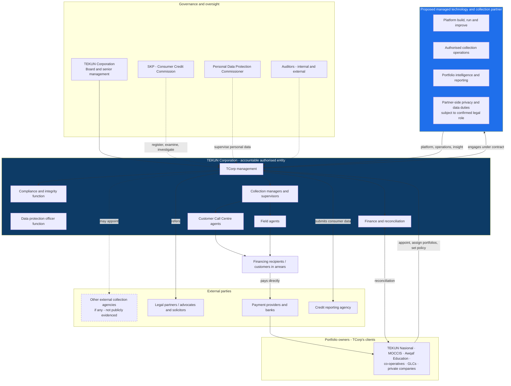
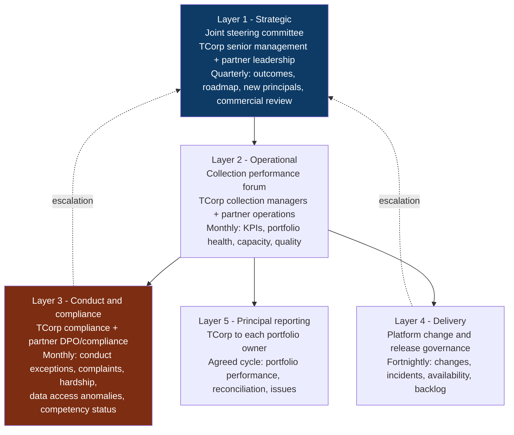
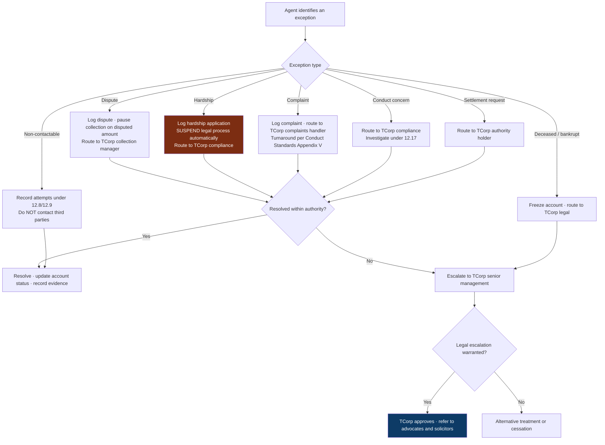
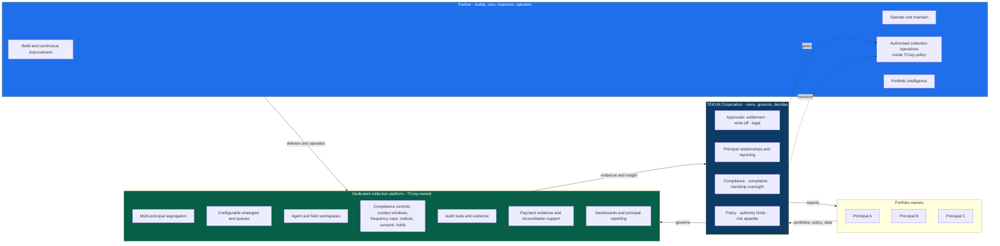

# Operating Model And Stakeholders

**Covers research area I.** **Research date:** 31 August 2026.

> **Status warning.** Everything in this file that describes *how work would be
> divided* is **proposed direction**, not established fact. TEKUN Corporation's
> actual current operating model is largely **not publicly disclosed**. This file
> gives a defensible starting design and names exactly what must be confirmed.

---

## 1. What we actually know about the current model

| Element | Evidence |
| --- | --- |
| TCorp operates a Customer Call Centre for collection | **Confirmed** - first-party, since 15 September 2015 |
| TCorp serves multiple principals simultaneously | **Confirmed** - ~30 stated, 24 identified, 2 new in 2026 |
| TCorp supervises loan arrears accounts from specified agencies | **Confirmed** - first-party description |
| Whether field collection is performed | **Not publicly disclosed** |
| Whether legal recovery is in-house or referred | **Not publicly disclosed** |
| Internal headcount and structure | **Not publicly disclosed** |
| Whether any function is outsourced | **Not publicly disclosed** |
| Systems used | **Not publicly disclosed** |

Design from this base. Do not design from an imagined current state.

---

## 2. Stakeholder map

---

## 3. The governing principle

> **TEKUN Corporation stays in strategic control. The partner operates.**

This is not diplomatic phrasing. It is what the law requires.

- SKP Conduct Standards paragraph 2.2: where an authorised entity enters into an
  arrangement with a representative, **the authorised entity remains accountable**
  for that representative's actions and conduct.
- Act 873 section 114: an offence by an **agent** acting on a person's behalf is
  deemed committed by that person, with the same penalty.

Accountability cannot be outsourced. Therefore the operating model must give
TCorp **provable oversight** of everything the partner does - not reports after
the fact, but live visibility, approval gates and audit trails.

A second consequence: the partner must never be positioned as the decision-maker
on customer outcomes. Settlement authority, write-off authority, legal escalation
authority and hardship decisions belong to TCorp.

---

## 4. Responsibility model (RACI)

**R** = performs · **A** = accountable · **C** = consulted · **S** = supports

| Activity | TCorp Board / management | TCorp compliance | TCorp finance | TCorp collection managers | TCorp agents | Partner platform team | Partner operations team | Portfolio owner | External legal |
| --- | --- | --- | --- | --- | --- | --- | --- | --- | --- |
| Set collection policy and risk appetite | **A/R** | C | C | C | n/a | S | S | C | n/a |
| Accept a new principal / portfolio | **A/R** | C | C | C | n/a | S | S | **R** | n/a |
| Define collection strategy per portfolio | **A** | C | n/a | **R** | n/a | S | C | C | n/a |
| Configure strategy in the platform | A | C | n/a | C | n/a | **R** | S | n/a | n/a |
| Assign work queues and cases | A | n/a | n/a | **R** | n/a | S | **R** | n/a | n/a |
| Contact customers in arrears | **A** | n/a | n/a | C | **R** | n/a | **R** | n/a | n/a |
| Verify customer identity before discussing debt | **A** | C | n/a | C | **R** | S | **R** | n/a | n/a |
| Issue reminders and 7-day recovery notices | **A** | C | n/a | C | R | S | **R** | C | n/a |
| Negotiate and record promises to pay | **A** | n/a | n/a | C | **R** | S | **R** | n/a | n/a |
| Approve a settlement or discount | **A/R** | C | C | C | n/a | n/a | C | C | n/a |
| Approve write-off | **A/R** | C | **R** | C | n/a | n/a | n/a | **C** | n/a |
| Approve legal escalation | **A/R** | C | n/a | C | n/a | n/a | C | C | **R** |
| Conduct litigation | A | C | n/a | n/a | n/a | n/a | n/a | C | **A/R** |
| Handle hardship applications | **A** | **R** | C | C | S | S | **R** | C | n/a |
| Handle complaints | **A** | **R** | n/a | C | S | S | **R** | C | n/a |
| Receive customer money | n/a | n/a | n/a | n/a | **Never** | **Never** | **Never** | **A/R** | n/a |
| Reconcile receipts to accounts | A | n/a | **R** | C | n/a | **S** | S | **C/R** | n/a |
| Monitor agent conduct and quality | **A** | **R** | n/a | **R** | n/a | S | **R** | n/a | n/a |
| Assess representative competency (annual) | **A** | **R** | n/a | C | n/a | n/a | **S** | n/a | n/a |
| Maintain audit trails and evidence | **A** | C | n/a | n/a | n/a | **R** | S | n/a | n/a |
| Detect unusual data access and downloads | **A** | C | n/a | n/a | n/a | **R** | S | n/a | n/a |
| Report a personal data breach | **A/R** | **R** | n/a | n/a | n/a | **S** | S | C | n/a |
| SKP registration and regulatory reporting | **A/R** | **R** | C | n/a | n/a | S | S | n/a | C |
| Submit consumer data to a credit reporting agency | **A/R** | C | C | n/a | n/a | **S** | n/a | C | n/a |
| Report portfolio performance to principals | **A** | n/a | C | **R** | n/a | **S** | **R** | **C** | n/a |
| Operate, maintain and improve the platform | C | C | n/a | C | n/a | **A/R** | C | n/a | n/a |
| Own the data | **A/R** | n/a | n/a | n/a | n/a | n/a | n/a | **C** | n/a |

**Two rows deserve emphasis.**

- **"Receive customer money" is marked Never** for every agent and every partner
  role. That follows Conduct Standards 12.13 and SKP's public consumer guidance.
  It is a design constraint, not a policy preference.
- **"Own the data" is TCorp's, always.** See
  [partnership-durability-strategy.md](partnership-durability-strategy.md).

---

## 5. Expected responsibilities by stakeholder

### TEKUN Corporation
Holds the client relationships and the regulatory accountability. Sets policy,
risk appetite and authority limits. Approves settlements, write-offs and legal
escalation. Owns the SKP relationship and any registration or declaration. Owns
the data. Decides which principals and portfolios are onboarded.

### Portfolio-owning organisations (TCorp's clients)
Own the underlying credit agreements and the customer relationship of origin.
Provide portfolio data, assignment rules and policy constraints. Receive customer
payments into their own accounts. Confirm reconciliation. Retain the ultimate
commercial decision on their own accounts. Approve, or are consulted on,
write-offs affecting their portfolio.

### Our managed technology and collection team
Designs, builds, operates, maintains and continuously improves the platform.
Performs or coordinates **authorised** collection activity strictly inside TCorp's
policy and authority limits. Produces portfolio intelligence and reporting.
Meets the privacy, security, breach and DPO duties that apply to its confirmed
legal role, subject to the parties' compliance and legal review. **Never** receives customer money,
**never** approves settlements or write-offs, and **never** escalates to legal
action on its own authority.

### TCorp management, collection managers and supervisors
Translate policy into strategy per portfolio. Own queue design and workload
distribution. Monitor conduct and quality. Coach agents. Own the day-to-day
service relationship with principals.

### Call-centre and field agents (whether TCorp's or the partner's)
Work assigned cases inside strategy rules. Verify identity before discussing
debt. Record every interaction. Respect contact windows and frequency caps. Carry
a valid authorisation document. Never accept payment. Escalate hardship,
disputes and complaints rather than resolving them informally.

### External collection agencies, if any exist
Must be **registered with SKP** if collection is outsourced to them (Conduct
Standards 12.3). Must be governed by the same conduct rules, monitored on the
same measures, and covered by contractual data-access safeguards (16.13(c)).

### Financing recipients / customers in arrears
Entitled to accurate information, identity verification, contact within
8am-9pm, contact no more than 3 times per week or 12 times per month, a 7-day
written recovery notice before recovery action, confidentiality from family and
employer, a hardship route, a complaints route, no cost pass-through, and
immediate cessation of recovery on settlement.

### Payment providers, banks, finance and reconciliation teams
Receive and evidence payments into the principal's or authorised entity's
account. Provide the reconciliation feed that closes the loop between a payment
and a case. Reconciliation timing is likely to drive fee calculation - confirm.

### Complaint handlers, compliance, and DPO functions
Complaints: investigate thoroughly, remediate misconduct, meet turnaround times.
Compliance: own SKP obligations, conduct monitoring, competency assessment.
DPO and privacy responsibilities must be assigned after confirming whether each
party is a controller, processor, sub-processor or joint controller and which
appointment criteria apply.

### Legal partners
Advocates and solicitors sit outside the Schedule 3 debt collection definition.
They conduct litigation on TCorp's or the principal's instruction. Neither TCorp
agents nor partner agents may falsely imply legal authority.

### Auditors, board and senior management
Require evidence, not assertion: audit trails, exception reports, conduct
monitoring results, reconciliation ageing, complaint statistics.

---

## 6. Proposed governance layers

**Layer 3 is deliberately separate from Layer 2.** Conduct and compliance must not
report through the same forum that is being measured on collection performance.
That separation is what makes paragraph 12.4 - remuneration promoting fair
outcomes - credible rather than decorative.

---

## 7. Escalation flow

**Note the hardship branch.** Section 86(5) suspends the right to commence
proceedings, execution or other legal process while a hardship application is
being assessed. The platform must enforce that automatically, not rely on an
agent remembering.

---

## 8. Labelled assumptions

Every one of these is an assumption, not a finding. Each has a confirming
question in [unknowns-and-discovery-questions.md](unknowns-and-discovery-questions.md).

| # | Assumption | Risk if wrong |
| --- | --- | --- |
| A1 | TCorp retains settlement, write-off and legal-escalation authority | If a principal holds it instead, approval flows and SLAs change materially |
| A2 | Customers pay into the principal's or authorised entity's account, never to an agent | If money is currently handled differently, that is a compliance issue to raise carefully, not a design assumption |
| A3 | TCorp is the data controller and the partner would be a data processor | Changes DPO duties, contracts and breach responsibility |
| A4 | TCorp has an existing complaints intake (a complaint form is published) | Complaints capability may need to be built rather than integrated |
| A5 | Field collection exists in some form | Field workflow may be new capability rather than digitisation |
| A6 | Reconciliation is performed by the principal, or jointly | Determines where the platform integrates and when fees crystallise |
| A7 | Each principal has its own policy constraints | If policies are uniform, multi-tenancy is simpler than assumed |
| A8 | Partner staff performing collection would act as TCorp's representatives under its authorisation | If separate registration is required, the model and timeline change |
| A9 | TCorp will remain the contracting party with principals | If principals contract the partner directly, the whole commercial model changes |
| A10 | Existing collection is predominantly call-centre based | Channel strategy and capacity planning depend on this |

---

## 9. Proposed target operating model

> **Labelled: proposed direction.** Not a current-state description.

**The three-line summary of the model:**

1. TEKUN Corporation **owns and governs** the platform and holds every decision
   that affects a customer's outcome.
2. The partner **builds, runs, improves and operates** - including performing or
   coordinating authorised collection activity - inside TCorp's policy envelope.
3. The platform **proves** what happened, to TCorp, to principals, and to
   regulators.
