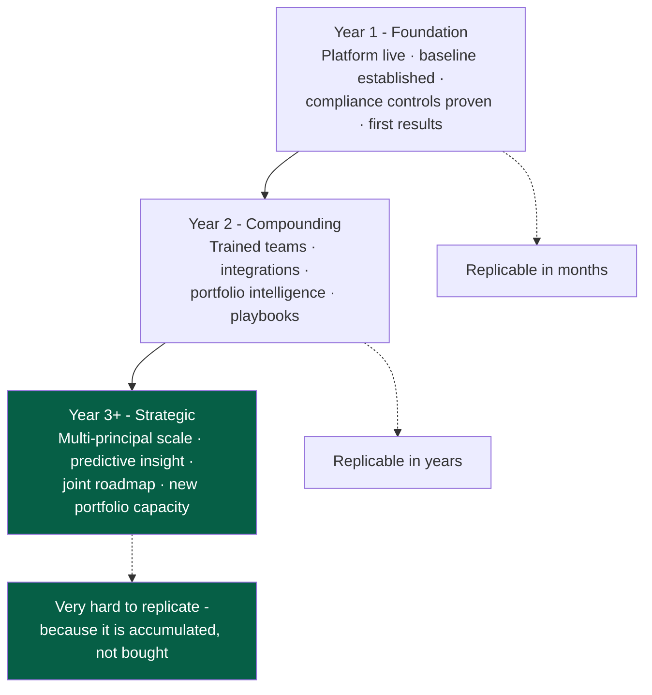
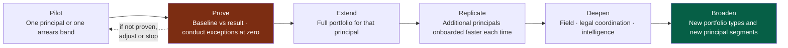

# Partnership Durability Strategy

**Covers research area N.** **Research date:** 31 August 2026.
**Audience of this file:** internal. Section 7 marks what is external-safe.

---

## 1. The internal position, stated plainly

The long-term goal is to become TEKUN Corporation's trusted technology,
collection-operations and performance-improvement partner - a relationship that
deepens over years rather than one that gets re-tendered annually.

**The internal phrase "make TEKUN reliant on us" must never appear in any
external document, email, slide or conversation.** It is also, on its own, the
wrong objective. Reliance that comes from a client being unable to leave is
fragile: it survives only until the client finds a way out, and it invites
exactly the procurement scrutiny a government-linked subsidiary is obliged to
apply.

The durable version is different, and it is stated as the operating principle for
this partnership:

> **TEKUN Corporation should stay because leaving would cost them value they can
> measure - never because leaving would cost them access to their own data,
> documentation, or operational knowledge.**

Everything in this file follows from that sentence.

---

## 2. Where durable value actually comes from

Seven sources, ranked by how hard they are for a competitor to replicate.

| # | Source of durability | Why it compounds | Replaceable by a competitor? |
| --- | --- | --- | --- |
| 1 | **Measurable results** | A partner with three years of audited improvement has an argument nobody else can make | Only by outperforming, which takes years |
| 2 | **Accumulated operating knowledge** | Which strategies work on which portfolio types, which contact patterns produce kept promises, which cohorts are uneconomic to pursue | No - this is earned per portfolio |
| 3 | **Trained collection teams** | Competency assessed, trained, coached, and current under Conduct Standards 15.2 | Only by rebuilding and reassessing |
| 4 | **Integrations** | Each principal's data feed, payment evidence, reconciliation and reporting route, built once and hardened | Only by rebuilding each one |
| 5 | **Governance** | Approval matrices, conduct monitoring, escalation paths that regulators and auditors accept | Slowly, and with risk during transition |
| 6 | **Service reliability** | Availability, restore-tested backups, incident discipline - trust built by not failing | Only over time |
| 7 | **Portfolio intelligence** | Longitudinal data across principals, cohorts and vintages that only exists because the partnership existed | No - it is a function of tenure |

> **The honest observation.** Items 2, 3 and 7 cannot be bought by a competitor
> at any price, because they are produced by having done the work. That is real,
> defensible durability, and it needs no lock-in mechanism at all.

---

## 3. Value-based retention model

| Horizon | What the partner delivers | What TCorp gains | What makes them stay |
| --- | --- | --- | --- |
| **0-6 months** | Platform live on a pilot portfolio; compliance controls operational; baseline established | Visibility they did not previously have; a defensible baseline | Proof that the partner delivers |
| **6-12 months** | Measured improvement on the pilot cohort; conduct exceptions trending to zero; first principal reporting packs | Evidence for their board and their principals | Results they can show upward |
| **Year 2** | Scale to more principals; integrations hardened; teams trained and assessed; playbooks written | Faster onboarding of new principals; lower cost-to-collect | Capacity they did not have |
| **Year 3** | Portfolio intelligence across cohorts; predictive insight; roadmap co-owned | Ability to win and serve more principals | Growth that depends on capability, not on a contract clause |
| **Year 4+** | Continuous improvement; joint strategy; new portfolio types | A collection business materially larger than in 2026 | The partnership is now part of how they compete |

**The strategic prize, stated internally:** TCorp's own mission is to be a
principal income-generating subsidiary for TEKUN Nasional, and its collection
business visibly expanded during 2026 with Awqaf Education and MOCCIS. A partner
who makes TCorp *able to take on more principals safely* is participating in
TCorp's own growth strategy rather than merely servicing a cost line.

---

## 4. Ethical boundaries - what we will not do

These are commitments, not preferences.

| Prohibited | Why | What we do instead |
| --- | --- | --- |
| **Data hostage** - withholding, degrading or delaying access to TCorp's data | TCorp owns its data. It is also a regulated entity that must be able to produce records to SKP and the Commissioner on demand | Full export in a documented, usable format, on demand, throughout the term |
| **Hidden documentation** - undocumented configuration, tribal-knowledge dependencies | Undermines the client's ability to be audited and to govern its own operation | Configuration, runbooks, data dictionary and decision logs maintained and handed over continuously |
| **Obstructive exit terms** - punitive termination fees, long notice traps, exit-only pricing | Makes the relationship coercive rather than earned; would fail a government-linked procurement review | Transition assistance committed **at signature**, priced and scoped in advance |
| **Artificial incompatibility** - proprietary formats, deliberately awkward schemas, undocumented APIs | Same reason; also increases operational risk for TCorp | Open, documented formats and interfaces |
| **Unethical lock-in of any kind** | It is wrong, it invites scrutiny, and it is unnecessary given §2 | Compete on results |
| **Overstating what exists** | Claiming TEKUN already uses our system, or that a planned capability is live | Distinguish existing, proposed and future in every document |
| **Claiming compliance** | We can build controls; only TCorp's compliance function and counsel can conclude compliance | Describe controls and map them to rules |
| **Guaranteeing profit** | Not deliverable and not credible | Show the measurable pathway with named KPIs |

### The transition-readiness commitment

A deliberately counter-intuitive position, and the strongest trust signal
available:

> **TEKUN Corporation should be able to leave at any time, cleanly, with
> everything it needs - and should choose not to.**

Concretely, maintained from day one and demonstrated annually:

1. Complete data export, documented and tested
2. Current configuration documentation
3. Current runbooks and operating procedures
4. Data dictionary and integration specifications
5. Open case, promise, dispute, hardship and legal-matter registers
6. Full interaction history, which TCorp needs anyway under Conduct Standards 12.9
7. A written transition plan, refreshed annually
8. Named transition assistance terms in the contract

**Why this is commercially smart, not merely ethical.** A government-linked
subsidiary that must satisfy procurement, audit and now a regulator will
discount, or reject, a partner it cannot leave. Demonstrable exit readiness
removes the single largest objection to a long-term commitment.

---

## 5. Expansion model

Expansion should follow capability, not contract scope.

| Stage | Gate to pass before advancing |
| --- | --- |
| Pilot → Prove | Platform live, controls operational, baseline agreed in writing |
| Prove → Extend | Measured improvement **and** conduct exceptions within agreed thresholds |
| Extend → Replicate | Onboarding playbook written and tested once |
| Replicate → Deepen | Multi-principal operation stable; reporting accepted by principals |
| Deepen → Broaden | Governance mature; TCorp confident presenting results to its own board and principals |

**Each gate is a genuine stop point.** A partnership that expands through failed
gates is the kind that ends badly in year three.

---

## 6. Joint governance and roadmap

Retention is largely a governance outcome. The forums are defined in
[operating-model-and-stakeholders.md §6](operating-model-and-stakeholders.md#6-proposed-governance-layers).
What matters for durability:

| Practice | Why it produces durability |
| --- | --- |
| Joint steering committee with TCorp chairing | Signals that TCorp governs; prevents the partner drifting into apparent control |
| Roadmap co-owned, prioritised by TCorp | Improvements are theirs, not sold to them |
| Results reviewed against baseline, openly | Builds the audited track record that is itself the retention asset |
| Conduct and compliance reported separately | Protects the relationship from a conduct incident becoming a trust collapse |
| Annual transition-readiness review | Converts the exit commitment into a demonstrated fact |
| Continuous improvement backlog visible to TCorp | Shows the partnership is still investing, not coasting |
| Principal-level service reviews | Keeps the partner connected to what TCorp's own clients experience |

> **The renewal test.** At every renewal, TCorp should be able to answer, with
> numbers: what changed, what it cost, what it produced, and what happens next.
> If the partner cannot supply that, no lock-in clause would have saved the
> relationship anyway.

---

## 7. External-safe wording

### Use these

- long-term capability partnership
- strategic operating partnership
- compounding operational value
- continuous performance improvement
- accumulated portfolio intelligence
- measurable, auditable results
- TEKUN Corporation-owned, partner-operated
- transition-ready by design
- modernise, integrate, scale and continuously improve TEKUN Corporation's
  established collection and credit-recovery business

### Never use these

| Never write | Why |
| --- | --- |
| "make TEKUN reliant on us" | Internal intent; reads as predatory |
| "lock in", "sticky", "captive", "switching cost" | Signals coercion |
| "TEKUN uses our system" | **False.** TEKUN Corporation is a prospective client |
| "we will increase your profit" | Unguaranteeable |
| "fully compliant" / "guarantees compliance" | Only counsel and TCorp's compliance function can conclude that |
| "grant recipients" for repayable accounts | Inaccurate - use *financing recipients* or *customers in arrears* |
| "your current provider is failing" | **No incumbent third-party provider is publicly evidenced.** Unsupported and damaging |
| "TEKUN has no collection capability" | **False.** TCorp has run a collection call centre since September 2015 |
| "replace your existing system" | TCorp's current system is unknown |
| "ISO 27001 certified" | Not verified; must never be claimed without a certificate |

### The framing to lead with

> TEKUN Corporation has operated a credit management and recovery business since
> 2015 and serves around 30 appointing organisations. The proposal is to
> **modernise, integrate, scale and continuously improve** that established
> business - with TEKUN Corporation owning and governing the platform, and our
> team building, operating and improving it under TEKUN Corporation's policy and
> authority.

That sentence is accurate, evidence-backed, respectful of what TCorp has already
built, and it is the one framing that survives scrutiny.
