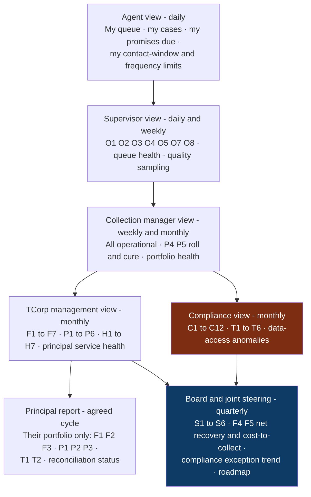
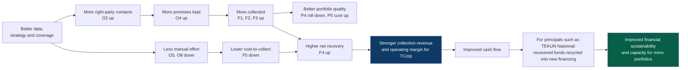

# Performance And Commercial Framework

**Covers research areas K and L.** **Research date:** 31 August 2026.

> **No price is decided here.** No figure in this file is a quote, and no
> benchmark is TEKUN's rate. Section 9 lists exactly what must be known before
> any number is proposed.

---

## 1. Why definitions matter more than targets

Collection language is used loosely across the industry. "Collection rate" can
mean at least four different things depending on numerator, denominator and
population. If TEKUN Corporation and a partner sign a commercial arrangement
where payment depends on a metric, and that metric is not defined to the level of
numerator, denominator, population, period and exclusions, the arrangement will
produce a dispute.

Every KPI below is therefore specified in full. **Names may differ from what
TEKUN uses internally - agree the definition, not the label.**

### The anchor definition, from an authoritative source

CGAP / The World Bank Group, *Microfinance Consensus Guidelines: Definitions of
Selected Financial Terms, Ratios, and Adjustments for Microfinance*, September
2003:

| Item | Definition as published |
| --- | --- |
| **B3 Portfolio at risk** | The value of all loans outstanding that have one or more instalments of principal past due more than a certain number of days. Includes the **entire unpaid principal balance, both past-due and future instalments**, but **not accrued interest**. **Does not include** loans that have been restructured or rescheduled |
| **B4 Restructured portfolio** | Principal balance of all loans renegotiated or modified to lengthen or postpone originally scheduled principal instalments, or to substantially alter original terms; includes refinanced loans |
| **R11 PAR ratio** | Portfolio at risk (X days) ÷ Gross loan portfolio |
| **R12 Write-off ratio** | Value of loans written off ÷ Average gross loan portfolio |
| **R13 Risk coverage ratio** | Loan-loss reserve ÷ Portfolio at risk > X days |

The guidelines add that when referring to PAR an institution should **always
specify the number of days**, and should **indicate whether restructured loans
are included** - some institutions include them deliberately, believing they
carry higher risk.

> **Contradiction logged.** A search summary encountered during this research
> asserted that CGAP/MicroRate standards are "explicit that rescheduled and
> restructured loans belong in the PAR numerator regardless of their current
> payment status." **The primary document says the opposite** at item B3, and
> treats inclusion as a disclosure choice at R11. The primary source governs.
> This is a live example of why search snippets are not evidence.
>
> **Limitation:** this publication dates from September 2003. It remains a widely
> used consensus reference, but its age should be acknowledged, and any
> Malaysian regulatory definition of impaired or non-performing financing takes
> precedence for regulatory reporting.

---

## 2. KPI dictionary

Each entry gives: name · meaning · numerator · denominator · population ·
period · data source · exclusions · misinterpretation risk · owner · frequency.

### 2.1 Operational leading indicators

These move first and are the ones a partner can genuinely influence week to week.

| # | KPI | Definition |
| --- | --- | --- |
| **O1** | **Contact rate** | *Meaning:* share of assigned accounts where any contact attempt was made. *Num:* accounts with ≥1 logged contact attempt in period. *Den:* accounts assigned and workable in period. *Population:* assigned accounts. *Period:* weekly and monthly. *Source:* interaction log. *Exclusions:* accounts on hardship hold, dispute pause, cessation, or legal referral. *Risk:* rewards volume of attempts, not quality - **never** use alone, and always pair with the frequency-cap compliance measure C3. *Owner:* collection manager. *Frequency:* weekly |
| **O2** | **Right-party contact rate** | *Meaning:* share of attempts that reached the verified customer. *Num:* attempts where identity was verified under Conduct Standards 12.12 and a conversation occurred. *Den:* total contact attempts. *Population:* all attempts. *Period:* weekly. *Source:* interaction log identity-verification flag. *Exclusions:* attempts to numbers later marked invalid. *Risk:* poor contact data depresses this and looks like agent underperformance. *Owner:* collection manager. *Frequency:* weekly |
| **O3** | **Promise-to-pay rate** | *Meaning:* share of right-party contacts producing a recorded promise. *Num:* promises recorded. *Den:* right-party contacts. *Population:* contacted accounts. *Period:* weekly. *Source:* promise records. *Exclusions:* promises on accounts already settled. *Risk:* **easily gamed** - agents can record weak promises. Must always be read with O4. *Owner:* collection manager. *Frequency:* weekly |
| **O4** | **Kept-promise rate** | *Meaning:* share of promises honoured in full and on time. *Num:* promises where payment matched amount and date within an agreed tolerance. *Den:* promises falling due in period. *Population:* promises due. *Period:* monthly. *Source:* promise records reconciled to payment evidence. *Exclusions:* promises superseded by an approved restructure or hardship plan. *Risk:* tolerance definition changes the number substantially - fix it in writing. *Owner:* collection manager. *Frequency:* monthly |
| **O5** | **Time to first action** | *Meaning:* elapsed time from account assignment to first substantive action. *Num:* sum of elapsed hours. *Den:* count of accounts assigned. *Population:* newly assigned accounts. *Period:* monthly. *Source:* assignment and interaction timestamps. *Exclusions:* accounts assigned then withdrawn. *Risk:* a trivial automated action can be logged to game the clock - define "substantive". *Owner:* collection manager. *Frequency:* monthly |
| **O6** | **Time to payment** | *Meaning:* elapsed time from first action to first qualifying payment. *Num:* sum of elapsed days. *Den:* accounts making a first payment in period. *Population:* accounts that paid. *Period:* monthly. *Source:* interaction log and payment evidence. *Exclusions:* payments made before any contact. *Risk:* survivorship - only counts accounts that paid. *Owner:* collection manager. *Frequency:* monthly |
| **O7** | **Cases per agent** | *Meaning:* active workload per agent. *Num:* active cases. *Den:* full-time-equivalent agents. *Population:* active cases. *Period:* monthly average. *Source:* case records and rota. *Exclusions:* suspended cases. *Risk:* raising it looks like productivity but can breach quality and frequency rules. *Owner:* supervisor. *Frequency:* monthly |
| **O8** | **Case-processing time** | *Meaning:* average days to close a case. *Num:* sum of days open for cases closed in period. *Den:* cases closed. *Population:* closed cases. *Period:* monthly. *Source:* case records. *Exclusions:* cases closed administratively at migration. *Risk:* closing cases early flatters it. *Owner:* supervisor. *Frequency:* monthly. *Benchmark note:* Dynamics 365 reports "average days to close case" and "average days to close activities" as standard measures |

### 2.2 Financial outcome indicators

| # | KPI | Definition |
| --- | --- | --- |
| **F1** | **Amount collected** | *Meaning:* gross value of qualifying payments received on assigned accounts. *Num:* sum of reconciled payments. *Den:* n/a - absolute. *Population:* assigned accounts. *Period:* monthly. *Source:* **reconciled** payment evidence from the principal, never agent-reported. *Exclusions:* reversed, dishonoured or misapplied payments; payments on accounts never assigned. *Risk:* unreconciled figures overstate. *Owner:* finance. *Frequency:* monthly |
| **F2** | **Collection rate** | *Meaning:* proportion of amounts due in period that were collected. *Num:* amount collected against instalments due in period. *Den:* total instalments due in period. *Population:* the defined portfolio. *Period:* monthly. *Source:* billing schedule and reconciled payments. *Exclusions:* accounts under approved moratorium or hardship plan - **state explicitly**. *Risk:* **the most ambiguous term in collections.** Some define it against amounts due, others against total outstanding, others against assigned arrears. Fix numerator, denominator and population contractually. *Owner:* finance. *Frequency:* monthly |
| **F3** | **Recovery rate** | *Meaning:* proportion of a defined arrears or written-off pool recovered. *Num:* amount recovered from the pool. *Den:* opening value of the pool. *Population:* a **named, frozen cohort** - e.g. accounts >180 days at a stated date. *Period:* cumulative from cohort start. *Source:* cohort register and reconciled payments. *Exclusions:* accounts returned to the principal mid-cohort. *Risk:* meaningless unless the cohort is frozen; a moving denominator invites dispute. *Owner:* finance. *Frequency:* monthly, cumulative |
| **F4** | **Net recovery** | *Meaning:* amount collected less the direct cost of collecting it. *Num:* F1 minus attributable collection costs (fees, operations, platform, legal, field). *Den:* n/a. *Population:* portfolio or principal. *Period:* monthly. *Source:* F1 and cost ledger. *Exclusions:* costs not attributable to collection. *Risk:* cost attribution rules decide the answer - agree them first. *Owner:* finance. *Frequency:* monthly |
| **F5** | **Cost-to-collect** | *Meaning:* cost incurred per unit recovered. *Num:* total attributable collection cost. *Den:* amount collected (F1). *Population:* portfolio. *Period:* monthly, with rolling 3-month view. *Source:* cost ledger and F1. *Exclusions:* one-off implementation cost - report separately. *Risk:* improves automatically when easy accounts are worked and worsens on hard cohorts; always segment by arrears age. *Owner:* finance. *Frequency:* monthly |
| **F6** | **Recovery per agent** | *Meaning:* recovery productivity. *Num:* amount collected. *Den:* FTE agents. *Population:* portfolio. *Period:* monthly. *Source:* F1 and rota. *Exclusions:* non-collection staff. *Risk:* portfolio mix dominates this; never compare agents across different arrears bands. *Owner:* collection manager. *Frequency:* monthly |
| **F7** | **Write-off ratio** | *Meaning:* share of portfolio removed as unlikely to be repaid. *Num:* value of loans written off. *Den:* **average** gross loan portfolio. *Population:* the portfolio. *Period:* annual, monitored quarterly. *Source:* principal's ledger. *Exclusions:* per the principal's write-off policy. *Risk:* write-off policy differences make cross-principal comparison invalid. *Owner:* principal, with finance. *Frequency:* quarterly. *Source of definition:* CGAP R12 |

### 2.3 Portfolio quality indicators

| # | KPI | Definition |
| --- | --- | --- |
| **P1** | **Portfolio at risk (PAR X days)** | *Meaning:* value of loans with principal past due beyond X days. *Num:* entire unpaid principal balance - past-due **and** future instalments - of qualifying loans; **excludes accrued interest**. *Den:* n/a - absolute; see P2 for the ratio. *Population:* the portfolio. *Period:* month-end. *Source:* principal's ledger. *Exclusions:* per CGAP B3, restructured and rescheduled loans are excluded - **but the choice must be stated**. *Risk:* comparing PAR figures with different day-thresholds or different restructure treatment is meaningless. *Owner:* finance. *Frequency:* monthly. *Definition source:* CGAP B3 |
| **P2** | **PAR ratio** | *Num:* Portfolio at risk (X days). *Den:* Gross loan portfolio. Always state X. *Definition source:* CGAP R11 |
| **P3** | **Arrears rate** | *Meaning:* share of accounts, or value, in any arrears. *Num:* accounts or value with any overdue instalment. *Den:* total accounts or value. *Population:* portfolio. *Period:* month-end. *Risk:* **not the same as PAR** - arrears rate can count the overdue amount only, while PAR counts the whole outstanding balance. Never present them interchangeably. *Owner:* finance. *Frequency:* monthly |
| **P4** | **Roll rate** | *Meaning:* share of accounts moving from one ageing bucket to the next worse bucket. *Num:* accounts in bucket N at period start that are in bucket N+1 at period end. *Den:* accounts in bucket N at period start. *Population:* per bucket. *Period:* monthly. *Source:* ageing snapshots. *Exclusions:* accounts settled or restructured mid-period - treat explicitly. *Risk:* requires point-in-time snapshots; cannot be reconstructed reliably from current-state data. *Owner:* finance. *Frequency:* monthly |
| **P5** | **Cure rate** | *Meaning:* share of delinquent accounts returning to current. *Num:* accounts in a bucket at period start that are current at period end. *Den:* accounts in that bucket at period start. *Population:* per bucket. *Period:* monthly. *Source:* ageing snapshots. *Exclusions:* accounts cured only via restructure - **report separately**, since a restructure-driven cure is not the same as a payment-driven cure. *Risk:* mixing the two overstates performance. *Owner:* collection manager. *Frequency:* monthly |
| **P6** | **Risk coverage ratio** | *Num:* loan-loss reserve. *Den:* PAR > X days. *Owner:* principal's finance. *Frequency:* quarterly. *Definition source:* CGAP R13 |

> **Terminology note.** TEKUN Nasional's Auditor-General report uses
> *non-performing financing (NPF)* - with arrears over six months as the
> classification threshold for most schemes - and *hutang lapuk* (bad debt) for
> arrears over 24 months where litigation action including judgment execution has
> been taken. **Those are TEKUN Nasional's internal definitions, not TCorp's, and
> not the Act's.** Do not silently map them onto PAR.

### 2.4 Customer-treatment indicators

These exist to prove the operation is fair, and they are **not** optional.

| # | KPI | Definition |
| --- | --- | --- |
| **T1** | **Complaint rate** | *Num:* complaints received relating to collection conduct. *Den:* accounts contacted (per thousand). *Period:* monthly. *Source:* complaints register. *Risk:* a falling rate may mean a broken intake, not better conduct - monitor intake health too. *Owner:* compliance. *Frequency:* monthly |
| **T2** | **Complaint resolution time** | *Num:* sum of days from receipt to resolution. *Den:* complaints resolved. *Period:* monthly. *Source:* complaints register. *Reference:* Conduct Standards Chapter 14 and the turnaround times at Appendix V. *Owner:* compliance. *Frequency:* monthly |
| **T3** | **Hardship application volume and outcome mix** | *Num:* applications by outcome across the five classifications at Conduct Standards 13.3. *Den:* total applications. *Period:* monthly. *Risk:* a very low approval rate is a conduct signal, not an efficiency win. *Owner:* compliance. *Frequency:* monthly |
| **T4** | **Hardship response timeliness** | *Num:* applications acknowledged and responded to within the specified timelines. *Den:* applications received. *Reference:* 13.3 and Appendix IV. *Owner:* compliance. *Frequency:* monthly |
| **T5** | **Cessation compliance** | *Num:* accounts where recovery action stopped within the agreed window after regularisation, settlement or plan acceptance. *Den:* accounts qualifying for cessation. *Reference:* **Conduct Standards 12.18**. *Risk:* a single failure here is a serious conduct breach, so measure at 100% target. *Owner:* compliance. *Frequency:* monthly |
| **T6** | **Dispute resolution time** | *Num:* sum of days open. *Den:* disputes closed. *Owner:* collection manager. *Frequency:* monthly |

### 2.5 Compliance indicators

Every one of these should target zero exceptions, and be reported to the conduct
and compliance forum, not the performance forum.

| # | KPI | Rule | Measure |
| --- | --- | --- | --- |
| **C1** | Contact-window exceptions | Conduct Standards 12.15(c)(i) | Contacts outside 8am-9pm ÷ total contacts |
| **C2** | Identity-verification exceptions | 12.12 | Debt discussions without a logged verification ÷ debt discussions |
| **C3** | Contact-frequency exceptions | 12.15(c)(ii) | Consumers contacted >3 times in a week or >12 in a month ÷ consumers contacted |
| **C4** | Recovery-notice compliance | 12.6 | Recovery actions preceded by a compliant notice ≥7 calendar days earlier ÷ recovery actions |
| **C5** | Third-party disclosure exceptions | 12.12, 12.15(f) | Contacts with non-consumer third parties ÷ total contacts. **Target zero** |
| **C6** | Payment-handling exceptions | 12.13 | Instances of a representative receiving payment. **Target zero** |
| **C7** | Representative authorisation validity | 12.10 | Active representatives with a valid, in-date authorisation document ÷ active representatives. **Target 100%** |
| **C8** | Competency assessment currency | 15.2 | Representatives with a current pre-appointment or annual assessment ÷ active representatives. **Target 100%** |
| **C9** | Cost pass-through exceptions | 12.16 | Accounts charged a recovery cost. **Target zero** |
| **C10** | Data-access anomalies | 16.9(b), 16.9(c) | Unusual viewing or downloading alerts raised, investigated and closed |
| **C11** | Breach notification timeliness | PDPA s.12B; DBN Guideline 6.1 | Breaches notified to the Commissioner within 72 hours ÷ notifiable breaches. **Target 100%** |
| **C12** | Regulatory submission timeliness | Authorisation Standards 13.4, 13.6 | Complaints data and credit reporting agency submissions made on time |

### 2.6 Platform health indicators

| # | KPI | Measure | Owner | Frequency |
| --- | --- | --- | --- | --- |
| **H1** | Platform availability | Uptime ÷ agreed service hours | Partner | Monthly |
| **H2** | Incident volume and severity | Incidents by severity | Partner | Monthly |
| **H3** | Mean time to restore | Sum of restore time ÷ incidents | Partner | Monthly |
| **H4** | Backup success and restore test | Successful backups; last successful **restore test** | Partner | Monthly backup, quarterly restore |
| **H5** | Reconciliation ageing | Value and count of receipts unreconciled beyond an agreed threshold | Finance | Weekly |
| **H6** | Data completeness | Accounts with complete identity and contact fields ÷ total accounts | Data governance | Monthly |
| **H7** | Integration health | Failed inbound/outbound transfers ÷ total | Partner | Weekly |

> **H4 says "restore test" deliberately.** A successful backup is not evidence of
> recoverability. The Auditor-General recommended that TEKUN Nasional establish a
> backup database and a disaster recovery plan following data loss and a system
> compromise in February 2022 *(TEKUN Nasional context)*.

### 2.7 Strategic growth indicators

| # | KPI | Measure | Owner | Frequency |
| --- | --- | --- | --- | --- |
| **S1** | Number of principals under management | Count of active principals | TCorp management | Quarterly |
| **S2** | Portfolio value under management | Total value of assigned portfolios | TCorp management | Quarterly |
| **S3** | Principal onboarding lead time | Days from appointment to first collection action | TCorp management | Per onboarding |
| **S4** | Portfolio-owner contribution | Net recovery contribution by principal | Finance | Quarterly |
| **S5** | Principal retention and renewal | Contracts renewed ÷ contracts due for renewal | TCorp management | Annually |
| **S6** | Capacity headroom | Accounts manageable at current quality versus accounts under management | TCorp management | Quarterly |

---

## 3. Reporting hierarchy

**Compliance reports separately into the board.** It does not route through the
performance line. That is what makes the conduct measures credible.

---

## 4. Baseline design

No commercial arrangement involving performance can be built without a baseline,
and no current baseline is available in the public evidence reviewed.

| Step | What it involves |
| --- | --- |
| 1. Freeze the cohort | Define the portfolio, principal, arrears bands and account list at a stated date |
| 2. Agree definitions in writing | Numerator, denominator, population, period, exclusions for every metric that will be paid against |
| 3. Establish the historical run rate | At least 6, preferably 12, months of prior performance on the same definitions |
| 4. Record starting conditions | Data quality, contact-data completeness, channel mix, headcount, systems |
| 5. Agree the counterfactual | What would have happened without change - the honest hard part |
| 6. Agree the measurement source | Reconciled payment evidence from the principal, never agent-reported figures |
| 7. Agree adjustment events | Portfolio additions, withdrawals, moratoria, policy changes, restructures |
| 8. Set the review cadence and dispute route | Before go-live, not after the first disagreement |

> **Warning about step 5.** Improvement measured against a frozen historical run
> rate always flatters the intervention if the portfolio mix changes. Segment by
> arrears age and vintage, or the number is not trustworthy.

---

## 5. Pilot measurement design

A bounded pilot is the recommended path because it creates a defensible baseline,
limits risk to TCorp's live client relationships and allows the operating design
to be aligned with TCorp's confirmed regulatory pathway and readiness programme.

| Element | Design |
| --- | --- |
| Scope | One principal, or one arrears band within one principal |
| Duration | Long enough to observe a full promise-to-payment cycle - typically 3-6 months |
| Control | Where volume permits, a matched hold-out group worked under the existing process |
| Primary measures | F2 collection rate, F3 recovery rate on a frozen cohort, O4 kept-promise rate |
| Guardrail measures | **All of C1-C12 and T1-T6.** A pilot that lifts recovery while generating conduct exceptions has failed |
| Cost measures | F5 cost-to-collect, reported separately from one-off implementation cost |
| Success definition | Agreed in writing before the pilot starts |
| Exit | Defined continue / adjust / stop criteria |

---

## 6. Commercial model options

Each is an **illustrative option**. None is recommended here, and none carries a
rate.

### 6.1 Implementation and onboarding fee

*How it works:* one-off fee for design, build, data migration, integration,
configuration and training.
*Risk:* client carries delivery risk unless milestone-linked.
*Advantages:* funds real setup cost; keeps ongoing fees honest.
*Disadvantages:* capital outlay before any result.
*Cash flow:* front-loaded to the partner.
*Incentive problems:* few, if milestone-linked to accepted deliverables.
*Fair-treatment safeguard:* none needed.
*Suitability:* high - setup cost is real and should not be hidden inside a
commission.
*Needed before pricing:* scope, data volumes, integration count, migration
complexity.

### 6.2 Platform operation and maintenance fee

*How it works:* recurring fee for hosting, support, security, availability and
maintenance.
*Risk:* partner carries run-cost risk.
*Advantages:* predictable for both sides; funds reliability.
*Disadvantages:* fixed cost regardless of results.
*Cash flow:* even.
*Incentive problems:* none directly, but does not by itself reward improvement.
*Fair-treatment safeguard:* none needed.
*Suitability:* high.
*Needed before pricing:* user counts, volumes, availability target, environments.

### 6.3 Collection operations fee (fixed monthly management fee)

*How it works:* fixed periodic fee for running the collection operation.
*Risk:* client carries volume risk.
*Advantages:* predictable; **no incentive to over-pursue anyone**.
*Disadvantages:* no direct link to outcome.
*Cash flow:* even.
*Incentive problems:* under-effort risk - needs service-level and activity floors.
*Fair-treatment safeguard:* inherently safe on conduct.
*Suitability:* high as a floor component.
*Needed before pricing:* volumes, arrears mix, channel mix, headcount.

### 6.4 Per-account placed

*How it works:* fee per account assigned.
*Risk:* shared.
*Advantages:* scales with workload.
*Disadvantages:* rewards assignment, not resolution.
*Cash flow:* follows placement volume.
*Incentive problems:* encourages accepting accounts that should not be worked.
*Fair-treatment safeguard:* cap placements per consumer; enforce cessation rules.
*Suitability:* medium, better as a component than a whole model.
*Needed before pricing:* placement volumes and account characteristics.

### 6.5 Per-agent or per-seat

*How it works:* priced on resourced capacity.
*Risk:* shared.
*Advantages:* transparent; easy to scale up or down.
*Disadvantages:* rewards headcount, penalising automation that should reduce it.
*Cash flow:* even.
*Incentive problems:* **direct conflict with productivity improvement** - the
partner is paid more for needing more people.
*Fair-treatment safeguard:* none needed on conduct.
*Suitability:* medium; poor fit for a partnership premised on productivity gains.
*Needed before pricing:* required capacity and shift patterns.

### 6.6 Success fee / contingency commission

*How it works:* percentage of amounts actually recovered.
*Risk:* partner carries most operating risk.
*Advantages:* strong alignment on recovery; low fixed cost to the client.
*Disadvantages:* highly variable revenue; can be unviable on aged, low-value or
hard-to-trace portfolios.
*Cash flow:* lags reconciliation, sometimes badly.
*Incentive problems:* **the most significant of any model** - pressure to
over-contact, to push settlements that are not in the customer's interest, to
under-serve hardship cases, and to deprioritise complaint handling.
*Fair-treatment safeguards, which must be explicit:*
- **Conduct Standards 12.4 requires that reward and remuneration systems for
  collection representatives promote fair outcomes.** A commission design must be
  tested against this before proposal.
- Conduct gate: commission withheld or reduced where C1-C12 exceptions occur.
- Cap on contact attempts, enforced by the platform.
- Hardship and complaint handling excluded from any performance calculation, and
  never staffed from a commission-paid pool.
- No commission on amounts recovered from accounts that should have ceased under
  12.18.
- **Recovery cost must never be passed to the consumer (12.16).**

*Suitability:* medium; acceptable only with the safeguards above and never as
100% of remuneration.
*Needed before pricing:* recoverable base, arrears ageing, historical recovery
rates, cost-to-serve, reconciliation timing.

### 6.7 Stage-tiered commission

*How it works:* different rates by arrears bucket - typically higher rates on
older, harder debt.
*Risk:* partner.
*Advantages:* prices difficulty honestly; makes aged portfolios workable.
*Disadvantages:* complex to administer; bucket boundaries invite dispute.
*Incentive problems:* creates an incentive to let accounts age into a
higher-paying bucket. **Mitigate with an early-resolution bonus and by monitoring
roll rates (P4).**
*Fair-treatment safeguard:* as 6.6, plus roll-rate monitoring.
*Suitability:* medium-high, if bucket definitions and anti-ageing controls are
watertight.
*Needed before pricing:* full ageing distribution and historical recovery by bucket.

### 6.8 Hybrid fixed plus performance

*How it works:* fixed floor covering cost-to-serve, plus a performance element
above an agreed baseline.
*Risk:* shared, with a floor for the partner.
*Advantages:* **funds the compliance and quality work that pure commission
starves**, while still rewarding results.
*Disadvantages:* needs a credible baseline; more to negotiate.
*Cash flow:* partly predictable.
*Incentive problems:* materially lower than pure commission, because the fixed
element funds hardship, complaints and quality regardless of recovery.
*Fair-treatment safeguard:* fund compliance, complaints and hardship from the
**fixed** component only.
*Suitability:* **highest of the archetypes for this situation**, given the
regulatory conduct requirements and the absence of a baseline.
*Needed before pricing:* baseline, cost-to-serve, volumes, ageing mix.

### 6.9 Gain-share above a baseline

*How it works:* partner takes a share of measured improvement over baseline.
*Risk:* partner, above baseline.
*Advantages:* directly rewards improvement; easy to justify to a board.
*Disadvantages:* **entirely dependent on baseline integrity**; disputes are
common when portfolio mix shifts.
*Cash flow:* lagging and variable.
*Incentive problems:* incentive to argue the baseline down; same conduct
pressures as 6.6.
*Fair-treatment safeguard:* as 6.6, plus independent baseline validation and
agreed adjustment events.
*Suitability:* medium-high once a pilot has produced a defensible baseline.
*Needed before pricing:* validated baseline, adjustment rules, dispute mechanism.

### 6.10 Component fees: legal recovery and field collection

*How it works:* separately priced activities, usually per referral or per visit.
*Risk:* shared.
*Advantages:* transparent; avoids cross-subsidy.
*Disadvantages:* incentive to over-refer or over-visit.
*Incentive problems:* significant. **Field visits and legal escalation are
exactly where consumer harm occurs.**
*Fair-treatment safeguards:* every referral and workplace visit requires TCorp
approval and a recorded justification; workplace-visit rules at 12.15(c)(iii)
enforced by the platform; **costs never passed to the consumer (12.16)**.
*Suitability:* only with approval gates.
*Needed before pricing:* expected referral and visit volumes, and TCorp's
authority matrix.

### 6.11 Model comparison

| Model | Operating risk | Revenue predictability | Conduct risk | Suitability here |
| --- | --- | --- | --- | --- |
| Implementation fee | Client | High | None | High |
| Platform operation | Partner | High | None | High |
| Fixed management fee | Client | High | Low | High |
| Per-account placed | Shared | Medium | Medium | Medium |
| Per-agent / per-seat | Shared | High | Low | Medium - misaligned with productivity |
| Success fee | Partner | Low | **High** | Medium, only with safeguards |
| Stage-tiered commission | Partner | Low | **High** | Medium-high with controls |
| **Hybrid fixed + performance** | Shared | Medium | **Medium, manageable** | **Highest** |
| Gain-share | Partner | Low | Medium-high | Medium-high after a pilot |
| Component fees | Shared | Medium | **High** | Only with approval gates |

---

## 7. Contract terms to settle alongside price

| Term | Position to take |
| --- | --- |
| Service levels | Availability, response, resolution, reporting timeliness |
| Performance baselines | Defined and validated before any performance element applies |
| Incentive and penalty bands | Symmetric; capped; conduct-gated |
| Change requests | Defined route and pricing for scope change |
| Contract renewal | Clear term, renewal and notice periods |
| **Data ownership** | **TEKUN Corporation owns its data, always** |
| **Portability** | Full export in a documented, usable format, on demand |
| **Transition assistance** | Committed at contract signature, not negotiated at exit |
| Intellectual property | Platform IP with the partner; TCorp configuration, data and derived reports with TCorp; clear licence during and after term |
| Source-code ownership | Address explicitly - including whether escrow applies |
| Software licensing | Clear grant covering TCorp and its principals as required |
| Expansion to additional portfolios | Pre-agreed pricing mechanism so growth does not need renegotiation |
| Sub-processing | Named, approved, contractually bound under PDPA and Conduct Standards 16.13(c) |
| Regulatory change | Who bears the cost of change driven by SKP or the Commissioner |

---

## 8. Incentive safeguards, consolidated

Any performance-linked element must carry all of these:

1. **Conduct gate.** Performance payment reduced or withheld where compliance
   exceptions C1-C12 breach agreed thresholds.
2. **Fixed funding for fair treatment.** Hardship, complaints, dispute handling
   and quality assurance funded from the fixed component only.
3. **Platform-enforced limits.** Contact windows and frequency caps are hard
   blocks, not guidance.
4. **No pay on improper recovery.** No performance credit for amounts recovered
   from accounts that should have ceased under 12.18, or where a conduct breach
   is substantiated.
5. **No cost pass-through.** Structurally impossible in the fee configuration
   (12.16).
6. **Approval gates on harm-capable actions.** Field visits and legal escalation
   require recorded TCorp approval.
7. **Independent conduct reporting.** Compliance reports to the board, not
   through the performance line.
8. **Remuneration design review.** The agent-level reward scheme reviewed against
   Conduct Standards 12.4 before launch and at every material change.

---

## 9. Information required before any price is proposed

**No rate should be proposed until every Tier-1 item is known.**

### Tier 1 - blocking

| # | Information |
| --- | --- |
| 1 | Number of principals and portfolios in scope |
| 2 | Total accounts and total value under management |
| 3 | Ageing distribution by value and count |
| 4 | Historical collection and recovery rates, on agreed definitions |
| 5 | Current cost-to-collect, however TCorp measures it |
| 6 | Current headcount: internal, outsourced, field |
| 7 | Current commercial terms with principals |
| 8 | Reconciliation process and timing |
| 9 | Systems currently in use and integration surface |
| 10 | TCorp's SKP registration or declaration status |

### Tier 2 - needed for a firm quote

| # | Information |
| --- | --- |
| 11 | Data quality: identity and contact completeness |
| 12 | Channel mix and per-channel costs |
| 13 | Complaint, hardship, dispute and legal escalation volumes |
| 14 | Settlement and write-off authority limits |
| 15 | Required service levels and reporting cycles |
| 16 | Contract expiry dates per principal |
| 17 | Hosting, residency and security constraints |
| 18 | Migration scope: historical interactions, open cases, legal matters |

### Tier 3 - needed to structure performance terms

| # | Information |
| --- | --- |
| 19 | Agreed baseline period and cohort |
| 20 | Agreed metric definitions in writing |
| 21 | Agreed adjustment events |
| 22 | TCorp's target outcomes and their relative priority |
| 23 | TCorp's risk appetite for variable versus fixed cost |

---

## 10. The value pathway - stated honestly

**No profit is guaranteed.** The measurable pathway is:

Each arrow is a **measurable step with a named KPI**, not a promise. Any of them
can fail to move, and the measurement framework is designed to show that honestly
rather than hide it.

The fund-recycling link at the right-hand end is grounded in evidence: TEKUN
Nasional's stated objectives, as recorded by the Auditor-General, include
*"memastikan pinjaman yang dikeluarkan dapat dikutip semula mengikut jadual agar
dapat disalurkan semula kepada usahawan lain"* - ensuring loans issued are
collected back on schedule so they can be channelled again to other entrepreneurs
*(TEKUN Nasional context)*.
