# Collection Platform Capability Benchmark

**Covers research area J.** **Research date:** 31 August 2026.

---

## 1. How this benchmark was built

Two very different kinds of source, deliberately kept apart:

| Source class | What it contributes | How it is treated |
| --- | --- | --- |
| **Malaysian regulator** - SKP Conduct Standards v1.0, Act 873, PDPA and the Commissioner's guidelines | Requirements that are **binding** | A capability derived from these is **mandatory**, and the rule is cited |
| **First-party product documentation** - Microsoft Dynamics 365 Finance credit and collections | Evidence that a capability **exists in mature products** and what it is called | A capability derived from these is a **benchmark**, never automatically a requirement |

> **The rule applied throughout.** A vendor feature is not a requirement just
> because a vendor ships it. Every benchmark capability below is assessed for
> relevance to TEKUN Corporation, and marked minimum, growth or advanced.

**Vendor coverage limitation, stated honestly.** Only Microsoft Dynamics 365
Finance first-party documentation was opened in depth as a product benchmark.
Other collection, CRM and case-management platforms were not individually
reviewed. Capability *names* below therefore lean on Dynamics terminology; the
underlying concepts are general, but a broader vendor sweep would strengthen this
file and is listed as a gap.

**Capability tiers**

| Tier | Meaning |
| --- | --- |
| **Minimum** | Needed for a lawful, auditable multi-principal collection operation from day one |
| **Growth** | Needed as volume, principals and channels scale |
| **Advanced** | Differentiating; valuable once the foundation is proven |

---

## 2. Domain 1 - Multi-principal and portfolio segregation

TCorp serves around 30 principals. This domain is the structural foundation.

| Capability | Source | Relevance to TEKUN | Tier | Regulatory link | Human control |
| --- | --- | --- | --- | --- | --- |
| Separate principal (client) entities with isolated data | Regulator + benchmark | Essential - ~30 principals, some competing co-operatives | **Minimum** | Conduct Standards 16.3 (no third-party disclosure); 16.13(c) third-party access control | Access granted per principal by TCorp |
| Portfolio separation within a principal | Benchmark (customer pools) | Principals may have several schemes or products | **Minimum** | n/a | TCorp defines portfolios |
| Per-principal policy configuration | Regulator | Different principals, different authority limits and policies | **Minimum** | 2.2 accountability | TCorp approves each policy set |
| Per-principal branding on notices and correspondence | Regulator | 12.6 requires the notice to name the recovery department or appointed external collector | **Minimum** | 12.6(e), 12.6(f) | TCorp approves templates |
| Cross-principal reporting for TCorp only | Benchmark (cross-company duty) | TCorp needs a whole-business view principals must not see | **Growth** | 16.3 | Role-restricted |
| Principal onboarding workflow | Interpretation from 2026 expansion | Three appointments in 2026 shows onboarding is a live bottleneck | **Growth** | n/a | TCorp approves go-live |

---

## 3. Domain 2 - Account, financing and ageing records

| Capability | Source | Relevance | Tier | Regulatory link | Human control |
| --- | --- | --- | --- | --- | --- |
| Account and financing agreement record | Benchmark | Core entity | **Minimum** | 12.5 needs the outstanding amount and breakdown | Data owned by principal |
| Outstanding balance with breakdown of principal, interest/profit, fees and charges | **Regulator** | 12.5(a)(i) requires this breakdown on reminders | **Minimum** | 12.5, 12.6(a) | Finance validates |
| Missed repayment due dates | **Regulator** | 12.5(a)(ii), 12.6(b) | **Minimum** | 12.5, 12.6 | n/a |
| Ageing buckets / aged balances | Benchmark (aging period definitions, aging snapshots) | Needed for strategy and reporting | **Minimum** | n/a | TCorp defines bucket boundaries |
| Point-in-time ageing snapshots | Benchmark | Needed for reliable trend and roll-rate reporting | **Growth** | n/a | n/a |
| Identity completeness validation | **Interpretation from evidence** | The Auditor-General found 119 entrepreneurs on TEKUN Nasional's bad-debt list **without complete identity-card records**. Identity is also required before any debt discussion | **Minimum** | 12.12 identity verification | TCorp data governance |
| Restructured / rescheduled account flag | Benchmark + KPI need | Materially changes portfolio-quality measurement | **Growth** | n/a | n/a |
| Deceased and bankrupt status | Regulator + interpretation | PDPA: data subject excludes a deceased individual; bad-debt policy references bankruptcy | **Minimum** | PDPA s.4 as amended | TCorp legal |

---

## 4. Domain 3 - Strategy, queues and assignment

| Capability | Source | Relevance | Tier | Regulatory link | Human control |
| --- | --- | --- | --- | --- | --- |
| Configurable collection strategies | Benchmark (collections process setup, process hierarchy) | Strategy must differ by principal, product and arrears stage | **Minimum** | n/a | TCorp approves each strategy |
| Strategy steps timed relative to due date | Benchmark (*When*, *Days in relation to the invoice due date*) | Drives reminder and notice sequencing | **Minimum** | 12.5, 12.6 | n/a |
| Pre-dunning / early notice step | Benchmark (*Pre-dunning*) | Early intervention before an account ages | **Growth** | 12.5 | n/a |
| Exclusion rules by balance or amount | Benchmark (*Exclude from process*) | Avoid uneconomic or inappropriate contact | **Growth** | n/a | TCorp sets thresholds |
| "Quiet days" between contacts | Benchmark (*quiet days*) - **and** regulator | Dynamics offers it as good practice; **SKP makes frequency limits binding** | **Minimum** | **12.15(c)(ii)** | Hard limit, not agent-adjustable |
| Work queues and case assignment | Benchmark (customer pools, agent pools, list pages) | Core operational mechanic | **Minimum** | n/a | Supervisors assign |
| Manual assignment override | Benchmark (*Manual assignment*) | Needed for exceptions | **Minimum** | n/a | Supervisor authority |
| Strategy simulation before activation | Benchmark (*Process simulation*, *Preview process assignment*) | Prevents a mis-configured strategy contacting thousands of people | **Growth** | 12.15(c)(ii) - a bad config could breach frequency caps | Mandatory review before activation |
| Strategy execution history | Benchmark (*Collections process history*) | Evidence of what ran and when | **Minimum** | 12.9 records | Audit-readable |
| Segmentation and prioritisation scoring | Benchmark + caution | Improves productivity | **Advanced** | **PDPA ADMP guideline - profiling** | **Human review required**; explainability mandatory |

> **Caution on the last row.** Any model that ranks people in arrears is
> profiling. The Commissioner's Automated Decision-Making and Profiling guideline
> is directly relevant and its current status must be checked before this is
> designed. Automated *prioritisation of work* is a much safer starting point than
> automated *decisions about a person's treatment*.

---

## 5. Domain 4 - Agent workspace and interaction

| Capability | Source | Relevance | Tier | Regulatory link | Human control |
| --- | --- | --- | --- | --- | --- |
| Single consolidated customer view | Benchmark ("all collections information on one page") | Agent efficiency and accuracy | **Minimum** | 12.10(a) clear and accurate information | n/a |
| Interaction timeline of every attempt and outcome | **Regulator** | 12.9 requires records of **all** communication attempts | **Minimum** | **12.9** | Immutable |
| Scripted identity verification gate before debt discussion | **Regulator** | 12.12 | **Minimum** | **12.12** | Cannot be bypassed |
| Representative authorisation record with validity period | **Regulator** | 12.10(b) lists five mandatory elements including validity period | **Minimum** | **12.10** | Issued and revoked by TCorp |
| Contact-window enforcement, 8am-9pm | **Regulator** | 12.15(c)(i) | **Minimum** | **12.15(c)(i)** | Consumer may request otherwise; recorded |
| Contact-frequency counter that **blocks** at 3/week and 12/month | **Regulator** | 12.15(c)(ii) | **Minimum** | **12.15(c)(ii)** | Hard block, override only with logged justification |
| Consent register for any third-party disclosure | **Regulator** | 12.12 requires **explicit written consent** | **Minimum** | **12.12** | TCorp compliance holds |
| Block on contacting non-consumer third parties | **Regulator** | 12.15(f) prohibits contacting family, friends, employer even to locate | **Minimum** | **12.15(f)** | No "trace via relatives" workflow |
| Communication templates, multi-language | Benchmark (email/letter templates, default language) | Malaysia is bilingual; notices must be understood | **Minimum** | 12.5, 12.6 | TCorp approves wording |
| Omnichannel: call, SMS, email, letter | Benchmark + regulator | 12.7 requires best efforts to reach the consumer | **Growth** | 12.7, 12.8 | Channel consent respected |
| Non-contactable classification | **Regulator** | 12.8 defines the circumstances | **Minimum** | **12.8** | n/a |
| Call recording and quality monitoring | Interpretation from 12.17 and Chapter 15 | Complaint investigation needs evidence | **Growth** | 12.17, 15.x | Access restricted; PDPA applies |

---

## 6. Domain 5 - Notices, promises and payments

| Capability | Source | Relevance | Tier | Regulatory link | Human control |
| --- | --- | --- | --- | --- | --- |
| Repayment reminder generation with required disclosures | **Regulator** | 12.5(a) and (b) | **Minimum** | **12.5** | TCorp approves templates |
| **7-day recovery notice with all six mandatory disclosures**, and an enforced gate preventing recovery action before the 7 days elapse | **Regulator** | 12.6 - this is the single most testable rule in the standard | **Minimum** | **12.6** | System-enforced, not agent-judged |
| Notice showing appointed external debt collector and any change of appointment | **Regulator** | 12.6(e), 12.6(f) | **Minimum** | **12.6** | TCorp maintains the register |
| Promise-to-pay management | Benchmark (*Promise to pay* collection status) | Core collection mechanic | **Minimum** | n/a | n/a |
| Broken promise handling | Benchmark (*Promise to pay broken*) | Drives next treatment | **Minimum** | n/a | n/a |
| Partial payment handling | Benchmark | Common in micro-financing | **Minimum** | n/a | n/a |
| Payment **evidence** integration - never payment **collection** by an agent | **Regulator** | 12.13 forbids representatives accepting payment | **Minimum** | **12.13** | **No cash-handling capability at all** |
| Receipt or statement acknowledging payment | **Regulator** | 12.14 | **Minimum** | **12.14** | Issued by the authorised entity |
| Reconciliation support: match receipts to accounts and cases | Benchmark + interpretation | Determines when a case closes and, probably, when a fee crystallises | **Minimum** | n/a | Finance validates |
| Reconciliation ageing and exception reporting | Interpretation | Unreconciled receipts are the classic leakage point | **Growth** | n/a | Finance owns |
| Fee configuration that **cannot** attach recovery cost to the consumer | **Regulator** | 12.16 | **Minimum** | **12.16** | Structurally prevented |

---

## 7. Domain 6 - Hardship, disputes, complaints and cessation

| Capability | Source | Relevance | Tier | Regulatory link | Human control |
| --- | --- | --- | --- | --- | --- |
| Hardship case type with the six specified circumstances | **Regulator** | Conduct Standards 13.1 | **Minimum** | **13.1** | TCorp assesses |
| **Automatic suspension of legal process during hardship assessment** | **Regulator** | Act 873 **section 86(5)** suspends proceedings, execution or other legal process during assessment | **Minimum** | **s.86(5)** | System-enforced hold |
| Hardship response classification and timelines | **Regulator** | 13.3 scenarios A, B(i), B(ii), C(i), C(ii); Appendix IV flow; Appendix V turnaround | **Minimum** | **13.3** | TCorp decides outcomes |
| Prominent hardship contact point | **Regulator** | 13.2 | **Minimum** | **13.2** | n/a |
| Dispute status with collection pause on the disputed amount | Benchmark (*Disputed* status) + prudence | Prevents pursuing a contested amount | **Minimum** | 12.1 professional and reasonable | TCorp resolves |
| Complaints workflow with turnaround tracking | **Regulator** | Chapter 14 applies in full to DCAs; 12.17 requires thorough investigation and remedial action | **Minimum** | **Ch.14, 12.17** | TCorp complaints handler |
| Complaints data submission to SKP | **Regulator** | Authorisation Standards 13.4 - within 6 months of authorisation | **Minimum** | **AS 13.4** | TCorp compliance |
| **Immediate cessation trigger** on regularisation, full settlement, or acceptance into a debt resolution plan, with prompt status update | **Regulator** | 12.18 | **Minimum** | **12.18** | Automatic |
| Restructuring / debt resolution plan record | **Regulator** | 12.18(c) references acceptance under a plan | **Growth** | 12.18 | TCorp approves |
| Vulnerable-customer flag | Benchmark | Extends beyond the six hardship circumstances | **Advanced** | n/a | Careful PDPA treatment |

---

## 8. Domain 7 - Field collection and legal referral

| Capability | Source | Relevance | Tier | Regulatory link | Human control |
| --- | --- | --- | --- | --- | --- |
| Field visit planning and outcome capture | Benchmark + regulator | The Auditor-General recommended TEKUN Nasional increase collection through **home/premises visits, NOD issuance and litigation** *(TEKUN Nasional context)* | **Growth** | 12.9 records | Supervisor authorises |
| **Workplace-visit gate** enforcing last-resort status and the four permitted exceptions | **Regulator** | 12.15(c)(iii) | **Minimum**, if field visits occur at all | **12.15(c)(iii)** | Justification recorded before the visit |
| Field agent authorisation document on device | **Regulator** | 12.10(b) | **Minimum**, if field visits occur | **12.10** | Validity period enforced |
| Evidence management: photographs, notes, acknowledgements | Benchmark | Supports complaint investigation and litigation | **Growth** | 16.x data protection applies | Access restricted |
| Legal referral packaging | Benchmark | Advocates and solicitors are outside the Schedule 3 definition | **Growth** | Schedule 3 | **TCorp approves every escalation** |
| Litigation status tracking | Benchmark | Continuity through transitions | **Growth** | n/a | Legal partner updates |
| Block on falsely implying legal authority | **Regulator** | 12.15(a)(ii) | **Minimum** | **12.15(a)(ii)** | Template control + monitoring |

---

## 9. Domain 8 - Control, access, audit and security

| Capability | Source | Relevance | Tier | Regulatory link | Human control |
| --- | --- | --- | --- | --- | --- |
| Role-based access control | **Regulator** | 16.13(c) third-party access must be identified and controlled | **Minimum** | **16.13(c)** | TCorp grants |
| Segregation of duties | Interpretation + benchmark (approval workflows) | Approver must not be the collector | **Minimum** | n/a | TCorp defines |
| Approval workflows for settlement, write-off, legal escalation | Benchmark (workflow approval of credit limit changes and releases) | Keeps decisions with TCorp | **Minimum** | 2.2 accountability | TCorp authority matrix |
| Comprehensive audit trails | **Regulator** | 16.10 references regular audit-trail review | **Minimum** | **16.10** | Immutable, exportable |
| Encryption of stored consumer information | **Regulator** | 16.5 names password protection and data encryption | **Minimum** | **16.5** | Platform |
| Detection of unauthorised access | **Regulator** | 16.9(a) | **Minimum** | **16.9** | Alerts to compliance |
| **Detection of unusual or frequent viewing** of consumer information | **Regulator** | 16.9(b) - unusually specific and rarely built by default | **Minimum** | **16.9(b)** | Compliance reviews |
| **Detection of unusual or suspicious downloading** | **Regulator** | 16.9(c) | **Minimum** | **16.9(c)** | Compliance reviews |
| Detection of unauthorised external disclosure | **Regulator** | 16.9(d) | **Minimum** | **16.9(d)** | Compliance reviews |
| Data-loss prevention with classification, inventory and violation alerts | **Regulator** | 16.13-16.14 | **Minimum** | **16.13-16.14** | Data owners accountable |
| Random periodic sample checks | **Regulator** | 16.10 | **Minimum** | **16.10** | Compliance function |
| Breach register and 72-hour notification workflow | **Regulator** | PDPA s.12B; DBN Guideline 6.1 | **Minimum** | **s.12B, DBN 6.1** | DPO owns |
| DPO and accountability records for each party where required by its confirmed legal role and applicable criteria | **Regulator** | PDPA s.12A | **Minimum** | **s.12A** | Confirmed accountable parties |
| Retention and secure disposal | **Regulator** | 16.2 covers the full lifecycle to disposal | **Minimum** | **16.2** | TCorp policy |
| Cross-border transfer controls | Regulator (guideline identified, not read) | Hosting location matters | **Minimum** | CBPDT guideline - **verify** | TCorp approves hosting |
| Physical controls: restricted rooms, clear desk, device restrictions in the call centre | **Regulator** | 16.6-16.7, 16.15-16.16 | **Minimum** | **16.6-16.16** | **Organisational, not platform** |
| Restriction of web-based and end-to-end encrypted messaging for staff handling consumer data | **Regulator** | 16.8 | **Minimum** | **16.8** | **Organisational + endpoint, not platform** |

> **Platform versus policy.** The last two rows are explicitly **organisational
> controls**. A stakeholder document must not imply that buying a platform
> satisfies them. CCTV, clear-desk policy, device restrictions and staff
> disciplinary awareness are TCorp's to implement.

---

## 10. Domain 9 - Reporting, intelligence and operations

| Capability | Source | Relevance | Tier | Regulatory link | Human control |
| --- | --- | --- | --- | --- | --- |
| Operational dashboards | Benchmark (10 Power BI report pages) | Daily management | **Minimum** | n/a | n/a |
| Portfolio ageing reporting | Benchmark (*Aged balances* page) | Core portfolio health | **Minimum** | n/a | n/a |
| Collections status reporting: disputed, promise to pay, broken promise | Benchmark (*Collections status* page) | Pipeline health | **Minimum** | n/a | n/a |
| Case and activity throughput: open cases, average days to close | Benchmark (*Open cases*, *Average days to close case/activities*) | Productivity | **Growth** | n/a | n/a |
| Write-off analysis by reason | Benchmark (*Write-off by reason*) | Leakage and policy insight | **Growth** | n/a | TCorp approves write-offs |
| Expected payments / payment predictions | Benchmark (*Expected payments*, *Use prediction*) | Cash-flow forecasting for principals | **Advanced** | ADMP considerations if it drives treatment | Human review |
| Per-principal reporting packs | Interpretation | ~30 principals each need their own view | **Minimum** | 16.3 segregation | TCorp approves before release |
| Agency performance reporting, if external agencies are used | **Regulator** | 12.3 registration duty and 2.2 accountability imply monitoring | **Growth** | **12.3, 2.2** | TCorp reviews |
| Compliance exception reporting | **Regulator** | Contact-window, frequency, notice-gate and consent breaches | **Minimum** | Ch.12 | Compliance forum |
| Credit reporting agency submission | **Regulator** | Authorisation Standards 13.6 - within 12 months of authorisation | **Growth** | **AS 13.6** | TCorp approves |
| APIs and integration to principal systems, payment providers, messaging | Benchmark | Multi-principal reality | **Growth** | 16.13(c) contractual safeguards | TCorp approves each integration |
| Platform availability and operational monitoring | Interpretation | Service reliability is a partnership commitment | **Minimum** | 16.11 operational resilience | SLA governed |
| Backup and disaster recovery | **Regulator + audit evidence** | 16.11 recovery; the Auditor-General recommended TEKUN Nasional establish a backup database and disaster recovery plan after data loss and a February 2022 system compromise *(TEKUN Nasional context)* | **Minimum** | **16.11** | Tested, not assumed |
| **Full data export in a usable format** | Ethics + partnership | TCorp must be able to leave with its data | **Minimum** | n/a | Available on demand |
| Transition support and documentation | Ethics + partnership | See the durability file | **Minimum** | n/a | Contractual |
| Explainable AI assistance | Benchmark + caution | Agent assistance, summarisation, next-best-action | **Advanced** | **ADMP guideline** | **Human decision always; explanation always** |

---

## 11. Minimum viable compliant platform

If only one list survives into a proposal, it is this. These are the capabilities
without which a lawful, auditable multi-principal collection operation cannot be
run in Malaysia today.

1. Multi-principal data segregation with role-based access
2. Account records with balance broken down into principal, interest/profit, fees
3. Ageing buckets and point-in-time snapshots
4. Configurable strategy with steps timed to due dates
5. Work queues, case assignment, manual override
6. Agent workspace with scripted identity verification gate
7. Immutable interaction log of every contact attempt and outcome
8. Representative authorisation record with validity period
9. Contact-window enforcement, 8am-9pm
10. Contact-frequency hard block at 3/week and 12/month
11. Reminder generation with mandatory disclosures
12. 7-day recovery notice with six mandatory fields and an enforced pre-action gate
13. Consent register and third-party disclosure block
14. Promise-to-pay, broken promise, partial payment
15. Payment evidence and reconciliation support, with **no** agent cash handling
16. Receipt or statement issuance
17. Hardship case type that automatically suspends legal process
18. Dispute and complaint workflows with turnaround tracking
19. Immediate cessation trigger on settlement or plan acceptance
20. Approval workflows for settlement, write-off and legal escalation
21. Comprehensive, exportable audit trails
22. Encryption of stored consumer information
23. Anomaly detection for unusual viewing and downloading
24. Breach register and 72-hour notification workflow
25. Backup, disaster recovery and tested restore
26. Per-principal reporting and compliance exception reporting
27. Full data export on demand

---

## 12. Capability tiering summary

```mermaid
flowchart LR
    subgraph MIN["MINIMUM - lawful and auditable from day one"]
        M1["Multi-principal segregation"]
        M2["Compliance controls:<br/>contact windows · frequency caps ·<br/>7-day notice gate · identity gate ·<br/>consent · cessation trigger"]
        M3["Interaction log and audit trails"]
        M4["Hardship · disputes · complaints"]
        M5["Payment evidence and reconciliation"]
        M6["Security: encryption · anomaly detection ·<br/>breach workflow · backup and DR"]
    end

    subgraph GROW["GROWTH - as principals and volume scale"]
        G1["Omnichannel and templates"]
        G2["Field collection workflow"]
        G3["Legal referral and tracking"]
        G4["Strategy simulation"]
        G5["APIs and integrations"]
        G6["Agency performance monitoring"]
        G7["Principal onboarding workflow"]
    end

    subgraph ADV["ADVANCED - differentiating once proven"]
        A1["Payment prediction"]
        A2["Segmentation and prioritisation scoring"]
        A3["Explainable AI agent assistance"]
        A4["Portfolio intelligence across principals"]
        A5["Vulnerable-customer treatment"]
    end

    MIN --> GROW --> ADV

    style MIN fill:#065f46,color:#ffffff
    style GROW fill:#0d3b66,color:#ffffff
    style ADV fill:#3d2b56,color:#ffffff
```

**Everything in the Advanced tier that touches customer treatment requires human
decision-making and explainability**, and must be checked against the
Commissioner's Automated Decision-Making and Profiling guideline before design.

---

## 13. Gaps in this benchmark

Recorded honestly rather than hidden.

| Gap | Effect | How to close |
| --- | --- | --- |
| Only one product vendor reviewed in depth | Capability names lean on Dynamics terminology | Review 3-4 more collection/case-management platforms' first-party docs |
| No Malaysian collection-platform vendor reviewed | Local integration and language expectations unknown | Targeted review |
| TCorp's current system unknown | Cannot state what is new versus replaced | Discovery question T1-4 |
| Cross-border transfer guideline not read | Hosting-location advice unverified | Open the CBPDT guideline |
| ADMP guideline status not confirmed | Automated-decision design constrained by an unknown | Open the guideline; check whether it is final or in consultation |
| ISO/IEC 27001 page inaccessible | No standard-specific claim can be made | Obtain the standard through a legitimate route |
