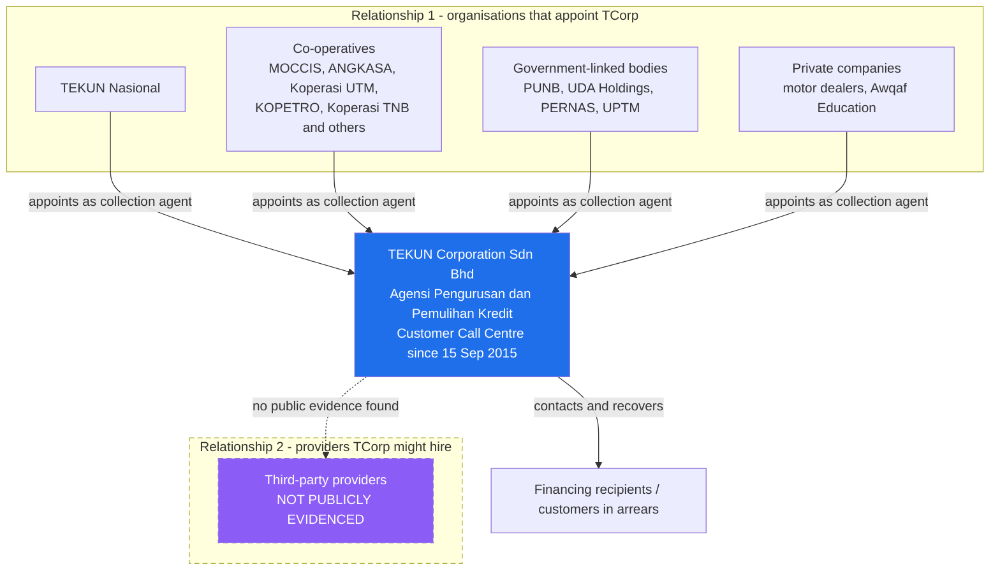

# TEKUN Corporation Sdn Bhd - Entity Profile

**Research date:** 31 August 2026. **Sources:** see [source-register.md](source-register.md).
**Status of this file:** verified public facts plus clearly labelled interpretation.

---

## 1. In plain language

TEKUN Corporation Sdn Bhd - it calls itself **TCorp** - is the commercial
subsidiary of TEKUN Nasional. One of its five businesses is collecting overdue
loan and financing accounts on behalf of other organisations. It has been doing
this since 2015 through its own call centre, and it publicly says that 30
agencies and companies have appointed it as their debt collection agent.

The important thing to understand before anything else: **TCorp is already a
collection business.** It is not starting from zero. Anything proposed to TCorp
should be framed as strengthening and scaling an established operation.

---

## 2. Legal and corporate identity

| Item | Detail | Confidence |
| --- | --- | --- |
| Legal name | TEKUN Corporation Sdn Bhd | Confirmed |
| Company number shown | `1082602-T` | Confirmed |
| Registered with SSM | 27 February 2014 | Confirmed |
| Relationship | Subsidiary (*anak syarikat*) of TEKUN Nasional | Confirmed |
| Registered address shown | Tingkat 4, Menara 2, Lingkaran Maju, Jalan Lingkaran Tengah 2, Bandar Tasik Selatan, 57000 Kuala Lumpur | Confirmed |
| Contact | Tel +603-9059 8965, Fax +603-9059 9241, `mailbox@tcorp.com.my` | Confirmed |
| Operating hours | Mon-Thu 8.30am-5.30pm; Fri 8.30am-5.00pm | Confirmed |

> **Entity warning.** `1082602-T` uses the pre-2016 company-number format shown on
> TCorp's own website. TEKUN Nasional shows a different registration,
> `199801015544 (471673-V)`. These are two distinct legal entities. Never merge
> them, and never attribute a TEKUN Nasional fact to TEKUN Corporation.

---

## 3. Purpose and stated direction

TCorp's own "About us" text says it was established to be *a platform for
developing the potential of Malaysian entrepreneurs, particularly small and
medium industry, in product development and marketing*.

Its published **mission** is to be *"satu subsidiari utama penjana pendapatan
kepada TEKUN Nasional"* - a principal income-generating subsidiary for TEKUN
Nasional.

Its published **objectives** are all retail and entrepreneurship objectives:
building an entrepreneurship ecosystem in the retail sector, marketing micro-SME
and Bumiputera products into the local market, and helping local entrepreneurs
compete with established brands (aligned to DKN2030).

> **Interpretation (not a source statement).** The published Vision/Mission/
> Objectives page does **not** mention credit management or collection at all,
> even though collection is listed first among the five core businesses and has
> its own dedicated page. Two readings are possible: the objectives page is
> simply out of date, or collection is positioned as a revenue engine serving the
> mission rather than as an objective in its own right. Either reading matters
> commercially, and it is a question for TEKUN, not something to assert.

**What is safe to say externally:** TCorp's stated mission is to generate income
for TEKUN Nasional, and credit management and recovery is one of its core
businesses.

---

## 4. Business divisions

TCorp publicly lists five core businesses (*Teras Perniagaan*):

| # | Division | Public description |
| --- | --- | --- |
| 1 | **Pengurusan dan Pemulihan Kredit** | Credit management and recovery - the collection business |
| 2 | Perdagangan & Peruncitan | Trading and retail, including TEKUN Mart |
| 3 | Jaringan Usahasama | Business network, including TEKUN eDokumen |
| 4 | Makanan & Minuman | Food and beverage - He & She Coffee |
| 5 | Pengurusan Bangunan | Building management - Park & Ride Bandar Tasik Selatan |

> **Do not confuse.** TCorp's site also carries a `CollectCo` premium-point logo
> associated with **TEKUN Mart**. In that context "collect" refers to a parcel or
> product collection point, not debt collection. This is a genuine trap for
> keyword searches.

---

## 5. The collection business

### 5.1 What TCorp publicly says it does

TCorp describes itself as an **Agensi Pengurusan dan Pemulihan Kredit** (credit
management and recovery agency) with *"pengalaman luas mengendalikan kutipan
hutang"* - extensive experience handling debt collection - and positions itself
as *"komited, profesional dan efisen"*.

Its operating description: TCorp, through its **Pusat Panggilan Pelanggan (PPP)**
Customer Call Centre - carries out systematic and efficient debt collection for
clients nationwide. TCorp *"akan mengawalselia akaun tunggakan pinjaman daripada
agensi/institusi yang tertentu bagi pelaksanaan kerja-kerja pengurusan dan
pemulihan kredit"* - it supervises loan arrears accounts from specified
agencies and institutions in order to carry out credit management and recovery.

### 5.2 Verified operating facts

| Fact | Detail | Confidence |
| --- | --- | --- |
| Customer Call Centre established | **15 September 2015** | Confirmed |
| Ministry of Finance registration | Registered under MOF with field code **221105, Perkhidmatan Pemungut Hutang** (debt collector services) | Confirmed (TCorp first-party statement) |
| Number of appointing organisations | **30 agencies/companies** have appointed TCorp as debt collection agent | Confirmed as a first-party claim; the underlying list is partially visible |
| Primary channel evidenced | Call centre (PPP) | Confirmed |
| Field collection, legal recovery, tracing | Not described on the public site | Not publicly disclosed |
| Collection platform or system used | Not described on the public site | Not publicly disclosed |

> **Freshness note.** The "30 agencies/companies" figure is a website statement
> with no date stamp. TCorp announced at least two further appointments during
> 2026 (§6). Whether 30 is current, or predates those, is unknown.

### 5.3 What the call centre implies

> **Interpretation.** A dedicated call centre operating since September 2015,
> serving roughly 30 principals nationwide, implies at minimum: account intake
> from multiple principals, contact and follow-up workload management, and some
> form of reporting back to each principal. It does **not** by itself prove the
> existence of an integrated multi-principal collection system, workflow
> automation, field operations, or performance analytics. Those must be asked,
> not assumed.

---

## 6. Publicly named client organisations

These organisations **appointed TCorp to collect on their behalf**. They are
TCorp's clients - the portfolio owners in Relationship 1. **They are not vendors
hired by TCorp.**

### 6.1 Named on TCorp's client panel

Identified from the client logo panel on TCorp's credit management and recovery
page (24 identifiable of the 30 claimed):

| Category | Organisations |
| --- | --- |
| Parent / government-linked | TEKUN Nasional; PUNB; UDA Holdings; PERNAS; UPTM |
| Co-operative apex and agri bodies | ANGKASA; NAFAS; Peladang; KSKMAS |
| Co-operatives | Koperasi Permodalan FELDA Malaysia Berhad; Koperasi UTM Berhad; KAIMB; Koperasi Muslim Malaysia Berhad; Co-Didik; KOPETRO; Koperasi Serbaguna Perkhidmatan Pendidikan Sabak Bernam; Koperasi Kakitangan Kumpulan BIMB Holdings Malaysia Berhad; Koperasi Pegawai-Pegawai Kerajaan Negeri Perlis Berhad; Koperasi Pekebun Kecil Getah Nasional Berhad; Koperasi Pegawai-Pegawai Kerajaan Negeri Pahang Darul Makmur Berhad; Koperasi TNB |
| Motor dealers | Two-Way Motor; Berjaya Mega Motor Kapar; Ming Motor |

**Method note:** these names were read from the logo image filenames and the
rendered client panel. Six of the claimed 30 could not be identified. Exact legal
names should be confirmed with TEKUN before external use.

### 6.2 Appointments announced during 2026

| Date | Client | Event | Signatories / witnesses |
| --- | --- | --- | --- |
| 7 May 2026 | **Awqaf Education Sdn Bhd** | *Kontrak Perjanjian Perkhidmatan Agensi Kutipan Hutang dan Pemulihan Kredit*; TCorp appointed as debt collection agency | Encik Husnaidy bin Ibrahim (TCorp Board Member and Chief Executive); Encik Ibrahim Adham bin Ismail (Director, Awqaf Education) |
| 7 July 2026 | **MOCCIS** (Koperasi Pegawai-Pegawai Melayu Malaysia Berhad) | *Majlis Pelantikan* - appointment as credit recovery agency | n/a |
| 23 July 2026 | **MOCCIS** | Contract signing, *Perkhidmatan Pengurusan dan Pemulihan Kredit* | Signed by Husnaidy bin Ibrahim and Dato' Ahmad Sobri bin Wan Teh (MOCCIS Chairman); witnessed by Tn. Haji Yusoff bin Awang (TEKUN Nasional Deputy Chief Financial Officer) and Dato' Azizan bin Noordin (MOCCIS Secretary) |
| 7 August 2026 | **MOCCIS** | Memorandum of Understanding, strategic cooperation | Dato' Normaziah Sheikh Mohamed (TCorp Board Member) and Dato' Ahmad Sobri bin Wan Teh; witnessed by YB Tuan Steven Sim Chee Keong (Minister of Entrepreneur Development and Cooperatives) and Dato' Sri Khairul Dzaimee bin Daud (Secretary-General) |

**Not disclosed in any of these announcements:** contract duration, contract
value, commission rate, portfolio size, number of accounts, arrears ageing,
geographic scope, or the systems to be used.

> **Interpretation.** Three MOCCIS events in five weeks, a ministerial witness,
> and a separate Awqaf Education appointment in the same year indicate that
> TCorp's collection business is **actively expanding in 2026**, not static. This
> is the single most commercially relevant signal in the public record: capacity,
> onboarding speed and multi-principal governance are live problems for TCorp
> right now.

---

## 7. Governance, integrity and supplier policies

TCorp publishes a governance set under *Mengenai Kami*:

- Maklumat Korporat (corporate information)
- Visi, Misi & Objektif
- Mengenai Pengerusi (about the Chairman)
- Ahli Lembaga Pengarah (board members)
- Struktur Organisasi
- **Polisi Integriti**
- **Kod Etika Pembekal TEKUN Corporation Sdn Bhd** (supplier code of ethics)
- **Pernyataan Anti-Rasuah** and **Polisi Anti Rasuah** (anti-corruption)
- **Polisi Pemberian Maklumat** (whistleblowing)
- **Borang Maklumat Aduan** (complaint form)

> **Why this matters to a prospective partner.** A published supplier code of
> ethics and anti-corruption policy means any vendor relationship will be
> assessed against a written integrity standard, and that TCorp expects
> procurement discipline. The existence of a complaint form also indicates a
> complaint intake path already exists, which is directly relevant to the
> regulator's complaints-handling expectations.

### Named individuals identified

| Name | Role as publicly stated | Source context |
| --- | --- | --- |
| Encik Husnaidy bin Ibrahim | Board Member and Chief Executive, TEKUN Corporation | Awqaf (May 2026) and MOCCIS (July 2026) signings |
| Dato' Normaziah Sheikh Mohamed | Board Member, TEKUN Corporation | MOCCIS MoU (August 2026) |

Officeholders change. Reverify before naming anyone in an external document.

---

## 8. Procurement posture

TCorp maintains a public **Iklan Sebut Harga** (quotation notices) page and an
**Iklan Kerjaya** (career advertisements) page.

| Observation | Detail | Confidence |
| --- | --- | --- |
| Quotation notices page exists | Yes, under *Berita TCorp* | Confirmed |
| Live or archived quotation notices visible on 31 August 2026 | **None** - the page rendered no notice entries | Confirmed as at access date |
| Career advertisements page | Returned HTTP 404 on 31 August 2026 | Confirmed as at access date |

> **Interpretation, stated carefully.** TCorp has a published route for inviting
> quotations. That it carried no visible notices on the access date does not prove
> TCorp does not procure services; notices may be time-limited, taken down after
> closing, or handled through other channels. It does mean **no public quotation
> notice for collection services was found.**

---

## 9. What TEKUN Corporation is *not*

| Not this | Why it matters |
| --- | --- |
| Not TEKUN Nasional | Different entity, different mandate, different regulator exposure |
| Not a new entrant to collection | Operating a collection call centre since September 2015 |
| Not, on public evidence, a lender in its own right | It collects **on behalf of** principals; no public evidence it originates credit |
| Not publicly confirmed as SKP-registered | See [regulatory-and-responsible-collection.md](regulatory-and-responsible-collection.md) - this is a live, time-critical question |
| Not confirmed to outsource collection to third parties | See [current-third-party-and-commercial-model.md](current-third-party-and-commercial-model.md) |

---

## 10. Ecosystem diagram

**Read the dashed path as unproven.** Solid arrows are evidenced appointments.
The dashed box is a searched-for relationship with no public evidence found.

---

## 11. TEKUN Nasional - context only

This section exists only to explain the ecosystem TCorp sits in. **Nothing here
is a TEKUN Corporation fact.** Full detail is in
[current-third-party-and-commercial-model.md](current-third-party-and-commercial-model.md)
and the claim register.

| Item | Detail | Source class |
| --- | --- | --- |
| Legal form | Company limited by guarantee (*Syarikat Berhad Menurut Jaminan*), established 9 November 1998 under the Companies Act 1965, formerly Yayasan TEKUN Nasional | Auditor-General report |
| Registration shown | `199801015544 (471673-V)` | TEKUN Nasional website |
| Ministry | Ministry of Entrepreneur Development and Cooperatives (KUSKOP); previously under the Ministry of Agriculture and Food Security from 1 April 2009 | Auditor-General report |
| Mandate | Easy, fast, entrepreneur-friendly micro-financing; guidance and support; entrepreneur community and networks; **and ensuring loans issued are collected back on schedule so they can be re-lent to other entrepreneurs** | Auditor-General report |
| Example product terms | TEKUN Niaga: RM1,000-RM100,000, 4% per annum, 6 months to 10 years, no collateral | TEKUN Nasional FAQ |

The last mandate point is the strategic hinge: **for TEKUN Nasional, recovery is
what funds the next round of financing.** That is the honest, evidence-backed
basis for a value argument - not a profit guarantee.

> **Critical disambiguation.** TEKUN Nasional's FAQ states *"Pihak TEKUN Nasional
> tidak melantik ejen atau pihak ketiga dalam menguruskan permohonan Skim
> Pembiayaan TEKUN Niaga."* This refers to **loan applications** - an
> anti-middleman warning for applicants. It says nothing about collection, and it
> must never be quoted as evidence about collection arrangements.
